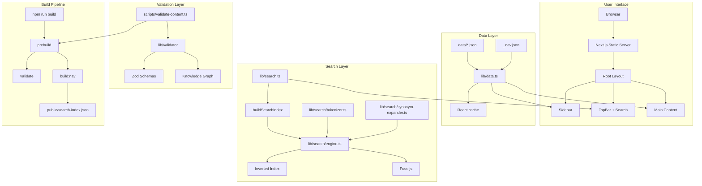
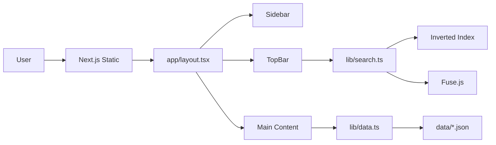
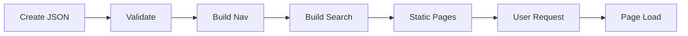
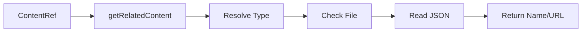
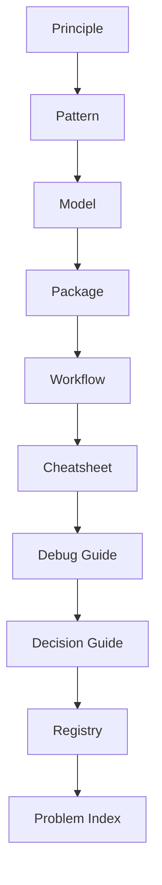

# AI Engineering Navigation System (AENS)
## The Definitive Canonical Specification

**Version:** 1.0  
**Status:** Authoritative  
**Purpose:** Single source of truth for the AI Engineering Navigation System  
**Audience:** AI assistants, contributors, and maintainers  

---

# 1. Executive Summary

## Purpose of AENS

The AI Engineering Navigation System (AENS) is a **personal AI Engineering knowledge system** designed to help practitioners:
- Recall Python package syntax and API usage
- Browse AI/ML/DL/LLM models and their characteristics
- Review the Hugging Face ecosystem tools
- Study end-to-end workflows (RAG, fine-tuning, evaluation, inference)
- Use cheatsheets while building real AI systems
- Troubleshoot common engineering problems

## Problem It Solves

AENS addresses the critical gap in AI engineering knowledge management:

| Problem | AENS Solution |
|---------|---------------|
| Scattered documentation across multiple sources | Centralized, curated knowledge base |
| No single source of truth for AI engineering concepts | Canonical references for each concept |
| Difficulty finding relevant information quickly | Fast search with tokenization and synonym expansion |
| No relationship mapping between concepts | Typed graph relationships between content types |
| Content quality drift over time | Validation-first architecture with Zod schemas |
| No offline access to knowledge | Static-first, local JSON storage |

## Target Audience

- **Primary:** AI/ML engineers building production systems
- **Secondary:** Researchers transitioning to engineering roles
- **Tertiary:** AI assistants contributing to or maintaining the system

## Primary Philosophy

AENS follows a **knowledge-first architecture** where:
1. **Content is king** - All architectural decisions serve content quality
2. **Static-first** - No database, no external APIs, zero-latency navigation
3. **Validation-first** - All content validated at build time
4. **Relationship-driven** - Knowledge connected through typed graph relationships
5. **Decision-first navigation** - Content organized by engineering decisions, not technology

## Long-Term Vision

AENS aims to become the **definitive reference catalog** for AI engineering, providing:
- Complete coverage of Python scientific stack (NumPy, Pandas, PyTorch, TensorFlow, scikit-learn)
- Comprehensive model library (classical ML, deep learning, LLM architectures)
- End-to-end workflow blueprints for common AI tasks
- Troubleshooting knowledge base for production issues
- Decision frameworks for technology selection

---

# 2. Project Principles

## Core Engineering Philosophy

### 2.1 Static-First Architecture
All content is statically generated at build time. This eliminates:
- Server-side rendering overhead
- Database dependencies
- Runtime API calls
- Network latency

**Implementation:**
- All routes use `generateStaticParams()`
- Content stored as JSON files in `data/` directory
- Navigation indexes pre-built via `scripts/build-nav-index.ts`

### 2.2 Local-First Data
All content stored as local JSON files, not in external systems.

**Benefits:**
- Zero API costs
- No network latency
- Version-controlled content
- Offline capability
- Privacy (no data leaves local machine)

### 2.3 Content-First Design
The application is a navigational layer to official documentation, not a documentation replacement.

**Implementation:**
- `sources[]` field in all content for official documentation links
- `official_docs` field in package tasks
- Cross-linking via `ContentRef` type

### 2.4 Performance Optimization
Navigation and search optimized for large catalogs.

**Techniques:**
- `_nav.json` lightweight indexes for sidebar
- React.cache() for data loading memoization
- Inverted index for O(1) search lookups
- Item limits (12 visible) with "See all N →" links
- Alphabetical grouping for lists >30 items

### 2.5 Type Safety
Strong typing at both compile time and runtime.

**Implementation:**
- TypeScript types in `types/` directory
- Zod schemas in `lib/schemas/` directory
- Type-sync enforced (types ↔ schemas must match)
- `ContentRef` type for cross-links

### 2.6 Modularity
Components and functions have single responsibilities.

**Patterns:**
- Composition over inheritance
- Cache pattern for expensive operations
- Fallback pattern for missing data
- Type-safe cross-links

### 2.7 Progressive Disclosure
Show only what's needed, reveal more on demand.

**Implementation:**
- Collapsible sections in content pages
- Item limits in navigation
- Expandable cheatsheet entries
- Sticky action bar for mobile

### 2.8 Accessibility
Keyboard-first, screen-reader friendly design.

**Features:**
- Keyboard navigation in search
- Semantic HTML
- ARIA labels
- Focus management

### 2.9 Mobile-First
Design for mobile first, enhance for desktop.

**Implementation:**
- Mobile sidebar trigger (Sheet component)
- Mobile card views for tables
- Sticky action bar
- Responsive layouts

### 2.10 Validation-First
Validate content before it enters the system.

**Pipeline:**
- Prebuild validation script
- Zod schema validation
- Naming convention checks
- Placeholder detection
- Minimum content quality rules
- ContentRef integrity checks

## Knowledge-First Architecture

Knowledge in AENS is organized in a **dependency hierarchy**:

```
Principle (Foundation)
    ↓
Pattern (Concept)
    ↓
Model (Algorithm)
    ↓
Package (Implementation)
    ↓
Workflow (Process)
    ↓
Cheatsheet (Syntax)
    ↓
Debug Guide (Troubleshooting)
    ↓
Decision Guide (Trade-offs)
    ↓
Registry (Metadata)
    ↓
Problem Index (Discovery)
```

## Decision-First Navigation

Navigation is organized around engineering decisions:
- **Problem-first:** What problem am I solving?
- **Task-first:** What task do I need to accomplish?
- **Tool-first:** What tool/library should I use?

## Learning Philosophy

AENS follows a **practitioner-first** approach:
- Write for engineers who need to implement
- Focus on actionable knowledge
- Provide copy-paste ready examples
- Link to official sources for deep dives

## Design Philosophy

- **Direct:** Say what you mean, avoid hedging
- **Technical:** Use precise terminology
- **Practical:** Focus on implementation, not theory
- **Concise:** Respect the reader's time

## UX Philosophy

- **Zero-latency:** Instant page loads
- **Keyboard-first:** Full keyboard navigation
- **Progressive disclosure:** Don't overwhelm
- **Consistent:** Same patterns across all content types

---

# 3. Complete System Architecture

## Architecture Overview

AENS is a static Next.js application with the following major subsystems:

```
┌─────────────────────────────────────────────────────────────────┐
│                         User Browser                               │
└────────────────────────────┬────────────────────────────────────┘
                             │ HTTP Request
                             ▼
┌─────────────────────────────────────────────────────────────────┐
│                    Next.js Server (Static)                         │
│  ┌───────────────────────────────────────────────────────────┐  │
│  │  Route Handler (app/[category]/[id]/page.tsx)              │  │
│  │  ├─ generateStaticParams()                               │  │
│  │  ├─ Data Loading (lib/data.ts - cached)                 │  │
│  │  ├─ Validation (route-params.ts)                        │  │
│  │  └─ Component Rendering                                   │  │
│  └───────────────────────────────────────────────────────────┘  │
│  ┌───────────────────────────────────────────────────────────┐  │
│  │  Root Layout (app/layout.tsx)                           │  │
│  │  ├─ Sidebar Navigation (components/layout/Sidebar.tsx)  │  │
│  │  ├─ TopBar with Search (components/layout/TopBar.tsx)  │  │
│  │  ├─ Search Index (lib/search.ts - cached)             │  │
│  │  └─ Session Tracking (lib/session-tracking.ts)          │  │
│  └───────────────────────────────────────────────────────────┘  │
└────────────────────────────┬────────────────────────────────────┘
                             │
       ┌────────────────────┼────────────────────┐
       │                    │                    │
       ▼                    ▼                    ▼
┌───────────────┐  ┌───────────────┐  ┌───────────────┐
│  data/        │  │  lib/         │  │  components/  │
│  JSON Files   │  │  Data Layer   │  │  UI Layer     │
│  + _nav.json  │  │  + Schemas    │  │  + Layout     │
└───────────────┘  └───────────────┘  └───────────────┘
```

## Information Flow

### 3.1 Request Flow

```
User Request
    ↓
Next.js Static Route
    ↓
generateStaticParams() [Build Time]
    ↓
lib/data.ts (cached data loader)
    ↓
Route Component (Server Component)
    ↓
ContentPageLayout (Shared Wrapper)
    ├─ Breadcrumbs
    ├─ TableOfContents
    ├─ StickyActionBar
    ├─ Main Content
    ├─ RelatedContent
    └─ OfficialResources
    ↓
HTML Response
```

### 3.2 Rendering Flow

```
JSON Content (data/)
    ↓
Schema Validation (scripts/validate-content.ts)
    ↓
Type Safety (types/*.ts + lib/schemas/*.ts)
    ↓
Data Loading (lib/data.ts - React cache)
    ↓
Route Component (app/**/page.tsx)
    ↓
Shared Components (components/shared/)
    ↓
Rendered HTML (Static Generation)
```

### 3.3 Navigation Flow

```
_build:nav Script
    ↓
Scan data/ Directory
    ↓
Extract Metadata
    ↓
Write _nav.json
    ↓
Runtime Loading
    ↓
Sidebar Rendering
    ├─ Group by first letter (if >30)
    ├─ Limit to 12 visible
    └─ Render "See all N →" links
```

### 3.4 Search Flow

```
lib/search.ts: buildSearchIndex() [cached]
    ↓
Load All Content
    ↓
Tokenize Fields
    ↓
Build Inverted Index
    ↓
Search Query
    ↓
lib/search/engine.ts: search()
    ├─ Synonym expansion
    ├─ Inverted index query
    ├─ Fuse.js fuzzy match
    └─ Score aggregation
    ↓
Ranked Results
```

### 3.5 Validation Flow

```
prebuild Script (package.json)
    ↓
npm run validate (scripts/validate-content.ts)
    ↓
Scan data/ Directory
    ↓
For Each JSON File:
    ├─ JSON Parse Validation
    ├─ Schema Validation (Zod)
    ├─ Slug Format Validation
    ├─ Filename === ID Validation
    ├─ Placeholder Detection
    ├─ Minimum Content Quality
    ├─ Duplicate Detection
    └─ ContentRef Integrity
    ↓
npm run build:nav (scripts/build-nav-index.ts)
    ↓
Next.js Build
```

### 3.6 Relationship Flow

```
ContentRef in JSON
    ├─ { id: "numpy", type: "package" }
    ├─ { id: "rag", type: "workflow" }
    ↓
lib/data.ts: getRelatedContent()
    ↓
For each ContentRef:
    ├─ Resolve type to directory
    ├─ Check file existence
    ├─ Read JSON file
    └─ Return { id, name, type, url }
    ↓
RelatedContent Component
    ├─ Render links
    └─ Handle missing targets
```

### 3.7 Content Generation Flow

```
User Visits Page
    ↓
PageVisitTracker Component
    ├─ recordPageVisit(id, name, type)
    └─ lib/session-tracking.ts
    ↓
localStorage Operations
    ├─ recentKnowledge: Array<{id, name, type, timestamp}>
    └─ continueReading: Map<id, {progress, scrollPosition, timestamp}>
    ↓
RecentKnowledgeSection
    ├─ getRecentKnowledge()
    └─ Render recent items
    ↓
ContinueReadingSection
    ├─ getContinueReading()
    └─ Render items with progress bars
```

## Mermaid Architecture Diagram



---

# 4. Repository Architecture

## Directory Structure

```
ai-engineering-handbook/
├─ app/                    # Next.js App Router
│  ├─ layout.tsx            # Root layout with Sidebar, TopBar
│  ├─ page.tsx              # Dashboard/home page
│  ├─ globals.css           # Tailwind v4 + shadcn styles
│  ├─ not-found.tsx         # 404 page
│  ├─ error.tsx             # Error boundary
│  ├─ packages/
│  │  └─ [id]/
│  │     └─ page.tsx        # Package detail page
│  ├─ models/
│  │  ├─ [category]/
│  │  │  ├─ page.tsx       # Model list with filters
│  │  │  └─ [id]/
│  │  │     └─ page.tsx    # Model detail page
│  ├─ registry/
│  │  └─ [task]/
│  │     └─ page.tsx        # Registry task page
│  ├─ workflows/
│  │  └─ [id]/
│  │     └─ page.tsx        # Workflow detail page
│  ├─ cheatsheets/
│  │  └─ [id]/
│  │     └─ page.tsx        # Cheatsheet detail page
│  ├─ patterns/
│  │  └─ [id]/
│  │     └─ page.tsx        # Pattern detail page
│  ├─ debug-guides/
│  │  └─ [id]/
│  │     └─ page.tsx        # Debug guide detail page
│  ├─ decision-guides/
│  │  └─ [id]/
│  │     └─ page.tsx        # Decision guide detail page
│  ├─ principles/
│  │  └─ [id]/
│  │     └─ page.tsx        # Principle detail page
│  └─ problem-index/
│     └─ page.tsx           # Problem index page
│
├─ components/
│  ├─ layout/
│  │  ├─ Sidebar.tsx        # Desktop sidebar
│  │  ├─ TopBar.tsx         # Header with search
│  │  ├─ MobileSidebarTrigger.tsx
│  │  ├─ DarkModeToggle.tsx
│  │  └─ ThemeInitializer.tsx
│  ├─ shared/
│  │  ├─ ContentPageLayout.tsx
│  │  ├─ SearchBox.tsx
│  │  ├─ Breadcrumbs.tsx
│  │  ├─ CodeBlock.tsx
│  │  ├─ PackageTaskList.tsx
│  │  ├─ WorkflowStepList.tsx
│  │  ├─ CheatsheetEntry.tsx
│  │  ├─ ModelCollapsibleSections.tsx
│  │  ├─ RelatedContent.tsx
│  │  ├─ OfficialResources.tsx
│  │  ├─ MetadataBadges.tsx
│  │  ├─ TableOfContents.tsx
│  │  ├─ StickyActionBar.tsx
│  │  ├─ ReadingProgress.tsx
│  │  ├─ BackToTop.tsx
│  │  ├─ PageVisitTracker.tsx
│  │  ├─ ReadingSessionTracker.tsx
│  │  ├─ ScrollRestore.tsx
│  │  ├─ QuickSetupSection.tsx
│  │  ├─ ExpandableText.tsx
│  │  ├─ Prose.tsx
│  │  ├─ CollapsibleRow.tsx
│  │  ├─ RecentActivity.tsx
│  │  └─ RecommendedNextSection.tsx
│  └─ ui/
│     ├─ badge.tsx
│     ├─ button.tsx
│     ├─ card.tsx
│     ├─ separator.tsx
│     └─ sheet.tsx
│
├─ data/
│  ├─ packages/
│  │  ├─ _nav.json
│  │  └─ *.json
│  ├─ models/
│  │  ├─ ml/
│  │  │  ├─ _nav.json
│  │  │  └─ *.json
│  │  ├─ dl/
│  │  │  ├─ _nav.json
│  │  │  └─ *.json
│  │  └─ llm/
│  │     ├─ _nav.json
│  │     └─ *.json
│  ├─ registry/
│  │  ├─ families/
│  │  │  ├─ _index.json
│  │  │  └─ */_index.json
│  │  └─ variants/
│  ├─ workflows/
│  │  ├─ _nav.json
│  │  └─ *.json
│  ├─ cheatsheets/
│  │  ├─ _nav.json
│  │  └─ *.json
│  ├─ patterns/
│  │  ├─ _nav.json
│  │  └─ *.json
│  ├─ debug-guides/
│  │  ├─ _nav.json
│  │  └─ *.json
│  ├─ decision-guides/
│  │  ├─ _nav.json
│  │  └─ *.json
│  ├─ principles/
│  │  ├─ _nav.json
│  │  └─ *.json
│  ├─ problem-index/
│  │  └─ taxonomy.json
│  ├─ search/
│  │  ├─ concept-groups.json
│  │  ├─ search.config.json
│  │  └─ synonyms.json
│  ├─ registered-tags.json
│  └─ registered-aliases.json
│
├─ lib/
│  ├─ data.ts               # All data loading (fs.readFileSync + React.cache)
│  ├─ search.ts             # Fuse.js search index builder
│  ├─ search-types.ts       # SearchResult type, createFuse config
│  ├─ resources.ts          # Resource URL resolver
│  ├─ route-params.ts       # generateStaticParams helpers
│  ├─ session-tracking.ts   # Session tracking utilities
│  ├─ relationships.ts      # Relationship resolution
│  ├─ utils.ts              # cn() utility
│  ├─ config/
│  │  └─ loader.ts          # AENS config loader
│  ├─ hooks/
│  │  ├─ useLocalStorage.ts
│  │  └─ useReadingSession.ts
│  ├─ search/
│  │  ├─ engine.ts          # Custom search engine
│  │  ├─ inverted-index.ts  # Inverted index implementation
│  │  ├─ related-search.ts  # Related content search
│  │  ├─ synonym-expander.ts
│  │  └─ tokenizer.ts       # Code tokenizer
│  └─ schemas/
│     ├─ base.ts            # BaseMetaSchema, ContentRefSchema
│     ├─ package.ts
│     ├─ model.ts
│     ├─ registry.ts
│     ├─ workflow.ts
│     ├─ cheatsheet.ts
│     ├─ pattern.ts
│     ├─ debug-guide.ts
│     ├─ decision-guide.ts
│     ├─ principle.ts
│     └─ index.ts
│
├─ scripts/
│  ├─ validate-content.ts   # Zod validation for all JSON files
│  └─ build-nav-index.ts    # Builds _nav.json files
│
├─ types/
│  ├─ package.ts
│  ├─ model.ts
│  ├─ registry.ts
│  ├─ workflow.ts
│  ├─ cheatsheet.ts
│  ├─ pattern.ts
│  ├─ debug-guide.ts
│  ├─ decision-guide.ts
│  ├─ principle.ts
│  └─ meta.ts
│
├─ docs/
│  ├─ architecture/
│  ├─ engineering/
│  ├─ guides/
│  ├─ reference/
│  ├─ adr/
│  └─ archive/
│
├─ public/
│  └─ search-index.json     # Generated search index
│
├─ aens.config.json       # AENS configuration
├─ package.json
└─ next.config.ts
```

## Canonical vs Implementation Folders

| Folder | Type | Purpose |
|--------|------|---------|
| `app/` | Canonical | Next.js App Router pages |
| `components/` | Canonical | UI components |
| `data/` | Canonical | Content JSON files |
| `lib/` | Canonical | Data layer, schemas, utilities |
| `types/` | Canonical | TypeScript type definitions |
| `scripts/` | Implementation | Build-time scripts |
| `docs/` | Documentation | Project documentation |
| `public/` | Generated | Static assets (search-index.json) |

---

# 5. Knowledge Architecture

## Content Types Overview

AENS defines 9 core content types, each with specific ownership and purpose:

| Type | Purpose | Owns | Never Owns |
|------|---------|------|------------|
| Principle | Theory, math, why | Theory, math, why | Implementation, APIs |
| Pattern | Concept, applicability | Concept, applicability | Library code, API syntax |
| Model | Algorithm selection | Algorithm selection | Implementation, APIs |
| Package | Library API usage | Library API usage | Algorithm theory |
| Workflow | End-to-end process | End-to-end process | APIs, theory |
| Cheatsheet | Syntax only | Syntax | Explanations |
| Debug Guide | Symptom-based troubleshooting | Symptom-based troubleshooting | Tutorials |
| Decision Guide | Trade-off analysis | Trade-off analysis | Implementation |
| Registry | Metadata | Metadata | Tutorials |

## 5.1 Package

**Purpose:** Library API reference and usage patterns

**Schema Location:** `lib/schemas/package.ts`

**Key Fields:**
```typescript
interface Package extends BaseMeta {
  name: string;           // Display name (e.g., "NumPy")
  version: string;        // Current stable version
  install: string;        // Installation command
  import_as: string;      // Import statement
  language: string;       // Programming language
  summary: string;        // Brief description
  tasks: PackageTask[];   // Array of common tasks
  alternatives: ContentRef[]; // Alternative packages
  package_specific_debugging: string[];
  migration_notes: string[];
  breaking_changes: string[];
}
```

**PackageTask Structure:**
```typescript
interface PackageTask {
  task: string;                    // Task name
  resource_id?: string;            // Optional resource ID
  mental_trigger?: string;         // When to use this
  syntax: string;                // Function signature
  important_params: string[];    // Key parameters (max 5)
  example: string;               // Usage example
  use_when?: string;             // Use case
  avoid_when?: string;           // Anti-pattern
  decision_notes?: string;       // Parameter choices
  gotchas: string[];             // Common pitfalls
  official_docs?: string;        // API documentation URL
  related_workflows: string[];   // Related workflow IDs
  related_cheatsheets: string[]; // Related cheatsheet IDs
}
```

## 5.2 Model

**Purpose:** Model selection and understanding

**Schema Location:** `lib/schemas/model.ts`

**Key Fields:**
```typescript
interface Model {
  // Identity & Discovery
  id: string;
  title: string;
  name: string;
  slug: string;
  description: string;
  tags: string[];
  aliases: string[];
  keywords: string[];
  searchtokens: string[];

  // Classification
  domain: 'ml' | 'dl' | 'llm';
  category: string;
  problemtypes: string[];

  // Decision Summary
  decisionsummary: {
    summary: string;
    bestusecases: string[];
    avoidwhen: string[];
    strengths: string[];
    limitations: string[];
    interpretability: string;
    trainingcharacteristics: string;
    inferencecharacteristics: string;
    computationalcharacteristics: string;
  };

  // Core Understanding
  coreunderstanding: {
    intuition: string;
    learningmechanism: string;
    assumptions: string[];
    mathematicalintuition: string;
    complexity: string;
    memorycomplexity: string;
    robustness: string;
    scalability: string;
    overfittingtendency: string;
    biasvariance: string;
  };

  // Hyperparameters
  hyperparameters: HyperParameter[];

  // Engineering Considerations
  engineeringconsiderations: {
    datasetsuitability: string[];
    scalability: string[];
    parallelization: string;
    computationalcost: string;
    memorybehavior: string;
    inferencecharacteristics: string;
    robustness: string[];
    sensitivitytooutliers: string;
    featureengineeringdependency: string;
    featurescalingrequirement: string;
    classimbalancebehavior: string;
    commonlimitations: string[];
    pipelineposition: string;
  };

  // Relationships
  relatedcontent: Array<{
    type: string;
    id: string;
    relationship: string;
  }>;
}
```

**Model Categories:**
- `ml` - Classical Machine Learning (Random Forest, SVM, etc.)
- `dl` - Deep Learning (CNN, RNN, Transformer, etc.)
- `llm` - Large Language Models (Llama, GPT, etc.)

**Problem Types:**
- `classification`, `regression`, `clustering`
- `generation`, `embedding`, `detection`, `segmentation`

## 5.3 Workflow

**Purpose:** End-to-end pipeline blueprints

**Schema Location:** `lib/schemas/workflow.ts`

**Key Fields:**
```typescript
interface Workflow extends BaseMeta {
  type: 'pipeline' | 'snippet';
  category: string;
  overview: string;
  starter_stack: string[];
  steps: WorkflowStep[];
  common_failure_points: string[];
  worked_examples: WorkedExample[];
  production_notes?: string;
  scaling_notes?: string;
  related_patterns: string[];
  related_models: string[];
  related_packages: string[];
  related_debug_guides: string[];
}
```

**WorkflowStep Structure:**
```typescript
interface WorkflowStep {
  step: number;
  name: string;
  what: string;
  tools: string[];
  decision: string;
  uses: {
    packages: string[];
    models: string[];
    cheatsheets: string[];
    patterns: string[];
    debug_guides: string[];
  };
  failure_points: string[];
  code?: string;
  language?: string;
}
```

## 5.4 Cheatsheet

**Purpose:** Quick syntax reference

**Schema Location:** `lib/schemas/cheatsheet.ts`

**Key Fields:**
```typescript
interface Cheatsheet extends BaseMeta {
  name: string;
  entries: CheatsheetEntry[];
  package_reference?: string;
  quick_references?: Array<{
    title: string;
    headers: string[];
    rows: string[][];
  }>;
}
```

**CheatsheetEntry Structure:**
```typescript
interface CheatsheetEntry {
  problem: string;        // What problem this solves
  trigger: string;        // When you need this
  snippet: string;        // Code solution (no markdown)
  minimal_notes: string;  // One critical thing to remember
  common_bug: string;     // Non-obvious silent failure
  docs_url: string;       // Official documentation URL
}
```

## 5.5 Pattern

**Purpose:** Reusable engineering concepts

**Schema Location:** `lib/schemas/pattern.ts`

**Key Fields:**
```typescript
interface Pattern extends BaseMeta {
  concept: string;
  applicability: string;
  anti_patterns: string[];
  implementation_notes?: string;
  examples: string[];
  variations: Variation[];
  decision_summary?: {
    when_to_use: string[];
    dont_use: string[];
    tradeoff: string;
  };
  tradeoffs: TradeoffDimension[];
  related_workflows: string[];
  related_models: string[];
  related_packages: string[];
  related_principles: string[];
  related_debug_guides: string[];
}
```

**Pattern Categories:**
- Data: `eda`, `data_validation`, `data_cleaning`, `feature_engineering`
- Training: `training_loop`, `early_stopping`, `gradient_accumulation`
- Optimization: `hyperparameter_search`, `cross_validation`
- Inference: `batch_inference`, `kv_cache`, `speculative_decoding`
- Deployment: `canary_deployment`, `monitoring`, `rollback`

## 5.6 Principle

**Purpose:** Fundamental engineering truths

**Schema Location:** `lib/schemas/principle.ts`

**Key Fields:**
```typescript
interface Principle extends BaseMeta {
  category: 'learning_theory' | 'optimization' | 'representation' | 
            'systems' | 'information_theory' | 'statistics' | 'probability';
  statement: string;
  mathematical_formulation?: string;
  intuition: string;
  implications: string[];
  limitations: string[];
  related_concepts: string[];
  referenced_by_patterns: string[];
  referenced_by_models: string[];
  referenced_by_workflows: string[];
}
```

## 5.7 Debug Guide

**Purpose:** Symptom-based troubleshooting

**Schema Location:** `lib/schemas/debug-guide.ts`

**Key Fields:**
```typescript
interface DebugGuide extends BaseMeta {
  category: 'training' | 'gpu' | 'data' | 'llm' | 'python' | 
            'deployment' | 'performance' | 'memory';
  overview?: {
    severity: 'critical' | 'high' | 'medium' | 'low';
    frequency: 'common' | 'occasional' | 'rare';
    typical_stage: 'development' | 'testing' | 'production' | 'any';
  };
  quick_identification: Array<{ check: string; description?: string; }>;
  symptoms: Array<{
    symptom: string;
    description?: string;
    error_message?: string;
    where_appears?: string;
  }>;
  root_causes: Array<{
    cause: string;
    probability: 'high' | 'medium' | 'low';
    explanation?: string;
    recognition_clues: string[];
  }>;
  solutions: Array<{
    solution: string;
    steps: string[];
    quick_fix?: string;
    permanent_fix?: string;
    difficulty: 'easy' | 'medium' | 'hard';
  }>;
  prevention: Array<{
    category: 'development' | 'production' | 'monitoring' | 'coding_habits';
    practices: string[];
  }>;
  related_packages: string[];
  related_workflows: string[];
  related_patterns: string[];
  related_models: string[];
}
```

## 5.8 Decision Guide

**Purpose:** Technology trade-off analysis

**Schema Location:** `lib/schemas/decision-guide.ts`

**Key Fields:**
```typescript
interface DecisionGuide extends BaseMeta {
  category: 'models' | 'frameworks' | 'llm' | 'infrastructure' | 
            'data_processing' | 'deployment';
  problem: string;
  evaluation_criteria: Array<{
    criterion: string;
    weight: number;
    description?: string;
  }>;
  options: Array<{
    name: string;
    id: string;
    strengths: string[];
    weaknesses: string[];
    best_for: string;
    avoid_when: string;
  }>;
  recommendations: string;
  use_cases: string[];
  related_workflows: string[];
  related_packages: string[];
  related_models: string[];
}
```

## 5.9 Registry

**Purpose:** Model deployment metadata

**Schema Location:** `lib/schemas/registry.ts`

**Key Fields (RegistryFamily):**
```typescript
interface RegistryFamily extends BaseMeta {
  provider: string;
  modality: 'llm' | 'embedding' | 'reranker' | 'vision' | 'speech' | 'multimodal';
  architecture?: Architecture;
  capabilities?: Capabilities;
  formats?: Formats;
  ecosystem?: Ecosystem;
  references: Reference[];
  license_info?: License;
  status?: Status;
  engineering_snapshot?: EngineeringSnapshot;
  related_resources: RelatedResource[];
}
```

**Key Fields (RegistryVariant):**
```typescript
interface RegistryVariant extends BaseMeta {
  family_id: string;
  size_mb?: number;
  specifications?: Specifications;
  hardware?: Hardware;
  deployment?: Deployment;
  downloads: Download[];
  runtime_compatibility: RuntimeCompatibility[];
}
```

## 5.10 Problem Index

**Purpose:** Problem-to-solution mapping

**Location:** `data/problem-index/taxonomy.json`

**Structure:**
```typescript
interface ProblemIndex {
  [category: string]: {
    problems: Array<{
      id: string;
      name: string;
      description: string;
      related_workflows?: string[];
      related_models?: string[];
      related_packages?: string[];
      related_patterns?: string[];
      related_decision_guides?: string[];
    }>;
  };
}
```

## Cross-Links and Relationships

### ContentRef Type
```typescript
interface ContentRef {
  id: string;
  type: 'workflow' | 'pattern' | 'model' | 'package' | 'cheatsheet' | 
        'debug_guide' | 'registry' | 'decision_guide' | 'principle';
  relationship_type?: string;
}
```

### Relationship Types
- `uses` / `used_by` - Dependency
- `implements` / `implemented_by` - Implementation
- `alternative_to` - Alternatives
- `debugged_by` - Debugging relationship
- `references` - General reference
- `related_to` - Generic relationship

### Relationship Field Shapes by Content Type

| Content Type | Relationship Fields | Field Shape |
|--------------|-------------------|-------------|
| Package | `related_workflows`, `related_cheatsheets` | `string[]` (plain IDs) |
| Model | `relatedcontent` | `ContentRef[]` (objects) |
| Pattern | `related_workflows`, `related_models`, `related_packages`, `related_principles` | `string[]` |
| Principle | `referenced_by_patterns`, `referenced_by_models`, `referenced_by_workflows` | `string[]` (inverse) |
| Workflow | `related_patterns`, `related_models`, `related_packages`, `related_debug_guides` | `string[]` |
| Debug Guide | All `related_*` fields | `string[]` |
| Decision Guide | All `related_*` fields | `string[]` |
| Cheatsheet | `package_reference` | `string` (singular) |
| Registry | `related_models`, `related_resources` | Mixed |

---

# 6. Navigation Architecture

## Top-Level Navigation

The sidebar provides navigation organized by content type:

```
Dashboard (/)
Problem Index (/problem-index)
Packages (/packages)
Models Library (/models)
  ├─ Machine Learning (/models/ml)
  ├─ Deep Learning (/models/dl)
  └─ Large Language Models (/models/llm)
Model Registry (/registry)
Workflows (/workflows)
Cheatsheets (/cheatsheets)
Patterns (/patterns)
Debug Guides (/debug-guides)
Decision Guides (/decision-guides)
Principles (/principles)
```

## Dynamic Routing

### Model Routes
- `/models` → Unified page showing all categories
- `/models/ml` → Model list for ML category
- `/models/ml/random-forest` → Model detail page
- `generateStaticParams()` generates paths for all model categories

### Registry Routes
- `/registry/families/{family_id}` → Registry family page
- `/registry/families/{family_id}/{variant_id}` → Registry variant page

### Content Routes
- `/packages/{id}` → Package detail page
- `/workflows/{id}` → Workflow detail page
- `/cheatsheets/{id}` → Cheatsheet detail page
- `/patterns/{id}` → Pattern detail page
- `/debug-guides/{id}` → Debug guide detail page
- `/decision-guides/{id}` → Decision guide detail page
- `/principles/{id}` → Principle detail page

## Navigation Performance

### _nav.json Files
- **Problem:** At 500+ packages, parsing all JSON files for sidebar is slow
- **Solution:** `_nav.json` contains only `id`, `name`, `version`, `updated_at`
- **Benefit:** One file read instead of N file reads
- **Fallback:** If `_nav.json` missing, fall back to full file scan

### Item Limits
- `MAX_VISIBLE_ITEMS = 12` - Maximum items shown in expanded section
- `ALPHA_GROUP_THRESHOLD = 30` - Items grouped by first letter when >30

## Breadcrumb Philosophy

Breadcrumbs follow the navigation hierarchy:
- Home → Content Type → Item Name
- Example: Home → Packages → NumPy

## Knowledge Discovery Philosophy

Discovery is multi-faceted:
1. **Search** - Full-text search with tokenization
2. **Navigation** - Browse by type and category
3. **Problem Index** - Problem-to-solution mapping
4. **Related Content** - Graph-based discovery
5. **Recent Activity** - Session-based history

---

# 7. Search Architecture

## Search Index Generation

```
lib/search.ts: buildSearchIndex() [cached]
    ↓
Load All Content
    ├─ packages
    ├─ models (ml/dl/llm)
    ├─ workflows
    ├─ cheatsheets
    ├─ registry
    ├─ patterns
    ├─ debug_guides
    └─ decision_guides
    ↓
Tokenize Fields
    ├─ name
    ├─ summary
    ├─ tasks[].syntax (packages)
    ├─ entries[].snippet (cheatsheets)
    ├─ problem_type (models)
    └─ steps[].what (workflows)
    ↓
Build Inverted Index
    ├─ tokenMap: token → Set<docId>
    └─ docMap: docId → SearchResult
    ↓
Write to public/search-index.json
```

## Tokenization Rules

The tokenizer (`lib/search/tokenizer.ts`) follows these rules:

1. **Dot-split:** `np.linalg.inv` → `["np", "linalg", "inv"]`
2. **Prefix segments:** `["np", "np.linalg", "np.linalg.inv"]`
3. **Package alias expansion:** `np` → also `numpy`
4. **CamelCase split:** `CrossEntropyLoss` → `["Cross", "Entropy", "Loss", "cross", "entropy", "loss"]`
5. **Snake/kebab split:** `learning_rate` → `["learning", "rate"]`
6. **Abbreviation expansion:** `svd` → `["singular", "value", "decomposition"]`
7. **Deduplicate and lowercase:** All tokens stored lowercase

### Package Aliases
```typescript
const PACKAGE_ALIASES: Record<string, string[]> = {
  'np': ['numpy'],
  'torch': ['pytorch'],
  'tf': ['tensorflow'],
  'pd': ['pandas'],
  'sklearn': ['scikit-learn'],
  // ... more
};
```

### Abbreviation Expansions
```typescript
const ABBREVIATION_EXPANSIONS: Record<string, string[]> = {
  'inv': ['inverse'],
  'svd': ['singular', 'value', 'decomposition'],
  'lstm': ['long', 'short', 'term', 'memory'],
  'cnn': ['convolutional', 'neural', 'network'],
  'rag': ['retrieval', 'augmented', 'generation'],
  // ... more
};
```

## Inverted Index

**Location:** `lib/search/inverted-index.ts`

**Structure:**
```typescript
interface InvertedIndex {
  tokenMap: Map<string, Set<string>>;  // token → Set<docId>
  docMap: Map<string, SearchResult>;   // docId → SearchResult
}
```

**Query Process:**
1. Split query into tokens
2. Look up each token in tokenMap
3. Score matches: `matchedTokenCount / totalQueryTokens`
4. Support prefix matching with 0.7 weight
5. Return sorted results

## Synonym Expansion

**Location:** `lib/search/synonym-expander.ts`

**Process:**
1. Split query into tokens
2. For each token, look up synonyms
3. For each token, look up concept groups
4. Return expanded tokens + concept group IDs

**Example:**
```
Query "embedding" → expands to:
- Tokens: ["embedding", "vector", "representation"]
- Concept group IDs: IDs of all embedding models
```

## Ranking Algorithm

**Location:** `lib/search/engine.ts`

**Scoring Factors:**
- Exact name match: 1.0
- Name prefix match: 0.98
- Name contains: 0.90
- Summary contains: 0.85
- Concept group membership: 0.96
- Inverted index match: 0-0.95
- Fuse.js fuzzy match: 0-0.45

**Aggregation:**
1. Query inverted index with expanded tokens
2. Boost exact/prefix/contains matches
3. Boost concept group members
4. Run Fuse.js fuzzy matching as fallback
5. Take max score from all sources
6. Sort by score descending
7. Return top N results

## Searchable Fields

| Content Type | Fields |
|--------------|--------|
| Packages | name, summary, tasks[].syntax, tasks[].task |
| Models | name, summary, problem_type, quick_start |
| Workflows | name, summary, steps[].what |
| Cheatsheets | name, summary, entries[].snippet, entries[].problem |
| Registry | id, name, task, size_mb, capabilities |
| Patterns | name, concept, applicability |
| Debug Guides | name, description, symptoms, error_messages, diagnostic_commands, root_causes, quick_checks, gotchas |
| Decision Guides | name, problem, options |
| Principles | name, statement, implications |

## Package Page Search/Filter

The package list page (`app/packages/page.tsx`) provides client-side search and filtering functionality:

### Search Functionality
- **Search input** - Filters packages by name, summary, and task names
- **Real-time filtering** - Results update as user types
- **Clear button** - X icon to clear search query

### Filter Options
- **Difficulty filter** - Filter by `beginner`, `intermediate`, `advanced`, `expert`
- **Maturity filter** - Filter by `research`, `experimental`, `emerging`, `production_ready`, `legacy`
- **More filters toggle** - Collapsible filter section with Filter icon button

### UI Components
- `PackageListClient.tsx` - Client component with search state management
- Results count display showing `filtered / total` packages
- "Clear all" button when filters are active
- Expandable package cards showing install/import commands

## Package Detail Page Search/Filter

The package detail page (`app/packages/[id]/page.tsx`) provides task navigation and search:

### Sticky Action Bar
- **Location:** `components/shared/StickyActionBar.tsx`
- **Purpose:** Quick navigation between package tasks
- **Trigger:** Appears when scrolling down (200px threshold) or near bottom
- **Features:**
  - Previous/Next section buttons
  - Current section label display
  - Sheet popup for full section list
  - Keyboard navigation support

### Task Navigation
- **Source:** `PackageTaskList` component
- **Navigation:** Click task chips to scroll to specific tasks
- **Anchors:** Each task has a unique ID for direct linking

## Cheatsheet Page Search/Filter

The cheatsheet list page (`app/cheatsheets/page.tsx`) provides client-side search and filtering functionality:

### Search Functionality
- **Search input** - Filters cheatsheets by name, description, and entry problems/triggers
- **Real-time filtering** - Results update as user types
- **Clear button** - X icon to clear search query

### Filter Options
- **Difficulty filter** - Filter by `beginner`, `intermediate`, `advanced`, `expert`
- **Domain filter** - Filter by domain (e.g., `ml`, `dl`, `llm`, `data`, `deployment`)
- **More filters toggle** - Collapsible filter section with Filter icon button

### UI Components
- `CheatsheetListClient.tsx` - Client component with search state management
- Results count display showing `filtered / total` cheatsheets
- "Clear all" button when filters are active
- Expandable cheatsheet cards showing quick reference tables

## Cheatsheet Entry List Search/Filter

The cheatsheet entry list (`app/cheatsheets/[id]/CheatsheetEntryList.tsx`) provides entry-level search:

### Content Command Palette
- **Location:** `components/shared/ContentCommandPalette.tsx`
- **Purpose:** Search and filter individual cheatsheet entries
- **Search fields:** problem, trigger, minimal_notes, common_bug, snippet
- **Keyboard shortcut:** `/` to focus search

### Features
- **Real-time filtering** - Results update as user types
- **Keyboard navigation** - Arrow keys to navigate, Enter to select
- **Auto-scroll** - Selected entry scrolls into view
- **Clear button** - X icon to clear search query

## Advanced Search Features

### Typo Tolerance

**Location:** `lib/search/typo-tolerance.ts`

Provides Levenshtein distance-based typo correction:
- `levenshteinDistance(a, b)` - Calculate edit distance
- `isLikelyTypo(input, candidate)` - Check if string is likely typo
- `findSimilarTerms(input, candidates)` - Find similar terms
- `checkCommonMisspelling(input)` - Correct common typos
- `generateTypoCorrections(query, allTokens)` - Generate corrected query

### Intent Detection

**Location:** `lib/search/intent-detection.ts`

Detects query intent and provides type-based prioritization:
- `detectIntent(query)` - Returns primary intent and confidence
- `getTypePriorityOrder(intent)` - Returns type priority order
- `getIntentPriority(intent, resultType)` - Returns priority value

**Intent Categories:**
- `package` - Code/API related queries
- `workflow` - How-to/process queries
- `problem` / `debug_guide` - Error/debug queries
- `model` - Model/architecture queries
- `pattern` - Pattern/best practice queries
- `cheatsheet` - Cheatsheet/syntax queries
- `registry` - Registry/model search queries
- `decision_guide` - Decision/comparison queries
- `principle` - Concept/theory queries

### Ranking Algorithm

**Location:** `lib/search/ranking.ts`

Advanced ranking with multiple signals:
- `calculateFreshnessBoost(updatedAt)` - +0.15 for content updated within 30 days
- `calculateConfidenceBoost(confidence)` - +0.15 for production_proven
- `calculateMaturityBoost(maturity)` - +0.15 for production_ready
- `calculateCanonicalBoost(status)` - +0.10 for canonical
- `calculateRelationshipBoost(result, relatedCount)` - +0.10 for 3+ related items
- `calculateDifficultyBoost(queryLength, isTechnical, difficulty)` - Difficulty-aware boosting
- `calculateProblemFirstBoost(result, query, intent)` - Problem-first ranking
- `isTechnicalQuery(query)` - Detect technical patterns

### Snippet Generation

**Location:** `lib/search/snippets.ts`

Context-aware snippet generation:
- `generateSnippet(text, query, maxLength)` - Create snippet with context
- `highlightMatches(text, query)` - Highlight matched terms
- `getMatchedFields(result, query)` - Identify matched fields
- `generateRelevanceExplanation(result, query)` - Generate explanation

### Query Assistance

**Location:** `lib/search/query-assistance.ts`

Provides search assistance features:
- `generateDidYouMean(query, allTokens)` - Generate typo suggestions
- `getAutocompleteSuggestions(partialQuery, allTokens)` - Get autocomplete
- `getPopularSearches()` - Get popular search queries
- `getRelatedSearches(query, allTokens)` - Get related queries
- `generateZeroResultRecovery(query, allTokens)` - Zero-result recovery
- `getTypeIcon(type)` - Get type icon for display

---

# 8. Rendering Architecture

## Markdown Pipeline

AENS uses `react-markdown` with plugins:
- `remark-gfm` - GitHub Flavored Markdown
- `remark-math` - LaTeX math support
- `rehype-katex` - Math rendering

## Prose Component

**Location:** `components/shared/Prose.tsx`

Renders markdown content with consistent styling.

## Code Blocks

**Location:** `components/shared/CodeBlock.tsx`

- Syntax highlighting via CSS
- Copy-to-clipboard button
- Language detection

## Tables

Tables rendered as responsive cards on mobile, standard tables on desktop.

## Mermaid Diagrams

Supported via `rehype-katex` and custom styling.

## Math Rendering

LaTeX math via KaTeX integration.

## Interactive Components

Client components for:
- Search box
- Sidebar toggle
- Dark mode toggle
- Collapsible sections
- Sticky action bar

---

# 9. UI System

## Design Language

- **Typography:** Inter font for body, Geist for code
- **Colors:** Tailwind CSS with dark mode support
- **Spacing:** Consistent 4px grid
- **Borders:** Subtle borders with rounded corners

## Component Patterns

### Composition Pattern
```typescript
<ContentPageLayout>
  <Breadcrumbs />
  <TableOfContents />
  <StickyActionBar />
  {children}
</ContentPageLayout>
```

### Cache Pattern
```typescript
export const getPackage = cache(function getPackage(id: string) {
  return readJSON<Package>(path.join(dataDir, 'packages', `${id}.json`));
});
```

### Fallback Pattern
```typescript
export const getPackageNavItems = cache(function getPackageNavItems(): NavItem[] {
  const navPath = path.join(dataDir, 'packages', '_nav.json');
  if (!fs.existsSync(navPath)) {
    return getAllPackageIds().map(id => ({ id, name: id }));
  }
  return readJSON<NavItem[]>(navPath);
});
```

## shadcn/ui Components

- `button` - Button component
- `badge` - Badge component
- `card` - Card component
- `separator` - Separator component
- `sheet` - Sheet component (mobile navigation)

## Consistency Rules

- All content pages use `ContentPageLayout`
- All code blocks have copy button
- All cross-links use `ContentRef` type
- All dates in `YYYY-MM-DD` format
- All IDs in kebab-case

---

# 10. Content Standards

## Content Quality Rules

### Mandatory Fields (BaseMetaSchema)
- `id` - Unique identifier (matches filename)
- `title` - Display title
- `name` - Short name
- `slug` - URL-friendly identifier
- `description` - 1-2 sentence description
- `tags` - Relevant tags
- `aliases` - Alternative names
- `keywords` - Search keywords
- `search_tokens` - Additional search terms
- `created_at` - Creation date (YYYY-MM-DD)
- `updated_at` - Last update date (YYYY-MM-DD)
- `sources` - At least one source reference

### ID Format
- Must be kebab-case: `/^[a-z0-9][a-z0-9-]*[a-z0-9]$|^[a-z0-9]$/`
- No underscores, no uppercase letters
- Examples: `random-forest`, `pytorch`, `rag`

## Writing Style

- **Direct:** Say what you mean
- **Technical:** Use precise terminology
- **Practical:** Focus on implementation
- **Concise:** 2-3 sentence paragraphs max

## Examples

**Good:**
```
problem: "Create a tensor from a NumPy array"
snippet: "x = torch.tensor(data, dtype=torch.float32, device='cuda')"
minimal_notes: "Instantiate tensors directly on target device to avoid PCIe bottleneck."
```

**Bad:**
```
problem: "Creating tensors"
snippet: "You can create tensors from arrays using torch.tensor()"
minimal_notes: "It's generally a good idea to think about where you want your tensors to live..."
```

## Validation Rules

- Schema validation (Zod)
- Slug format validation
- Filename/ID consistency
- No placeholder text
- Minimum content quality
- No duplicate IDs or names
- Reference integrity (no broken links)

---

# 11. Data Architecture

## JSON Schemas

All schemas in `lib/schemas/`:
- `base.ts` - BaseMetaSchema, ContentRefSchema
- `package.ts` - PackageSchema, PackageTaskSchema
- `model.ts` - ModelSchema, HyperParameterSchema
- `workflow.ts` - WorkflowSchema, WorkflowStepSchema
- `cheatsheet.ts` - CheatsheetSchema, CheatsheetEntrySchema
- `pattern.ts` - PatternSchema
- `principle.ts` - PrincipleSchema
- `debug-guide.ts` - DebugGuideSchema
- `decision-guide.ts` - DecisionGuideSchema
- `registry.ts` - RegistryFamilySchema, RegistryVariantSchema

## Validation

**Location:** `scripts/validate-content.ts`

Uses `RuleEngine` with `KnowledgeGraph` context.

## Generated Files

- `data/*/ _nav.json` - Navigation indexes
- `public/search-index.json` - Search index

## Navigation Indexes

Each `_nav.json` contains:
```json
[
  {
    "id": "numpy",
    "name": "NumPy",
    "version": "2.0.0",
    "updated_at": "2024-01-15",
    "type": "package"
  }
]
```

---

# 12. Build Pipeline

## Build Sequence

```
npm run build
    ↓
prebuild (package.json)
    ├─ npm run validate
    │   └─ scripts/validate-content.ts
    │       └─ lib/validator/*
    └─ npm run build:nav
    │   └─ scripts/build-nav-index.ts
    │       └─ lib/search.ts
    │           └─ public/search-index.json
    ↓
Next.js Build
    └─ generateStaticParams() for all routes
```

## Validation Pipeline

1. Load AENS Config (`aens.config.json`)
2. Build knowledge graph context
3. Run rule engine checks
4. Generate report
5. Fail on critical/high errors

## Navigation Generation

1. Scan each content directory
2. Extract `id`, `name`, `version`, `updated_at`
3. Write `_nav.json` to each directory
4. Build global search index

---

# 13. Development Workflow

## Content Workflow

1. Create JSON file in correct `data/` subdirectory
2. Follow schema in `lib/schemas/*.ts`
3. Use kebab-case for ID
4. Run `npm run validate`
5. Run `npm run build:nav`
6. Run `npm run build`

## Architecture Workflow

1. Understand existing patterns
2. Follow design principles
3. Use composition over inheritance
4. Add validation for new types
5. Update search indexing
6. Update navigation

## Bug Fixing

1. Identify the layer (data, UI, search, validation)
2. Check validation errors
3. Check console errors
4. Fix and validate
5. Test manually

## Testing

- `npm run validate` - Content validation
- `npm run lint` - ESLint
- `npm run build` - Full build test

## Review Process

- Technical accuracy verified
- Content quality meets standard
- Cross-links are appropriate
- Metadata is complete

---

# 14. Design Decisions

## Why Static?

- Zero server-side rendering overhead
- Fast initial page loads
- No database required
- Simple deployment (static hosting)

## Why JSON?

- Human-readable
- Version-controlled
- No database required
- Easy to edit

## Why Ownership Model?

- Clear responsibility boundaries
- Prevents knowledge duplication
- Enables quality control
- Supports bidirectional relationships

## Why Relationship System?

- Knowledge discovery
- Context preservation
- Navigation assistance
- Validation of references

## Why No Database?

- Zero API costs
- No network latency
- Privacy (no data leaves local machine)
- Simpler architecture

## Why No CMS?

- Version control for content
- No external dependencies
- Faster builds
- Simpler deployment

---

# 15. Future Boundaries

## What SHOULD NOT Change

### Architecture
- Static-first approach
- Local JSON storage
- React.cache() for data loading
- generateStaticParams() for all routes

### Schemas
- BaseMetaSchema structure
- ContentRef type
- Relationship types
- ID format (kebab-case)

### Ownership
- Knowledge ownership rules
- Content type boundaries
- Cross-link semantics

### Folder Structure
- `app/`, `components/`, `data/`, `lib/`, `types/`
- `_nav.json` location and format
- Schema location in `lib/schemas/`

### Navigation
- Sidebar structure
- Breadcrumb format
- Item limits

### Search Architecture
- Tokenization rules
- Inverted index approach
- Synonym expansion

## What IS Expected to Evolve

### Content
- New packages, models, workflows
- Updated versions
- New problem types

### Knowledge Density
- More cross-links
- More detailed content
- More examples

### Search Quality
- Better synonym mappings
- Improved ranking
- More search tokens

### Performance
- Faster builds
- Smaller bundles
- Better caching

### Bug Fixes
- Validation edge cases
- UI improvements
- Accessibility fixes

---

# 16. AI Assistant Guide

## What AENS Is

AENS is a **personal AI Engineering knowledge system** that:
- Stores knowledge as local JSON files
- Validates all content at build time
- Provides fast search and navigation
- Uses typed relationships between content

## How to Safely Modify AENS

### Before Making Changes
1. Read `docs/AGENTS.md` for loading order
2. Read `docs/engineering/project-rules.md` for hard rules
3. Read `docs/architecture/overview.md` for system understanding
4. Run `npm run validate` to ensure current state is valid

### Safe Modifications
- Add new content (follow existing patterns)
- Update existing content (maintain schema compliance)
- Add cross-links (ensure bidirectional)
- Fix typos and formatting

### Unsafe Modifications
- Changing folder structure
- Modifying schemas without updating types
- Adding database or external API calls
- Changing ID format
- Removing validation

## Common Mistakes

1. **Adding markdown to code fields** - `syntax`, `example`, `snippet` must be raw code
2. **Wrong date format** - Must be `YYYY-MM-DD`
3. **Empty sources array** - Must have at least one source
4. **String alternatives** - Must use `ContentRef` objects
5. **Missing related_content** - Must be bidirectional

## Project Conventions

### File Naming
- All JSON files: kebab-case
- All IDs: kebab-case
- All dates: `YYYY-MM-DD`

### Code Style
- Use Server Components by default
- Client Components only for interaction
- Use `React.cache()` for data loaders
- Use `cn()` utility for className

### Content Style
- Direct, technical, practical
- No markdown in code fields
- At least one source per content
- Cross-links where appropriate

---

# 17. Glossary

| Term | Definition |
|------|------------|
| AENS | AI Engineering Navigation System |
| ContentRef | Typed reference to another content item |
| _nav.json | Lightweight navigation index file |
| generateStaticParams | Next.js function for static route generation |
| React.cache() | React 19 caching for data loaders |
| Zod | TypeScript validation library |
| Fuse.js | Fuzzy search library |
| Inverted Index | Token-to-document mapping for fast search |
| Synonym Expansion | Query expansion with related terms |
| Knowledge Graph | Directed graph of content relationships |
| Content Type | One of: package, model, workflow, cheatsheet, pattern, debug_guide, decision_guide, principle, registry |
| Model Category | One of: ml, dl, llm |
| Pattern Category | One of: eda, training_loop, early_stopping, etc. |
| Debug Category | One of: training, gpu, data, llm, python, deployment, performance, memory |
| Decision Category | One of: models, frameworks, llm, infrastructure, data_processing, deployment |
| Principle Category | One of: learning_theory, optimization, representation, systems, information_theory, statistics, probability |

---

# 18. Appendix

## Architecture Diagrams

### System Overview


### Content Lifecycle


### Relationship Flow


## Folder Tree

```
ai-engineering-handbook/
├─ app/
├─ components/
├─ data/
├─ docs/
├─ lib/
├─ public/
├─ scripts/
├─ types/
├─ aens.config.json
└─ package.json
```

## Knowledge Graph



---

# 19. Personalized Dashboard

## Overview

The AENS dashboard provides a **personalized engineering workspace** that adapts to user behavior over time. It uses localStorage for all state management, requiring no backend.

## Dashboard State Schema

**Location:** `lib/dashboard-state.ts`

**Storage Key:** `aens-dashboard`

**Version:** 1 (for future migrations)

```typescript
interface DashboardState {
  version: number;
  favorites: FavoriteItem[];
  history: HistoryItem[];
  widgetPreferences: WidgetPreferences;
}

interface FavoriteItem {
  type: ContentType;
  id: string;
  name: string;
  href: string;
  timestamp: number;
}

interface HistoryItem {
  type: ContentType;
  id: string;
  name: string;
  href: string;
  timestamp: number;
  visitCount: number;
}

interface WidgetPreferences {
  [widgetId: string]: {
    enabled: boolean;
    pinned: boolean;
  };
}
```

## Content Types

All content types support favorites and history tracking:
- `package` - Python libraries
- `model` - ML/DL/LLM models
- `workflow` - End-to-end processes
- `cheatsheet` - Syntax references
- `pattern` - Engineering patterns
- `debug_guide` - Troubleshooting guides
- `decision_guide` - Trade-off analysis
- `principle` - Fundamental concepts
- `registry` - Model metadata

## Widget System

### Available Widgets

| Widget | Purpose | Default State |
|--------|---------|---------------|
| Continue Learning | Resume reading with scroll position | enabled, pinned |
| Favorites | Bookmarked content | enabled, pinned |
| Frequently Used | Top 5 most visited content | enabled, pinned |
| Recommendations | Context-aware suggestions | enabled, pinned |
| Recently Added | Newly added content | enabled, not pinned |
| Learning Progress | Visited/favorited stats per type | enabled, not pinned |
| Dashboard Insights | Dynamic usage insights | enabled, not pinned |

### Widget Architecture

All widgets are client components that:
- Use centralized state from `lib/dashboard-state.ts`
- Support hide/show via `isWidgetEnabled()`
- Support pin-to-top via `isWidgetPinned()`
- Sort dynamically in `PersonalizedWidgets.tsx`

### Widget Preferences

Users can customize the dashboard via the WidgetPreferences popover:
- **Eye icon** - Toggle widget visibility
- **Pin icon** - Pin widget to top of dashboard
- Preferences persist in localStorage

## Recommendation Engine

**Location:** `data/dashboard/recommendations.json`

Provides context-aware recommendations based on content relationships:

```json
{
  "pytorch": {
    "recommendations": ["autograd", "optimizer", "dataloader", "training-loop"]
  },
  "transformers": {
    "recommendations": ["attention", "tokenization", "positional-encoding"]
  }
}
```

**API:**
- `getRecommendations()` - Load all mappings
- `getRecommendedContent(sourceId, limit)` - Get recommendations for a content item

## Reading Session Tracking

**Location:** `lib/hooks/useReadingSession.ts`

Tracks reading progress for the Continue Learning widget:
- Scroll position (Y coordinate)
- Scroll percentage
- Timestamp
- Session duration

**Component:** `ReadingSessionTracker` (added to all content pages)

## Performance Considerations

- All state reads centralized in `lib/dashboard-state.ts`
- Widgets use `useState` with lazy initialization
- History limited to 50 items to prevent storage bloat
- Server component for Recently Added (no client JS needed)
- No duplicate helper logic across components

---

**End of Specification**

*This document is the canonical specification for AENS. All other documentation should reference this as the source of truth.*
