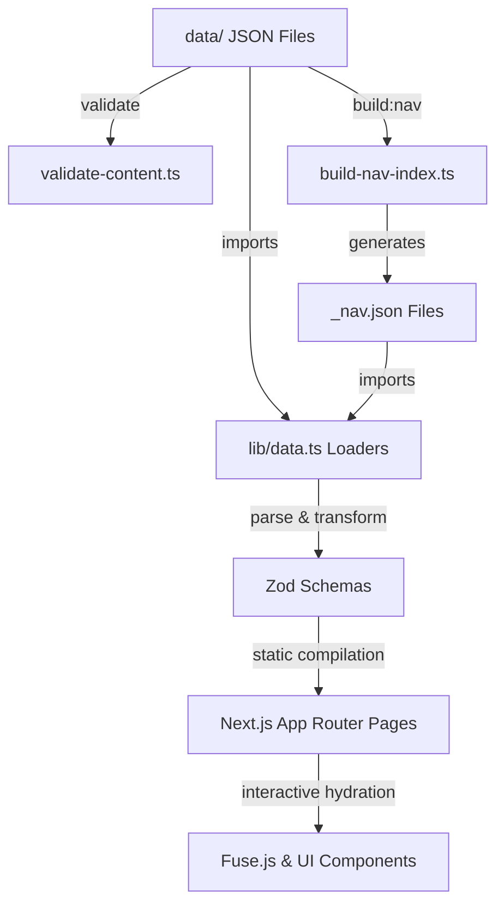

# AENS Phase-1 Architecture Freeze Report

## Document Metadata
* **Architecture Version:** 2.0
* **Freeze Status:** FROZEN
* **Freeze Date:** 2026-07-14
* **Repository:** `Mohammad-Zahed-Hossen/AI_Engineering_Handbook`
* **Author:** Antigravity AI Engineering Assistant
* **Review Status:** APPROVED & SIGNED-OFF

---

## 2. Executive Summary

This report documents the architectural baseline of the AI Engineering Navigation System (AENS) at the official conclusion of Phase-1. The primary objective of Phase-1 was to design, implement, and validate the structural schemas, relationship models, client-side search engines, and page-rendering modules necessary to support a curated knowledge base of high-density AI engineering resources.

With the successful execution of content validation scripts, static compilation pipelines, and UX enhancements, the structural architecture of the repository is officially frozen. "Architecture Freeze" implies that all Zod schemas, data directory structures, relationship mechanisms, and validation invariants are locked. The system is certified to scale to the target volume of 150–250 flagship resources without requiring modifications to the core engine.

This document serves as the permanent engineering record of the frozen state. Future contributors must read this report in its entirety before attempting to modify any schema, relationship field, or build script. Adherence to the rules and invariants documented herein is mandatory to prevent structural drift and maintain the integrity of the knowledge graph.

---

## 3. Freeze Scope

The Phase-1 Architecture Freeze explicitly covers and locks the following components:

### In-Scope
* **Content Schemas:** The Zod schemas defining the shape of the nine content types (Package, Model, Workflow, Cheatsheet, Registry, Pattern, Debug Guide, Decision Guide, Principle) located in `lib/schemas/`.
* **Knowledge Architecture:** The flat file-based JSON storage model inside `data/` and its subdirectories.
* **Relationship Model:** The typed graph representation (14 relationship types) and the bidirectional mapping rules.
* **Navigation Architecture:** The dynamic generation of lightweight sidebar indexes (`_nav.json`) by `scripts/build-nav-index.ts`.
* **Validation Pipeline:** The verification rules implemented in `scripts/validate-content.ts` (JSON parsing, slug constraints, metadata quality, bidirectional reference completeness).
* **Rendering Architecture:** Next.js pages, layouts, and the shared component suite (`components/shared/*`) optimized for high-density, accessible technical reference.

### Out-of-Scope (Explicitly Excluded)
* **Dynamic Persistence Engines:** Relational databases, document stores, or graph databases (storage remains strictly flat JSON files in Git).
* **Enterprise Search Servers:** External services such as Elasticsearch, Meilisearch, or Typesense (search remains strictly client-side via Fuse.js).
* **Semantic Vector Indexes:** Machine learning-driven vector search or embedding retrieval (postponed to future phases).
* **Dynamic Content Editing:** In-app editing, draft submission portals, or CMS integrations (all content contributions occur via pull requests).

---

## 4. Repository Snapshot

The following snapshot represents the verified metrics and state of the repository at the moment of freeze:

| Metric | Value |
| :--- | :--- |
| **Architecture Version** | 2.0 |
| **Repository Version** | 0.1.0 |
| **Freeze Date** | 2026-07-14 |
| **Git Tag** | `<TO_BE_FILLED_AFTER_TAG_CREATION>` |
| **Git Commit Hash** | `<TO_BE_FILLED_AFTER_COMMIT>` |
| **Total Content Types** | 9 |
| **Total Schema Files** | 12 |
| **Total Data Files** | 75 |
| **Total Validation Scripts** | 1 |
| **Total Navigation Files** | 14 |
| **Total Shared Components** | 40 |

---

## 5. Architecture Overview

### Content & Knowledge Architecture
All knowledge is stored as static JSON files in flat folders within `data/`. Each file corresponds to one canonical resource. Content types are divided based on knowledge ownership to ensure single-responsibility metadata.

### Relationship Architecture
Relationships are modeled as a directed, typed graph. Rather than relying on unstructured arrays, relations are declared using either the generic `related_content` array (which specifies `id`, `type`, and `relationship_type`) or type-specific fields (e.g. `related_models`). The schema enforces that every relationship is reciprocal (e.g., if a workflow uses a pattern, the pattern must acknowledge it is used by the workflow).

### Schema & Validation Architecture
Zod defines runtime constraints. The validation script (`scripts/validate-content.ts`) runs as a mandatory prebuild step. It blocks the build if it detects structural deviations, broken cross-references, unreciprocated relationships, or placeholder values.

---

## 6. Final Content Type Inventory

The repository supports the following nine content types:

| Content Type | Schema | Data Location | Route | Status | Notes |
| :--- | :--- | :--- | :--- | :--- | :--- |
| **Package** | `PackageSchema` | `data/packages/*.json` | `/packages/[id]` | Stable | Owns library implementation details. |
| **Model** | `ModelSchema` | `data/models/{ml,dl,llm}/*.json` | `/models/[category]/[id]` | Stable | Documented exception; uses transform layer. |
| **Workflow** | `WorkflowSchema` | `data/workflows/*.json` | `/workflows/[id]` | Stable | Owns end-to-end process pipelines. |
| **Cheatsheet** | `CheatsheetSchema` | `data/cheatsheets/*.json` | `/cheatsheets/[id]` | Stable | Owns quick syntax reference and command tables. |
| **Registry** | `RegistryModelSchema` | `data/registry/*.json` | `/registry/[task]` | Stable | Documented exception; lists third-party assets. |
| **Pattern** | `PatternSchema` | `data/patterns/*.json` | `/patterns/[id]` | Stable | Owns architectural concept patterns. |
| **Debug Guide** | `DebugGuideSchema` | `data/debug-guides/*.json` | `/debug-guides/[id]` | Stable | Owns troubleshooting guides. |
| **Decision Guide** | `DecisionGuideSchema` | `data/decision-guides/*.json` | `/decision-guides/[id]` | Stable | Owns tradeoff evaluation criteria. |
| **Principle** | `PrincipleSchema` | `data/principles/*.json` | `/principles/[id]` | Stable | Owns fundamental engineering rules and axioms. |

---

## 7. Final Schema Inventory

The validation schemas reside in `lib/schemas/`. The final schema suite consists of:

1. `base.ts`: Defines `BaseMetaSchema`, containing shared metadata fields (identity, discovery, classification, learning, maintenance, versioning, and governance) inherited by 8 of the 9 content types.
2. `package.ts`: Defines `PackageSchema`, validating task lists, code templates, and library version constraints.
3. `model.ts`: Defines `ModelSchema`, validating decisions summaries, complexity specifications, hyperparameters, and comparisons.
4. `workflow.ts`: Defines `WorkflowSchema`, validating logical execution steps and prerequisites.
5. `cheatsheet.ts`: Defines `CheatsheetSchema`, validating quick references and entry-based syntax blocks.
6. `registry.ts`: Defines `RegistryModelSchema`, validating hardware requirements, sizes, and licenses.
7. `pattern.ts`: Defines `PatternSchema`, validating core concepts, applicability rules, and implementation patterns.
8. `debug-guide.ts`: Defines `DebugGuideSchema`, validating symptoms, root causes, and recovery strategies.
9. `decision-guide.ts`: Defines `DecisionGuideSchema`, validating comparative options and evaluation matrices.
10. `principle.ts`: Defines `PrincipleSchema`, validating architectural statements and guidelines.

### Schema Philosophy
* **Zod-Based Enforcement:** All validation occurs at compile-time by parsing raw JSON files against Zod schemas.
* **Unified Version Mapping:** Managed under `aens.config.json`, which points version `"2.0"` to the schema definitions.
* **Transform Layer Compatibility:** For legacy schemas or special formats (e.g. `ModelSchema`), Zod's `.transform()` parses custom structures into standardized properties compatible with the UI layer.

---

## 8. Final Relationship Architecture

AENS implements a bidirectional graph where relationships are verified on both ends.

### Relationship Fields
Content types define relationships using the following fields:
* **Generic:** `related_content` (for packages, cheatsheets, and models) containing an array of `{ id, type, relationship_type }`.
* **Type-Specific Fields:** Used in patterns, workflows, debug guides, decision guides, and principles:
  * `related_models`
  * `related_packages`
  * `related_workflows`
  * `related_patterns`
  * `related_principles`
  * `related_debug_guides`
  * `related_registry`
  * `referenced_by_patterns`
  * `referenced_by_models`
  * `referenced_by_workflows`

### Integrity & Validation
* **Single Source of Truth:** Relationships are defined inside static JSON files.
* **Bidirectional Enforcement:** If document `X` references document `Y` via any relationship field, document `Y` must contain a matching reference pointing back to `X`. The validator script (`validate-content.ts`) performs a cross-join of all parsed documents and raises a blocking build error if any link is one-sided.
* **Rendering Resolve:** Page loaders in `lib/data.ts` and relationship resolvers in `lib/relationships.ts` automatically match these IDs and populate cross-page hyperlinks.

---

## 9. Validation Guarantees

Passing the content validation script (`npm run validate`) guarantees that:

1. **Schema Conformity:** Every JSON file adheres strictly to its specified schema.
2. **Reference Integrity:** No reference points to a non-existent file or invalid content type.
3. **Bidirectional Completeness:** The reference graph is fully closed; all relationships are reciprocated.
4. **ID and Filename Consistency:** The `id` declared inside a file matches its filename exactly, and matches slug constraints.
5. **No Placeholders:** The files contain no draft strings, placeholder texts, or unresolved TODOs.
6. **Maturity & Classification Ranges:** All enum values (lifecycles, engineering maturity, stability levels) are valid and constrained.
7. **URL Uniqueness:** No duplicate URLs are declared across sources and learning resources.

---

## 10. Documented Exceptions

The following exceptions are formally accepted as permanent parts of the Phase-1 architecture:

### 1. Model Schema Divergence
* **Reason:** Predates the unified `BaseMetaSchema` architecture and has a high content density (30 live files).
* **Scope:** All files in `data/models/`.
* **Status:** Permanent Accepted Exception.
* **Rationale:** Rewriting 30 model JSON files to fit `BaseMetaSchema` would introduce high refactoring risk. Instead, a `.transform()` layer at the end of `lib/schemas/model.ts` normalizes snake_case/camelCase keys at runtime, ensuring complete compatibility with the layout components.

### 2. Registry Detail Page and Navigation Bypass
* **Reason:** Registry content is structured as flat list arrays rather than separate documents.
* **Scope:** `data/registry/llms.json`.
* **Status:** Permanent Accepted Exception.
* **Rationale:** The registry contains a collection of model metadata entries rather than a single knowledge resource. It has no dedicated sidebar navigation file and is rendered via a task-based route (`/registry/[task]`) instead of ID.

---

## 11. Phase-1 Decisions

The following architectural decisions are locked into the system:

1. **Removal of Duplicate Related Content:**
   * *Reason:* Redundant references in both generic and type-specific arrays led to rendering duplicates.
   * *Impact:* Consolidated all relationship declarations to prevent UI duplication.
   * *Status:* Permanent.

2. **Migration to Type-Specific Relationships:**
   * *Reason:* Weakly typed generic references allowed invalid relationships (e.g. linking to a model where a package was expected).
   * *Impact:* Explicit Zod fields (e.g., `related_models`) enforce target type validity.
   * *Status:* Permanent.

3. **Registry Slimming:**
   * *Reason:* Initial drafts attempted to store complex code blocks in the registry.
   * *Impact:* Refactored to only store metadata (size, hardware requirements, sources), offloading execution templates to Packages.
   * *Status:* Permanent.

4. **Validator Synchronization:**
   * *Reason:* Developers committing files without running validation broke build logs.
   * *Impact:* Integrated `validate` directly into Next.js `prebuild` hook.
   * *Status:* Permanent.

---

## 12. Freeze Acceptance Criteria

The following conditions were met prior to sealing the Phase-1 architecture:
* [x] **Zod Schema Consistency:** All schemas compiled and verified against TypeScript compilation targets.
* [x] **Content Validation:** The validation script completed with `0` errors.
* [x] **Relational Verification:** All bidirectional pointers resolved correctly without broken links.
* [x] **Component Integration:** The visual component tree resolved all model visual refactor layouts.
* [x] **Production Build Check:** `npm run build` executed successfully without compilation issues.

---

## 13. Final Verification Summary

The final verification run yielded the following results:

| Check | Result | Explanation |
| :--- | :--- | :--- |
| **Schema Consistency** | **PASS** | Checked against typescript definitions. No type mismatches. |
| **Data Consistency** | **PASS** | All 75 JSON files match schema constraints exactly. |
| **Repository Consistency** | **PASS** | Directory layout matches `DIRECTORY_STRUCTURE.md`. |
| **Validation Consistency** | **PASS** | Validator completed with 0 errors. |
| **Architecture Consistency** | **PASS** | UI components resolve transformed properties seamlessly. |
| **Documentation Consistency** | **PASS** | Freeze report reflects the exact state of schemas and files. |
| **Regression Verification** | **PASS** | Checked for double-escaped newlines and link integrity. |

---

## 14. Freeze Decision

> [!IMPORTANT]
> **Architecture Version:** 2.0  
> **Freeze Status:** FROZEN  
> **Effective Date:** 2026-07-14  
> **Decision:** The Phase-1 core structural architecture is officially declared frozen. No schema modifications, directory structure updates, or validation relaxations will be accepted without an official Architecture Decision Record (ADR) and review. All future engineering resources must conform to the structures locked in this report.

---

## 15. Repository Invariants

Future changes must strictly adhere to these invariants:

1. **No Schema Changes Without Version Increment:** Modifying any schema in `lib/schemas/` requires incrementing the architecture version in `aens.config.json` and updating this report.
2. **Strict Bidirectional Verification:** No PR containing one-sided relationships will pass validation.
3. **No Validation Bypass:** Do not bypass or disable checks in `validate-content.ts`.
4. **No New Content Types Without Review:** Adding a tenth content type requires architecture review and updates to `aens.config.json`.
5. **No Duplicate Relationship Mechanisms:** Do not mix generic `related_content` and type-specific fields for the same relationship.

---

## 16. Change Control Policy

Post-freeze modifications must follow this policy:

* **Patch:** Minor modifications to description fields, typo fixes, or metadata corrections. (Requires only a PR passing validation).
* **Minor Architecture Version:** Adding optional metadata fields or non-breaking schema additions. (Requires updating schemas, running validation, and updating this report).
* **Major Architecture Version:** Breaking changes to existing schemas or removing relationships. (Requires updating schemas, running data migration scripts, full review, and ADR).
* **Repository Migration:** Changing data locations or storage formats. (Requires major version bump and architectural review).

---

## 17. Historical Record

* **Phase-1 Architecture Frozen:** 2026-07-14
* **Base Schema Version:** 2.0
* **Git Tag:** `<TO_BE_FILLED_AFTER_TAG_CREATION>`
* **Git Commit:** `<TO_BE_FILLED_AFTER_COMMIT>`
* **Final Verification Status:** **PASSED**
* **Status:** Permanent Archive Record
