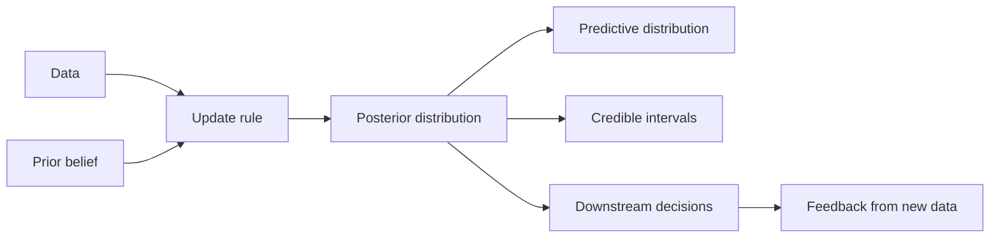

# Bayesian Inference

## Overview

Bayesian Inference is the principle of carrying uncertainty through the model rather than collapsing it into a single best parameter value. In AI engineering systems, it matters because uncertainty-aware inference enables calibrated prediction, safer downstream decision-making, and explicit reasoning about epistemic uncertainty when data are sparse or ambiguous.[^1][^2]

## Problem

When AI models are trained by optimizing a single point estimate via maximum likelihood or empirical risk minimization, they ignore the full distribution over model parameters and predictions, leading to overconfident outputs, inability to detect out-of-distribution inputs, and failure to propagate uncertainty through downstream pipelines. This is especially damaging in systems that make sequential decisions, fuse multiple model outputs, or expose probabilities to other services that assume those probabilities are meaningful.[^3][^1]

## Statement

Represent unknowns as distributions, update beliefs with data, and use the posterior—not just a point estimate—to drive prediction, calibration, and decision-making.[^2][^1]

## Intuition

A point estimate says “this is the answer,” while Bayesian inference says “this is the current belief state, and it should change when new evidence arrives.” The engineering value is that the posterior makes uncertainty an explicit artifact that can be inspected, composed, and passed downstream instead of being lost at the model boundary. That matters whenever the cost of wrong confidence is high or when the input regime is too sparse, noisy, or shifted for a single parameter vector to be a trustworthy summary.[^1][^3]

## Engineering Consequences

- **Uncertainty propagation** - Posteriors allow predictive uncertainty to be carried into ranking, thresholding, and decision logic instead of freezing the model into a single deterministic output.[^1]
- **Calibration discipline** - Bayesian updating provides a structured way to distinguish confidence from evidence, which is essential for systems that need reliable probabilities rather than only accurate labels.[^2]
- **OOD sensitivity** - When the posterior is informative, uncertainty can increase under unfamiliar inputs, improving detection of regimes where the model has weak support.[^3]
- **Data efficiency** - Informative priors help stabilize inference in low-data or high-noise regimes, reducing the brittleness of purely point-estimate training.[^2][^1]
- **Model comparison** - Posterior-aware workflows support principled comparison through marginal likelihood, predictive checks, and posterior predictive performance rather than relying on a single fit score.[^2]

## Common Violations

- **Violation** - A posterior is approximated or ignored, and the system exposes only point predictions.
**Symptoms** - Confidence scores stay high on ambiguous or unfamiliar inputs, and downstream services over-trust model outputs.
**Why It Happens** - The pipeline is optimized for throughput or simplicity, so uncertainty is dropped at the interface boundary.[^3][^1]
- **Violation** - Bayesian language is used, but the posterior is replaced by a heuristic uncertainty proxy.
**Symptoms** - “Uncertainty” looks plausible in demos but fails under stress tests, small sample settings, or distribution shift.
**Why It Happens** - The team substitutes a convenience approximation for posterior inference without checking what uncertainty the approximation actually captures.[^3]
- **Violation** - Priors are chosen casually or not at all in low-data regimes.
**Symptoms** - Estimates are unstable across retrains, and small data changes produce large swings in predictions.
**Why It Happens** - The prior is treated as optional decoration instead of part of the inference model.[^1][^2]
- **Violation** - Posterior summaries are interpreted as if they were frequentist confidence intervals.
**Symptoms** - Decision thresholds are misread, and reported intervals are used as if they had the wrong coverage semantics.
**Why It Happens** - The semantics of credible intervals and posterior probabilities are not kept distinct from point-estimation reporting.[^2]

## Appears In

- **Probabilistic modeling** - Examples include Bayesian neural networks, probabilistic regression, and latent-variable models where inference over parameters is part of the task.
- **Risk-sensitive decision systems** - Examples include medical triage, autonomous systems, and financial forecasting where calibrated uncertainty directly affects downstream actions.
- **Small-data or sparse-data learning** - Examples include scientific modeling, remote sensing, and industrial diagnostics where informative priors materially improve robustness.[^1]
- **Model monitoring and validation** - Examples include uncertainty calibration checks, posterior predictive checks, and Bayesian model comparison workflows.[^2]

## Mental Model

## Decision Checklist

- Do I need calibrated uncertainty rather than only point accuracy?
- Is the data regime sparse, noisy, or shifted enough that a point estimate is not sufficient?
- Do I have a meaningful prior or structural assumption to encode?
- Will downstream consumers benefit from posterior predictive distributions instead of deterministic outputs?
- Am I preserving uncertainty through the full pipeline rather than collapsing it at one interface?
- Is the chosen approximation faithful to the posterior quantity I actually need?

## Misconceptions

- **Myth** - Bayesian inference is only for academic models or small datasets.
**Reality** - It is most valuable whenever uncertainty must be explicit and decision consequences are asymmetric.[^1][^2]
- **Myth** - A good point estimate makes posterior inference unnecessary.
**Reality** - Point estimates erase parameter uncertainty, which can be the dominant error source in low-data or shifted regimes.[^3]
- **Myth** - Any approximate Bayesian method gives reliable uncertainty.
**Reality** - Approximation quality varies, and some methods preserve predictive fit while distorting posterior uncertainty.[^3]
- **Myth** - Credible intervals and confidence intervals are interchangeable.
**Reality** - They have different meanings and should not be reported or consumed as if they were the same.[^2]

## Engineering Heuristic

If the output will drive a decision, preserve the uncertainty that the decision depends on.

## Historical Origin

The concept is well established in classical statistics through Bayes, Laplace, Jeffreys, and later modern computational statistics, then adapted into machine learning through probabilistic modeling, Bayesian decision theory, and approximate inference methods such as MCMC and variational inference.[^1][^2]

## Tradeoffs

- **Benefits**
    - Explicit uncertainty quantification.
    - More robust behavior under limited data.
    - Principled incorporation of prior knowledge.
    - Better decision-making when uncertainty matters.[^1][^2]
- **Costs**
    - Higher computational and implementation complexity.
    - Approximate inference can be difficult to validate.
    - Posterior quality is sensitive to modeling and approximation choices.
    - Calibration and interpretability can degrade if the approximation is poor.[^3]

## Limitations

- It can be computationally expensive at modern model scales.
- Approximate inference may distort uncertainty if not validated against the quantity of interest.
- It is less useful when the decision problem does not depend on uncertainty.
- It can be counterproductive when the prior overwhelms weak but real evidence in a badly specified model.[^3][^1]

## Related Concepts

- Maximum likelihood estimation.
- Posterior distribution.
- Prior distribution.
- Credible interval.
- Bayesian neural network.
- MCMC.
- Variational inference.
- Bayesian updating.
- Marginal likelihood.
- Predictive distribution.

## Further Study

### Seminal Papers

- Aires, Prigent, and Rossow, *Neural network uncertainty assessment using Bayesian statistics*.[^1]
- Yao, Pan, Ghosh, and Doshi-Velez, *Quality of Uncertainty Quantification for Bayesian Neural Network Inference*.[^3]
- Diebold, Schorfheide, and others on Bayesian inference and model evaluation in applied settings.[^2]

### Books

- Andrew Gelman et al., *Bayesian Data Analysis*.[^2]
- Christopher M. Bishop, *Pattern Recognition and Machine Learning*.[^4]
- David J. C. MacKay, *Information Theory, Inference, and Learning Algorithms*.[^5]

### Official Documentation

- PubMed record for *Neural network uncertainty assessment using Bayesian statistics*.[^1]
- Columbia University book page for *Bayesian Data Analysis*.[^2]
- arXiv record for *Quality of Uncertainty Quantification for Bayesian Neural Network Inference*.[^3]

## Suggested Meta

- **Tags:** learning-theory, probabilistic-modeling, uncertainty-quantification, bayesian-methods, posterior-inference
- **Aliases:** bayesian-learning, posterior-estimation, bayesian-updating, credible-intervals, prior-posterior
- **Keywords:** bayesian, inference, posterior, prior, likelihood, uncertainty, epistemic, aleatoric, mcmc, variational-inference, bayesian-neural-network, conjugate-prior, marginal-likelihood
- **Search Tokens:** bayesian inference, posterior distribution, prior distribution, likelihood function, bayesian neural network, mcmc, variational inference, uncertainty quantification, epistemic uncertainty, credible interval, bayesian updating, conjugate prior
- **Difficulty:** Advanced
- **Domain:** learning_theory
- **Engineering Area:** probabilistic_modeling
- **Estimated Reading Time:** 15-20 minutes
- **Prerequisites:** None
- **Recommended Next:** maximum-likelihood-estimation, regularization, variational-inference, ensemble-methods
- **Cross-Links:**
    - referenced_by_patterns: training-loop, gradient-accumulation, kv-cache, mixed-precision, checkpointing, early-stopping, gradient-checkpointing, flash-attention, prompt-caching, streaming-inference, batch-inference
    - referenced_by_models: llama, mistral, bert
    - referenced_by_workflows: build-rag-system, fine-tune-llm-lora-qlora
[^10][^11][^12][^13][^14][^15][^16][^17][^18][^19][^20][^21][^22][^23][^24][^25][^26][^27][^28][^29][^30][^31][^32][^33][^34][^35][^36][^37][^38][^39][^40][^41][^42][^43][^44][^45][^46][^47][^48][^49][^6][^7][^8][^9]

⁂

[^1]: https://muse.jhu.edu/article/877894

[^2]: https://www.degruyterbrill.com/document/doi/10.1515/snde-2022-0055/html

[^3]: https://ieeexplore.ieee.org/document/8695637/

[^4]: https://www.semanticscholar.org/paper/eccb88fac455ed429884765f18c49296891185dc

[^5]: https://pubs.aip.org/aip/acp/article/1553/1/139-146/855810

[^6]: https://onlinelibrary.wiley.com/doi/10.1002/for.1195

[^7]: http://www.emerald.com/aea/article/28/83/111-131/59485

[^8]: https://www.tandfonline.com/doi/full/10.1080/10543406.2019.1632874

[^9]: https://ceur-ws.org/Vol-2563/aics_15.pdf

[^10]: https://arxiv.org/abs/2501.08285

[^11]: https://pubmed.ncbi.nlm.nih.gov/15476606/

[^12]: http://proceedings.mlr.press/v108/pearce20a/pearce20a.pdf

[^13]: https://arxiv.org/abs/1906.09686

[^14]: https://people.csail.mit.edu/lrchai/files/Chai_thesis.pdf

[^15]: https://www.sciencedirect.com/science/article/abs/pii/S0045782521004102

[^16]: https://openreview.net/pdf?id=tEw4vEEhHjI

[^17]: https://journals.sagepub.com/doi/10.1177/16878132241239802

[^18]: https://arxiv.org/html/2406.14838v1

[^19]: https://www.degruyter.com/document/doi/10.1524/strm.2013.1113/html

[^20]: https://www.cambridge.org/core/product/identifier/CBO9780511790942A170/type/book_part

[^21]: https://www.semanticscholar.org/paper/4ef15838204b7e6d043dcf0b51b6c78488bde6b6

[^22]: https://www.semanticscholar.org/paper/cc9eed3a20dc57987c7ff4a57bac6c4bc6dea730

[^23]: https://journals.sagepub.com/doi/10.1177/0049124107299429

[^24]: https://journals.sagepub.com/doi/10.1177/09622802070160030703

[^25]: https://onlinelibrary.wiley.com/doi/10.1002/9781119970606.ch3

[^26]: https://linkinghub.elsevier.com/retrieve/pii/C20090016742

[^27]: https://www.amazon.com/Bayesian-Analysis-Chapman-Statistical-Science/dp/1439840954

[^28]: https://sites.stat.columbia.edu/gelman/book/contents3.pdf

[^29]: https://www.amazon.com/Bayesian-Analysis-Chapman-Statistical-Science/dp/0412039915

[^30]: https://www.amazon.com/Bayesian-Analysis-Chapman-Statistical-2013-11-01/dp/B01JNVQ2QC

[^31]: https://www.barnesandnoble.com/w/bayesian-data-analysis-andrew-gelman/1136630656

[^32]: https://www.scribd.com/document/975544982/Bayesian-data-analysis-3rd-Edition-Gelman-A-ebook-safe-download

[^33]: https://www.taylorfrancis.com/books/mono/10.1201/9780429258480/bayesian-data-analysis-andrew-gelman-donald-rubin-hal-stern-john-carlin

[^34]: https://books.google.de/books?id=047qjwEACAAJ

[^35]: https://sites.stat.columbia.edu/gelman/book/

[^36]: https://shop.elsevier.com/books/doing-bayesian-data-analysis/kruschke/978-0-12-405888-0

[^37]: http://link.springer.com/10.1007/978-3-319-54274-4_8

[^38]: https://www.semanticscholar.org/paper/275578070fa97c1fe702098b4e40d538de5a21a4

[^39]: https://www.semanticscholar.org/paper/9a49d022fb83ae3b5a836c22209a4d06cc11fd72

[^40]: https://www.cambridge.org/core/product/identifier/9781108646185/type/book

[^41]: https://www.semanticscholar.org/paper/708b4a17c3cce1ed4a58e30d661bacc65ac6ba9d

[^42]: https://academic.oup.com/book/11531

[^43]: https://www.semanticscholar.org/paper/5d7dc5a7b10a4d81e4a774847de5fd790f39b853

[^44]: http://link.springer.com/10.1007/s00362-012-0428-3

[^45]: http://www.stat.ucla.edu/~sczhu/Courses/UCLA/Stat_202C/MCMC_book.pdf

[^46]: https://books.google.com/books/about/Markov_Chain_Monte_Carlo.html?hl=ms\&id=yPvECi_L3bwC

[^47]: https://par.nsf.gov/servlets/purl/10161394

[^48]: https://link.springer.com/book/10.1007/978-1-84996-187-5

[^49]: https://www.nature.com/articles/s41598-025-24093-6

