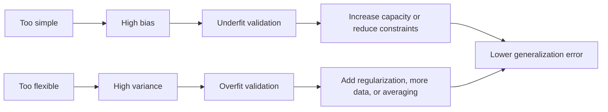

# Bias–Variance Tradeoff

## Overview

Bias–Variance Tradeoff is the principle that generalization failure is often traceable to the balance between systematic error and sensitivity to training data, not to model accuracy on the training set alone. For AI engineering systems, it is the diagnostic frame that keeps model selection, regularization, and data scaling grounded in out-of-sample behavior rather than incidental training gains.[^1][^2]

## Problem

When AI models exhibit high bias or high variance, engineers lack the diagnostic framework to identify which error source dominates, leading to misguided interventions, wasted training cycles, and models that fail to generalize to production data. Modern neural systems complicate this further because optimization effects and data sampling effects can both influence the observed error profile.[^2]

## Statement

Select model capacity, regularization, data, and training procedure to minimize generalization error by balancing underfitting and overfitting rather than optimizing training loss in isolation.[^1][^2]

## Intuition

The useful mental model is not “make the model bigger or smaller,” but “find the regime where added flexibility stops reducing systematic error faster than it increases sensitivity to noise.” In practice, the wrong response to poor validation performance depends on the dominant error source: more capacity can help underfitting, while more regularization, more data, or more careful averaging can help overfitting. The tradeoff is therefore a decision rule for intervention selection, not just a descriptive property of models.[^2][^1]

## Engineering Consequences

- **Model selection discipline** - Choosing architectures by validation behavior rather than training fit prevents teams from mistaking memorization for capability.[^1]
- **Regularization targeting** - The tradeoff tells engineers whether to reduce variance with penalties, noise, averaging, or more data, or to reduce bias by increasing capacity or relaxing constraints.[^3][^2]
- **Experiment efficiency** - A correct diagnosis avoids brute-force hyperparameter sweeps that explore the wrong side of the tradeoff and burn compute without improving generalization.[^2]
- **Production robustness** - Models tuned to the right bias–variance regime are less brittle under distribution shift and validation-set variance, improving downstream stability.[^1][^2]
- **Algorithm comparison** - The principle explains why different model classes can win in different data regimes, so comparisons must be made at equal generalization targets rather than equal training loss.[^4][^1]

## Common Violations

- **Violation** - Engineers optimize training loss and treat it as evidence of progress.
**Symptoms** - Training metrics improve while validation metrics plateau or worsen, and model updates become harder to justify.
**Why It Happens** - The training objective is easier to observe than the generalization objective, so teams overfit the observable signal.[^1]
- **Violation** - Validation loss is interpreted without checking whether the model is bias-dominated or variance-dominated.
**Symptoms** - Capacity changes, data changes, and regularization changes are applied interchangeably with inconsistent results.
**Why It Happens** - Teams skip diagnosis and jump directly to tuning actions.[^2]
- **Violation** - Wider or deeper models are assumed to be strictly worse because they “overfit.”
**Symptoms** - Underpowered models remain in production, with persistent underfitting and poor calibration to task complexity.
**Why It Happens** - Classic intuition is applied without checking whether the model is actually bias-limited rather than variance-limited.[^2]
- **Violation** - Early stopping, checkpoint averaging, or regularization are applied as generic defaults rather than as variance-control mechanisms.
**Symptoms** - Improvements are unstable across tasks, and tuning recipes fail to transfer across datasets.
**Why It Happens** - The method is used as a ritual instead of a targeted response to a measured failure mode.[^3]

## Appears In

- **Supervised learning** - Examples include regression, classification, boosted trees, and neural networks where generalization error is the main selection criterion.
- **Deep learning** - Examples include overparameterized networks where the classical U-shaped error curve may not hold cleanly and optimization effects interact with sampling effects.[^2]
- **Ensemble methods** - Examples include bagging, random forests, and checkpoint averaging, which are often used to reduce variance while keeping bias stable.[^4]
- **Model evaluation workflows** - Examples include cross-validation, early stopping, and ablation studies that estimate which side of the tradeoff is dominant.

## Mental Model

## Decision Checklist

- Is validation error dominated by underfitting rather than noisy training fit?
- Does increasing capacity improve validation performance before it starts to degrade?
- Are regularization and data augmentation being used to control variance rather than compensate for insufficient representation?
- Have I separated optimization error from sampling error when interpreting model behavior?
- Is the chosen intervention tied to a diagnosed failure mode, not a default recipe?

## Misconceptions

- **Myth** - The tradeoff always means bigger models overfit and smaller models generalize better.
**Reality** - Modern overparameterized models can reduce both bias and variance in some regimes.[^2]
- **Myth** - A low training error guarantees a good bias–variance balance.
**Reality** - Training fit alone says little about whether the model will generalize out of sample.[^1]
- **Myth** - Regularization always improves generalization.
**Reality** - Regularization can increase bias if the model is already underfitting.[^3][^1]
- **Myth** - The bias–variance tradeoff is a fixed law with one universal shape.
**Reality** - Its empirical form depends on model class, optimization, data regime, and loss decomposition.[^2]

## Engineering Heuristic

If validation gets worse, ask whether the model needs more expressiveness or less sensitivity before changing anything else.

## Historical Origin

The concept is well established in statistical learning theory and became central in machine learning through analyses of generalization error and nonparametric learning, especially the neural-network discussion by Geman, Bienenstock, and Doursat and later modern re-examinations in overparameterized settings.[^1][^2]

## Tradeoffs

- **Benefits**
    - Better diagnosis of generalization failure.
    - More targeted capacity and regularization choices.
    - Lower compute waste from misdirected tuning.
    - Better transfer of model-selection logic across tasks and architectures.[^1][^2]
- **Costs**
    - Requires validation infrastructure and disciplined evaluation.
    - Can be misread as a simple rule when the real behavior is model- and regime-dependent.
    - Modern systems may need more nuanced decompositions than the classical formulation provides.[^2]

## Limitations

- It is less decisive when validation data are too small or too noisy to separate bias from variance.
- It can be misleading if distribution shift dominates the error signal.
- In highly overparameterized systems, the classical monotonic intuition may not describe observed behavior well.
- It does not by itself determine the best optimization method, only the generalization regime to target.[^2]

## Related Concepts

- Generalization error.
- Overfitting.
- Underfitting.
- Regularization.
- Cross-validation.
- Model selection.
- Ensemble methods.
- Early stopping.
- Checkpoint averaging.

## Further Study

### Seminal Papers

- Geman, Bienenstock, and Doursat, *Neural Networks and the Bias/Variance Dilemma*.[^1]
- Neal et al., *A Modern Take on the Bias-Variance Tradeoff in Neural Networks*.[^2]
- Breiman, *Bagging Predictors*.[^4]

### Books

- Hastie, Tibshirani, and Friedman, *The Elements of Statistical Learning*.[^3]
- Bishop, *Pattern Recognition and Machine Learning*.[^5]
- Vapnik, *The Nature of Statistical Learning Theory*.[^6]

### Official Documentation

- arXiv abstract for *A Modern Take on the Bias-Variance Tradeoff in Neural Networks*.[^2]
- Neural Computation record for *Neural Networks and the Bias/Variance Dilemma*.[^1]
- Springer record for *An Efficient Method To Estimate Bagging's Generalization Error*.[^4]

## Suggested Meta

- **Tags:** learning-theory, ml-fundamentals, generalization, model-selection, bias-variance
- **Aliases:** bias-variance-decomposition, generalization-tradeoff, overfitting-underfitting
- **Keywords:** bias, variance, generalization, overfitting, underfitting, model-complexity, regularization
- **Search Tokens:** bias variance tradeoff, bias-variance decomposition, overfitting, underfitting, model complexity, generalization error
- **Difficulty:** Intermediate
- **Domain:** learning_theory
- **Engineering Area:** model_selection
- **Estimated Reading Time:** 15-20 minutes
- **Prerequisites:** None
- **Recommended Next:** regularization, cross-validation, ensemble-methods, model-selection
- **Cross-Links:**
    - referenced_by_patterns: training-loop, gradient-accumulation, kv-cache, mixed-precision, checkpointing, early-stopping, gradient-checkpointing, flash-attention, prompt-caching, streaming-inference, batch-inference
    - referenced_by_models: llama, mistral, bert
    - referenced_by_workflows: build-rag-system, fine-tune-llm-lora-qlora
[^10][^11][^12][^13][^14][^15][^16][^17][^18][^19][^20][^21][^22][^23][^24][^25][^26][^27][^28][^29][^30][^31][^32][^33][^34][^35][^7][^8][^9]

⁂

[^1]: https://aircconline.com/mlaij/V11N4/11424mlaij01.pdf

[^2]: https://arxiv.org/abs/2603.10385

[^3]: https://www.semanticscholar.org/paper/be51e9141ae2af4daf3a1ba745ad3ff66a5990f3

[^4]: https://arxiv.org/abs/2308.02870

[^5]: https://www.semanticscholar.org/paper/4ca8d9bb3981b723613a4faa6dd7973d7e120ebf

[^6]: https://ieeexplore.ieee.org/document/9922091/

[^7]: https://www.semanticscholar.org/paper/577d56aeb5187fe72e2746712da7df4724ecc392

[^8]: https://variancejournal.org/article/141805-bias-variance-tradeoff-a-property-casualty-modeler-s-perspective

[^9]: https://arxiv.org/abs/1810.08591

[^10]: https://papers.ssrn.com/sol3/papers.cfm?abstract_id=5086450

[^11]: https://ocw.mit.edu/courses/15-097-prediction-machine-learning-and-statistics-spring-2012/dec694eb34799f6bea2e91b1c06551a0_MIT15_097S12_lec04.pdf

[^12]: https://arxiv.org/pdf/1912.08286.pdf

[^13]: https://arxiv.org/pdf/2010.13933.pdf

[^14]: https://theory.stanford.edu/~aiken/publications/papers/popl14.pdf

[^15]: http://proceedings.mlr.press/v119/yang20j/yang20j.pdf

[^16]: https://www.casact.org/sites/default/files/2021-07/Bias-Variance-Tradeoff-Brady-Brockmeier.pdf

[^17]: https://openreview.net/pdf?id=HkgmzhC5F7

[^18]: https://www.sciencedirect.com/science/article/abs/pii/S2352012422009018

[^19]: https://onlinelibrary.wiley.com/doi/10.1111/j.1540-6261.1992.tb04402.x

[^20]: https://onlinelibrary.wiley.com/doi/10.1002/jae.3950070304

[^21]: https://link.springer.com/10.1023/A:1007519102914

[^22]: https://www.semanticscholar.org/paper/463a1779585aab66a6ef3fdc1b19e8c5d34d8070

[^23]: https://www.semanticscholar.org/paper/fd317f089b7005dd2c765ded8eb7c2e20b64a8d1

[^24]: http://baltijapublishing.lv/index.php/issue/article/view/3345

[^25]: https://www.tandfonline.com/doi/full/10.1080/09720510.2016.1187923

[^26]: https://www.semanticscholar.org/paper/e1d110694fa76c79081d65d2090ef90058490f79

[^27]: http://doursat.free.fr/docs/Geman_Bienenstock_Doursat_1992_bv_NeurComp.pdf

[^28]: https://www.sas.upenn.edu/~fdiebold/NoHesitations/BookAdvanced.pdf

[^29]: https://waxworksmath.com/Authors/G_M/Hastie/WriteUp/Weatherwax_Epstein_Hastie_Solution_Manual.pdf

[^30]: https://www.cse.iitm.ac.in/~vplab/courses/PRML/3_1_old.pdf

[^31]: https://www.semanticscholar.org/paper/Neural-Networks-and-the-Bias-Variance-Dilemma-Geman-Bienenstock/a34e35dbbc6911fa7b94894dffdc0076a261b6f0

[^32]: https://www.ias.informatik.tu-darmstadt.de/Publications/BibTex?id=312

[^33]: https://web.math.ku.dk/~richard/courses/stat_learn/allpdf/figures7.pdf

[^34]: https://theorempath.com/topics/elements-of-statistical-learning-book

[^35]: https://git.informatik.uni-leipzig.de/ls36hiqo/ocr-d/-/wikis/Literatur/diff?version_id=3d902e68f06e62d3fb8f478586c2e867f19d9386\&view=parallel

