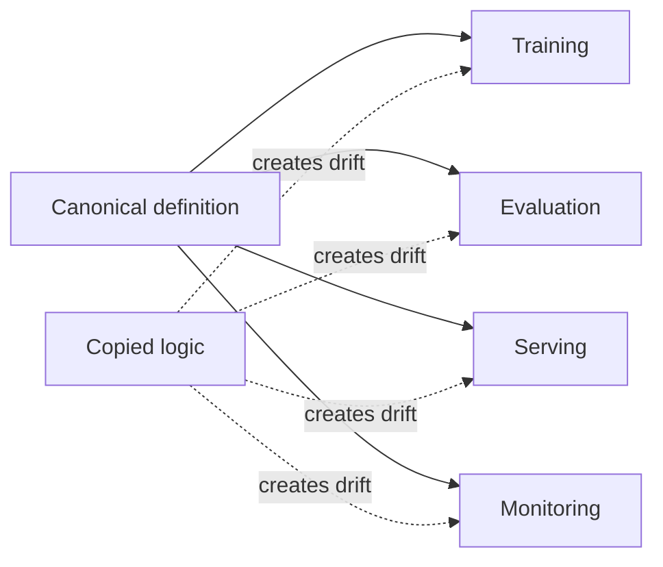

# DRY

## Overview

DRY is the maintainability principle that every piece of evolving knowledge should have a single authoritative representation. In AI engineering systems, it matters because duplicated logic across data pipelines, model code, and deployment configuration creates drift, change amplification, and inconsistent behavior under routine updates.[^1][^2]

## Problem

When AI engineering systems replicate preprocessing logic, model hyperparameters, feature definitions, or deployment configurations across notebooks, training scripts, serving code, and monitoring dashboards, every change becomes a multi-file hunt for duplicates, introducing drift, inconsistency, and subtle bugs that manifest only in production. The operational cost is not just extra editing work; it is fractured system behavior caused by multiple representations of the same engineering intent.[^2][^1]

## Statement

Represent each changing rule, transformation, or configuration once, and make every other consumer reference that canonical source rather than re-encoding the same knowledge independently.[^1][^2]

## Intuition

Duplication is a maintenance multiplier: every copied rule creates another place where the system can disagree with itself. In AI systems, that disagreement often appears as a preprocessing mismatch, a training-serving skew, or a stale parameter setting that was updated in one path but forgotten in another. DRY matters because it turns change from a search problem into a single edit with predictable downstream impact.[^2][^1]

## Engineering Consequences

- **Change safety** - One canonical definition reduces the chance that a correction is applied in one place but missed elsewhere, which is critical for preprocessing, feature engineering, and deployment settings.
- **Behavioral consistency** - Shared definitions keep training, evaluation, and serving aligned, reducing skew introduced by duplicated transformations.
- **Lower maintenance load** - Engineers spend less time tracing repeated logic and more time changing the actual policy once.
- **Bug surface reduction** - Fewer copies mean fewer opportunities for silent divergence, stale defaults, and contradictory assumptions.
- **Clearer ownership boundaries** - Canonical sources make it easier to identify which component owns a rule and which components merely consume it.

## Common Violations

- **Violation** - The same preprocessing logic is reimplemented in notebooks, batch jobs, and serving code.
**Symptoms** - Feature values differ between offline and online paths, and model performance degrades despite “matching” code.
**Why It Happens** - Teams copy logic for convenience instead of extracting a shared transformation boundary.[^2]
- **Violation** - Hyperparameters or schema constants are duplicated across training scripts and config files.
**Symptoms** - One path trains with stale settings, and experiment results cannot be reproduced exactly.
**Why It Happens** - Configuration is treated as an implementation detail rather than canonical system knowledge.
- **Violation** - Model- and dataset-specific rules are embedded in multiple downstream consumers.
**Symptoms** - Updating one rule requires a broad manual sweep, and some consumers continue to behave as if the old rule were still valid.
**Why It Happens** - The system lacks a single authoritative source for evolving knowledge.[^1]
- **Violation** - Monitoring and dashboard logic repeats business or feature definitions from pipeline code.
**Symptoms** - Metrics disagree with model behavior, and incident triage becomes a reconciliation exercise.
**Why It Happens** - Observability is built independently from the data and model contracts it is supposed to reflect.

## Appears In

- **Data pipelines** - Examples include shared feature definitions, centralized preprocessing, and schema-driven transformations used across ingestion and training.
- **Model training** - Examples include shared loss configuration, canonical hyperparameter sets, and reusable input normalization logic.
- **Serving systems** - Examples include common request validation, one source for feature computation, and shared model metadata consumption.
- **Evaluation and monitoring** - Examples include centralized metric definitions, consistent label mappings, and single-source dashboard calculations.

## Mental Model

## Decision Checklist

- Is this rule or transformation likely to change over time?
- Do multiple components need the same knowledge, or can they all reference one source?
- Would copying this logic create a training-serving or batch-online mismatch?
- Is there already a canonical owner for this definition?
- Can consumers depend on a shared abstraction instead of reimplementing behavior?
- Will duplication increase the cost of future changes more than abstraction increases complexity?

## Misconceptions

- **Myth** - DRY means every line of code must be abstracted immediately.
**Reality** - DRY targets duplicated knowledge that is likely to change, not every repeated syntax pattern.[^1]
- **Myth** - Copying code is harmless if the copies are small.
**Reality** - Small duplicates often become divergent precisely because they are easy to overlook during change.[^2]
- **Myth** - DRY only applies to code.
**Reality** - It applies to configurations, schemas, business rules, feature definitions, dashboards, and documentation artifacts that encode system knowledge.[^1]
- **Myth** - More abstraction always means better DRY compliance.
**Reality** - Excessive abstraction can hide meaning and make the system harder to evolve; the point is canonical representation, not abstraction for its own sake.[^2]

## Engineering Heuristic

If the same knowledge would need the same change in more than one place, it is a candidate for a single source of truth.

## Historical Origin

The principle was articulated in *The Pragmatic Programmer* by Andy Hunt and Dave Thomas and later reinforced in software design writing as a general rule for eliminating repeated knowledge and maintenance duplication.[^1][^2]

## Tradeoffs

- **Benefits**
    - Fewer divergent code paths.
    - Easier updates to shared rules and transformations.
    - Improved reproducibility across training, evaluation, and serving.
    - Lower maintenance cost and clearer ownership.[^1]
- **Costs**
    - More upfront design work to define canonical boundaries.
    - Shared abstractions can become too broad if forced too early.
    - Some repetition is cheaper than premature coupling in rapidly changing areas.
    - Centralized definitions can create bottlenecks if ownership is poorly managed.[^2]

## Limitations

- It is less useful for truly local, one-off logic that will never be reused or changed.
- It can become counterproductive when abstraction hides important context or creates brittle shared dependencies.
- It does not eliminate the need for deliberate duplication in generated artifacts or performance-critical specialized code.
- It should not be used to centralize unstable experimental logic that changes faster than the abstraction can absorb.

## Related Concepts

- Single source of truth.
- Separation of concerns.
- Modularity.
- Abstraction layers.
- Configuration as code.
- Canonical definition.
- Normalization.
- Change amplification.
- Shared libraries.
- Training-serving consistency.

## Further Study

### Seminal Papers

- Andy Hunt and Dave Thomas, *The Pragmatic Programmer*.[^1]
- Steve Smith, *Don’t Repeat Yourself*.[^2]
- Bertrand Meyer, *Object-Oriented Software Construction* and Design by Contract writings on coherent representation and change control.[^3]

### Books

- Andy Hunt and Dave Thomas, *The Pragmatic Programmer*.[^1]
- Steve Smith, *97 Things Every Programmer Should Know*.[^2]
- Martin Fowler, *Refactoring*.[^4]
- Bertrand Meyer, *Object-Oriented Software Construction*.[^3]

### Official Documentation

- The Open Source book article on additional design principles, including DRY and SPOT.[^1]
- O’Reilly excerpt of *97 Things Every Programmer Should Know* chapter on DRY.[^2]
- Springer paper on Single Source of Truth in service-oriented architecture.[^5]
[^10][^11][^12][^13][^14][^15][^16][^17][^18][^6][^7][^8][^9]

⁂

[^1]: https://www.semanticscholar.org/paper/0ebbd4140442f98226a990f544d3d940579fad72

[^2]: https://teses.usp.br/teses/disponiveis/45/45134/tde-20230727-113255/

[^3]: https://www.semanticscholar.org/paper/66bfae0f564128acd5c33f862d1222334203e6ec

[^4]: https://link.springer.com/10.1007/978-1-4419-7326-9

[^5]: https://www.semanticscholar.org/paper/6e39979a2de90a9aaf9661b2a341b637fb0dda97

[^6]: https://www.semanticscholar.org/paper/195ebfce48f9a8679af0928b3716dd21490a11b2

[^7]: http://ieeexplore.ieee.org/document/5189589/

[^8]: https://www.semanticscholar.org/paper/f2ad1c05beca060b2bec7f5c1b0aa87d033d3620

[^9]: https://www.oreilly.com/library/view/97-things-every/9780596809515/ch30.html

[^10]: https://media.pragprog.com/titles/tpp20/dry.pdf

[^11]: https://www.stat.auckland.ac.nz/~paul/ItDT/HTML/node23.html

[^12]: https://en.wikipedia.org/wiki/Don't_repeat_yourself

[^13]: https://www.amazon.com/Refactoring-Patterns-Joshua-Kerievsky/dp/0321213351

[^14]: https://ru.scribd.com/doc/45494123/DRY-Don-t-Repeat-Yourself

[^15]: https://softengbook.org/articles/other-design-principles

[^16]: https://link.springer.com/chapter/10.1007/978-3-662-45391-9_50

[^17]: https://www.academia.edu/44307353/Implementation_of_Dry_A_Principle_Software

[^18]: https://www.managementboek.nl/boek/9781098138868/data-management-at-scale-piethein-strengholt

