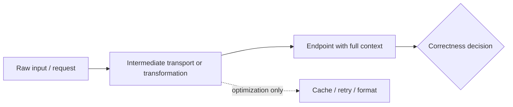

# End-to-End

## Overview

The End-to-End principle places correctness-critical responsibility at the endpoints rather than in opaque intermediate layers. In AI engineering systems, that means pushing integrity checks, semantic validation, and final correctness decisions to the components that have full context, while treating middle layers as transport or optimization mechanisms rather than sources of truth.[^1][^2]

## Problem

When AI engineering systems insert intermediate processing layers—feature extractors, format converters, or protocol adapters—between raw inputs and final outputs under the assumption that the middle layer can be trusted to maintain correctness, the endpoints become dependent on opaque transformations they cannot verify, creating hidden failure modes and forcing coordinated updates across the entire stack whenever an assumption changes. The result is fragile coupling, stale state, and a larger surface for silent corruption and compatibility drift.[^2][^1]

## Statement

Place correctness-sensitive logic where the full application context exists; let intermediate layers optimize, not decide correctness.[^1][^2]

## Intuition

If a middle layer cannot see the whole meaning of a transaction, it cannot guarantee the right outcome. In AI systems, the endpoint usually knows the true contract: whether a prediction is valid for a given task, whether a feature set is semantically compatible, whether a checkpoint is safe to load, or whether a response satisfies the user’s request. The principle matters because correctness claims made too early in the stack tend to be partial, and partial guarantees become dangerous when other layers start depending on them as if they were complete.[^2][^1]

## Engineering Consequences

- **Reduced hidden coupling** - Fewer correctness assumptions are embedded in shared infrastructure, so changes in one layer do not force synchronized updates everywhere.
- **Improved failure localization** - Errors are detected where the application has enough context to interpret them, which makes root cause analysis more actionable.
- **Better evolution of endpoints** - Endpoints can change semantics without requiring every intermediate layer to understand the new meaning in advance.
- **Cleaner responsibility boundaries** - Transport, routing, and formatting layers remain narrow, while application-specific correctness stays with the component that owns the contract.
- **Safer optimization** - Intermediate layers can still provide caching, retries, or performance improvements, but those optimizations do not masquerade as end-to-end correctness guarantees.

## Common Violations

- **Violation** - Middle layers enforce business or task semantics that only the endpoint can fully validate.
**Symptoms** - Systems appear to work until edge cases, new model versions, or new client behaviors break assumptions far from the original logic.
**Why It Happens** - Teams confuse convenience with correctness and promote partial checks into authoritative rules.[^1]
- **Violation** - Network, storage, or orchestration layers are trusted to certify final integrity.
**Symptoms** - A request is “acknowledged” upstream, but the endpoint later rejects it or finds it incomplete.
**Why It Happens** - Intermediate acknowledgements are mistaken for application success, even though they only prove transport progress.[^2][^1]
- **Violation** - Transformation layers become semantic choke points.
**Symptoms** - Schema changes, feature changes, or protocol changes require edits in multiple translators, adapters, and validators.
**Why It Happens** - The system accumulates reusable middleware that encodes assumptions better handled at the endpoint.
- **Violation** - Security or trust decisions are made before the endpoint has the full identity and context needed.
**Symptoms** - Authentication and authorization logic diverge across layers, creating inconsistent access behavior.
**Why It Happens** - Designers try to reduce endpoint complexity by pushing policy into shared infrastructure, which weakens the trust boundary model.[^2]

## Appears In

- **Training pipelines** - Examples include endpoint-level validation of labels, loss targets, and checkpoint compatibility rather than relying on preprocessing stages to guarantee semantic correctness.
- **Inference services** - Examples include model-facing request validation, output decoding, and task-specific acceptance criteria at the application edge.
- **Distributed storage systems** - Examples include end-node commit checks, transaction acknowledgements, and application-level integrity verification instead of trusting intermediate replicas alone.[^1]
- **Networked AI platforms** - Examples include client-side or service-side responsibility for meaning-bearing checks while the transport path stays focused on delivery and performance.[^2]

## Mental Model

## Decision Checklist

- Does the intermediate layer have enough context to decide correctness, or only to accelerate delivery?
- Would a later endpoint still need to repeat this check to be sure?
- Is the layer asserting a semantic guarantee or only a partial technical property?
- Will this middle-layer responsibility force unrelated components to change together?
- Can the endpoint own the invariant without blocking useful optimization in the middle?
- Are we confusing transport success with application success?

## Misconceptions

- **Myth** - End-to-end means every function must live only at the application edge.
**Reality** - Intermediate layers can still provide partial checks and optimizations, but they should not be treated as complete correctness authorities.[^1]
- **Myth** - The principle is only about networking.
**Reality** - It applies to any distributed or layered system where only the endpoint has the full context needed to validate the result.[^2]
- **Myth** - If the middle layer is reliable, endpoint checks are unnecessary.
**Reality** - Reliability of intermediates does not replace semantic correctness at the endpoint.[^1]
- **Myth** - Centralizing logic in the middle always reduces complexity.
**Reality** - It often creates opaque dependencies that make systems harder to evolve and reason about.[^2]

## Engineering Heuristic

If only the endpoint can judge whether the result is right, put the judgment there and let the middle layer optimize around it.

## Historical Origin

The concept evolved through software engineering practice and was formalized in the 1984 Saltzer, Reed, and Clark paper on function placement in distributed system design. The Internet architecture later broadened the principle into a guideline about where state and trust should live in distributed systems.[^1][^2]

## Tradeoffs

- **Benefits**
    - Stronger end-node correctness.
    - Lower coupling between layers.
    - Better resilience to protocol and implementation drift.
    - Clearer ownership of semantic checks.
    - Easier evolution of endpoints and clients.[^1][^2]
- **Costs**
    - More validation logic at the edges.
    - Some duplication of partial checks for performance.
    - Less opportunity for middle layers to hide complexity.
    - Harder design work up front to define what truly belongs at the endpoint.[^1]

## Limitations

- It is less useful when the middle layer is already the true owner of the contract being enforced.
- It can be counterproductive if endpoint validation is so expensive that a cheap intermediate check is needed to reject obviously invalid work early.
- It does not forbid end-to-end optimizations in the middle path when they are clearly performance-only.
- It should not be used to eliminate necessary infrastructure state that exists for routing, scheduling, or availability rather than correctness.

## Related Concepts

- Separation of concerns.
- Layering.
- Fate sharing.
- Single source of truth.
- Trust boundaries.
- Modularity.
- Least common mechanism.
- End-node responsibility.
- Semantic validation.
- Distributed correctness.

## Further Study

### Seminal Papers

- J. H. Saltzer, D. P. Reed, and D. D. Clark, *End-to-end arguments in system design*.[^1]
- J. Kempf and R. Austein, *The Rise of the Middle and the Future of End-to-End: Reflections on the Evolution of the Internet Architecture*.[^2]
- D. D. Clark, *The Design Philosophy of the DARPA Internet Protocols*.[^3]

### Books

- *Designing Data-Intensive Applications* by Martin Kleppmann.[^4]
- *Operating Systems: Three Easy Pieces* by Remzi H. Arpaci-Dusseau and Andrea C. Arpaci-Dusseau.[^5]
- *The Pragmatic Programmer* by Andy Hunt and Dave Thomas.[^6]

### Official Documentation

- MIT-hosted copy of *End-to-End Arguments in System Design*.[^1]
- RFC 3724, *The Rise of the Middle and the Future of End-to-End*.[^2]
- RFC 1958, *Architectural Principles of the Internet*.[^7]
[^10][^11][^12][^13][^14][^15][^16][^17][^18][^8][^9]

⁂

[^1]: https://dl.acm.org/doi/10.1145/357401.357402

[^2]: https://www.semanticscholar.org/paper/0b5c26697d7fe2fd90f337934de63dc973195dfa

[^3]: https://www.semanticscholar.org/paper/e8a3f3c2b6a5b186a50cc80d940ab1bce624a961

[^4]: http://ieeexplore.ieee.org/document/997043/

[^5]: http://ieeexplore.ieee.org/document/1621066/

[^6]: https://www.semanticscholar.org/paper/72fcba720d7642738c9f5f0ea5ffbe58370dcccd

[^7]: https://www.semanticscholar.org/paper/de7fc8143c970064465f7cdb26be212f4bc2d19b

[^8]: http://ieeexplore.ieee.org/document/765573/

[^9]: https://web.mit.edu/saltzer/www/publications/endtoend/endtoend.pdf

[^10]: http://web.mit.edu/Saltzer/www/publications/recguides/end-to-end.html

[^11]: https://en.wikipedia.org/wiki/End-to-end_principle

[^12]: https://web.mit.edu/saltzer/www/publications/endtoend/ANe2ecomment.pdf

[^13]: https://temporal.io/blog/paper-summary-end-to-end-arguments-in-system-design

[^14]: https://github.com/papers-we-love/papers-we-love/blob/main/distributed_systems/end-to-end-arguments-in-system-design.pdf

[^15]: https://www.cs.cornell.edu/courses/cs6410/2009fa/lectures/01-design.pdf

[^16]: https://www.cs.tufts.edu/comp/150IDS/assts/endtoend

[^17]: https://dl.acm.org/doi/abs/10.1145/357401.357402

[^18]: https://www.rfc-editor.org/rfc/rfc3724.txt

