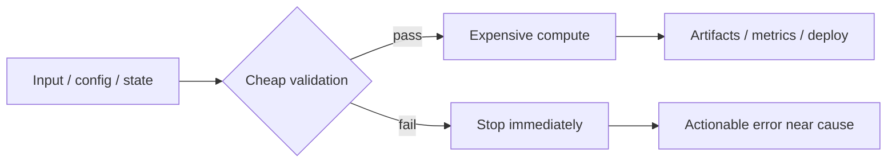

# Fail Fast

## Overview

Fail Fast is the principle of surfacing invalid assumptions, broken invariants, and misconfigured dependencies as early as possible in AI engineering pipelines. In training and inference systems, it reduces wasted compute and shrinks the blast radius by ensuring failures appear near the cause rather than after hours of downstream execution.

## Problem

When AI engineering pipelines defer validation, sanity checks, and invariant assertions to the end of long-running jobs, errors propagate undetected through hours or days of computation, corrupting downstream artifacts, exhausting budgets, and compressing the time available for debugging before production deadlines. Late failure is especially costly in distributed training, data preprocessing, and orchestration-heavy workflows because the original trigger is often far removed from the observed symptom.

## Statement

Validate early, assert invariants immediately, and terminate execution as soon as the system detects a condition that makes the current run invalid.

## Intuition

A pipeline that keeps running after it knows the input, configuration, or state is wrong is not being resilient; it is spending more money to produce a more confusing failure. Early termination preserves the evidence closest to the root cause, which makes debugging faster and prevents invalid intermediate state from contaminating later stages. In AI systems, that usually means catching schema drift, data corruption, shape mismatches, missing labels, incompatible checkpoints, or illegal hyperparameter combinations before they reach expensive compute.

## Engineering Consequences

- **Smaller blast radius** - Failures are contained at the earliest stage that can prove the run is invalid, which prevents bad state from propagating into checkpoints, metrics, or deployment artifacts.
- **Faster root cause analysis** - The error occurs near the fault, so logs, stack traces, and input artifacts are more actionable than failures discovered after downstream fan-out.
- **Lower wasted compute** - Long GPU or distributed jobs stop before burning hours on work that cannot produce a valid result.
- **Cleaner operational contracts** - Precondition checks make interface expectations explicit, which reduces ambiguity between producers, orchestrators, and consumers.
- **Stronger pipeline correctness** - Early invariant checks expose silent corruption modes that would otherwise survive until evaluation or production traffic.

## Common Violations

- **Violation** - Validation happens only after training, evaluation, or export completes.
**Symptoms** - Jobs consume full budgets before failing, and the error message points to a late symptom rather than the original defect.
**Why It Happens** - Teams optimize for throughput and forget that expensive stages should be gated by cheap correctness checks.
- **Violation** - Data and schema checks are deferred until model execution.
**Symptoms** - Hidden nulls, malformed records, or feature mismatches appear as obscure downstream exceptions or degraded metrics.
**Why It Happens** - Input contracts are treated as “someone else’s problem” instead of a first-class boundary.
- **Violation** - Invariant violations are logged but execution continues.
**Symptoms** - The pipeline appears healthy until corrupted artifacts, unstable metrics, or partial outputs surface later.
**Why It Happens** - Engineers mistake observability for enforcement and rely on logs where a hard stop is required.
- **Violation** - Retry logic masks deterministic configuration errors.
**Symptoms** - Retries repeat the same failure, incident duration increases, and the root cause is obscured by noise.
**Why It Happens** - The system treats unrecoverable faults as transient operational flukes.

## Appears In

- **Data ingestion pipelines** - Examples include schema validation, row-level sanity checks, and rejection of malformed batches before feature generation.
- **Training workflows** - Examples include shape assertions, label-space validation, checkpoint compatibility checks, and dataset consistency checks before GPU launch.
- **Inference services** - Examples include request validation, model-artifact compatibility checks, and input normalization failures that should stop at the edge.
- **Orchestrated AI jobs** - Examples include DAG tasks, scheduled backfills, and distributed workers that should terminate immediately when prerequisites are absent or inconsistent.

## Mental Model

## Decision Checklist

- Is there a cheap check that can prove the run is invalid before expensive work starts?
- Will continuing after this error create misleading artifacts or state?
- Is the failure deterministic rather than transient?
- Does the current stage own the contract being violated?
- Would a later failure make the root cause harder to isolate?
- Is retry the correct response, or should the job terminate immediately?

## Misconceptions

- **Myth** - Fail fast means making the system brittle.
**Reality** - It makes the system safer by preventing invalid execution from spreading into later stages.
- **Myth** - Logging an error is enough.
**Reality** - If the state is invalid, execution should stop; logs alone do not protect downstream systems.
- **Myth** - Early failure is only useful for developer ergonomics.
**Reality** - It materially reduces compute waste, incident duration, and corrupted artifact generation.
- **Myth** - All failures should be retried.
**Reality** - Deterministic validation failures should terminate immediately rather than be retried as if they were transient.

## Engineering Heuristic

If a cheap check can prove the run is doomed, fail before the expensive stage starts.

## Historical Origin

The concept evolved through software engineering practice, especially defensive programming, precondition enforcement, and operating discipline in distributed and batch systems where late failure is expensive.

## Tradeoffs

- **Benefits**
    - Earlier feedback loops.
    - Less wasted compute.
    - Easier debugging.
    - Reduced corruption of downstream outputs.
    - Clearer pipeline contracts.
- **Costs**
    - More validation code and invariant definitions.
    - More up-front design effort for boundaries and checks.
    - Potential false positives if checks are overly strict.
    - Need to distinguish deterministic failures from transient ones.

## Limitations

- It is less useful when partial progress is valuable even if the full run cannot complete.
- It can be counterproductive if validation is more expensive than the work it protects.
- It should not replace graceful degradation for non-critical subcomponents.
- It is not a substitute for retry handling on transient infrastructure failures.

## Related Concepts

- Defensive programming.
- Preconditions.
- Invariants.
- Input validation.
- Circuit breaker.
- Graceful degradation.
- Observability.
- Idempotency.
- Sanity checks.
- Early stopping.

## Further Study

### Seminal Papers

- H. M. Sneed, *The impact of early error detection on software maintenance cost*.[^1]
- M. D. Ernst et al., *Dynamically discovering likely program invariants to support program evolution*.[^2]
- B. Meyer, *Applying "design by contract"*.[^3]

### Books

- Bertrand Meyer, *Object-Oriented Software Construction*.[^3]
- Martin Kleppmann, *Designing Data-Intensive Applications*.[^4]
- Michael Nygard, *Release It!*.[^5]

### Official Documentation

- Python documentation on `assert` and exception handling.[^6]
- Java documentation on assertions and exception semantics.[^7]
- Google SRE book chapters on handling failures and reducing error budgets.[^8]
[^10][^11][^12][^13][^14][^15][^16][^17][^18][^19][^20][^21][^22][^9]

⁂

[^1]: AENS-Knowledge-Layer-Specification.md

[^2]: RESOURCE_KNOWLEDGE_REQUIREMENTS_REPORT.md

[^3]: CONTENT_QUALITY_STANDARD.md

[^4]: ARCHITECTURE_FREEZE.md

[^5]: https://www.youtube.com/watch?v=YA0Wq1rcs6U

[^6]: https://ebookk.ir/wp-content/uploads/2024/10/Prompt-Engineering-for-Generative-AI_p01-20.pdf

[^7]: https://gist.github.com/aashari/07cc9c1b6c0debbeb4f4d94a3a81339e

[^8]: https://github.com/github/awesome-copilot/blob/main/instructions/ai-prompt-engineering-safety-best-practices.instructions.md

[^9]: https://www.sundeepteki.org/advice/the-definitive-guide-to-prompt-engineering-from-principles-to-production

[^10]: https://towardsdatascience.com/prompt-engineering-fails-quietly-prompt-regression-is-why/

[^11]: https://github.com/NirDiamant/Prompt_Engineering

[^12]: https://github.com/alfonsograziano/ai-native-engineering

[^13]: https://winaykumar.com/ai/advanced/prompt-engineering/

[^14]: https://machinelearningmastery.com/prompt-engineering-for-agentic-ai/

[^15]: http://arxiv.org/pdf/2503.15282.pdf

[^16]: http://arxiv.org/pdf/2410.00880.pdf

[^17]: http://arxiv.org/pdf/2407.09231.pdf

[^18]: https://arxiv.org/pdf/2402.08072.pdf

[^19]: https://dl.acm.org/doi/pdf/10.1145/3626252.3630909

[^20]: https://www.aclweb.org/anthology/P18-1100.pdf

[^21]: https://arxiv.org/pdf/2401.05655.pdf

[^22]: https://www.aclweb.org/anthology/2020.emnlp-main.546.pdf

