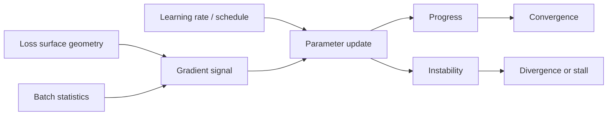

# Gradient Descent

## Overview

Gradient Descent is the baseline optimization principle that turns loss minimization into an iterative control problem over step size, curvature, and stochastic noise. In AI engineering systems, it matters because convergence quality, training stability, and compute efficiency are determined as much by the optimizer dynamics as by model architecture or data scale.[^1][^2]

## Problem

When AI models are trained without understanding how gradient descent interacts with loss landscape geometry, learning rate schedules, and batch statistics, training becomes unstable, converges to poor minima, or fails entirely, making systems unreliable and computationally wasteful. In modern deep learning, the same optimizer can behave very differently under non-convexity, ill-conditioning, stochastic gradients, and distributed execution.[^2][^1]

## Statement

Choose and tune gradient-based updates so that optimization makes consistent progress on the training objective without destabilizing parameter dynamics or wasting compute.[^1]

## Intuition

Gradient descent is less about “following the slope” than about controlling how aggressively the system reacts to local error signals. If steps are too large, the optimizer overshoots and oscillates; if too small, training stalls; if the gradient signal is too noisy, updates chase sampling artifacts instead of structure. The engineering task is to make the update rule compatible with the geometry of the loss surface and the statistics of the training regime.[^2][^1]

## Engineering Consequences

- **Convergence behavior** - Step size and schedule shape whether training reaches a useful basin or diverges before learning stabilizes.[^1]
- **Optimization stability** - Poorly scaled gradients, curvature mismatch, or noisy batches can cause oscillation, exploding updates, or stalled progress.[^2][^1]
- **Training efficiency** - The optimizer governs how many steps and how much compute are required to reach acceptable loss, which directly affects iteration speed and deployment cost.[^2]
- **Distributed robustness** - In large-scale or stochastic settings, the optimizer must tolerate batch variability, asynchrony, and approximate gradients without losing progress.[^2]
- **Hyperparameter sensitivity** - Learning rate, momentum, batching strategy, and schedules can dominate outcomes, so tuning strategy is part of system design rather than a secondary detail.[^1]

## Common Violations

- **Violation** - A single default learning rate is reused across models, datasets, and batch sizes.
**Symptoms** - Some runs diverge immediately, others crawl, and successful settings do not transfer between experiments.
**Why It Happens** - Optimization is treated as an implementation detail instead of a regime-dependent control problem.[^1]
- **Violation** - Gradient noise from small batches or distributed updates is ignored.
**Symptoms** - Loss curves are jagged, validation results are unstable, and repeated runs with the same code produce materially different outcomes.
**Why It Happens** - Engineers assume stochasticity is harmless rather than a factor that changes effective update dynamics.[^2]
- **Violation** - Curvature and conditioning are ignored when selecting the optimizer.
**Symptoms** - Training appears stuck even though gradients are nonzero, or progress varies wildly across layers and parameter groups.
**Why It Happens** - The loss surface is treated as locally uniform when it is not.[^1]
- **Violation** - Learning rate schedules are bolted on after instability appears.
**Symptoms** - Late-stage training oscillates, checkpoint quality varies sharply, and the final model depends on accidental stopping time.
**Why It Happens** - Schedule design is deferred until after core optimization dynamics have already been misconfigured.[^1]

## Appears In

- **Supervised model training** - Examples include neural network training, regression fitting, and classifier optimization where convergence determines whether the model is usable.
- **Large-scale deep learning** - Examples include LLM pretraining, fine-tuning, and distributed data-parallel training where stochasticity and scale change optimizer behavior.
- **Federated and decentralized learning** - Examples include local SGD and parameter-server training, where data heterogeneity and update delays alter convergence properties.
- **Online and streaming learning** - Examples include continual updates from arriving data, where the optimizer must remain stable under nonstationary input.

## Mental Model

## Decision Checklist

- Is the learning rate compatible with the scale and conditioning of the gradients?
- Does the batch size produce gradients that are informative rather than excessively noisy?
- Is the optimizer choice appropriate for the loss landscape and model scale?
- Are schedule transitions aligned with known convergence phases?
- Do repeated runs show stable optimization behavior under the same configuration?
- Is the observed failure mode due to optimization dynamics rather than model capacity?

## Misconceptions

- **Myth** - Gradient descent is just a mechanical update rule.
**Reality** - Its practical behavior depends on geometry, stochasticity, and schedule design, so it is a system-level optimization choice.[^2][^1]
- **Myth** - If loss decreases on the first few steps, the optimizer is correctly configured.
**Reality** - Early progress can hide later instability, slow asymptotics, or poor basin selection.[^1]
- **Myth** - Bigger batches always improve optimization.
**Reality** - Batch changes alter gradient noise and effective step dynamics; “better” depends on the regime.[^2]
- **Myth** - Adaptive optimizers remove the need to reason about convergence.
**Reality** - They change the update geometry, but they do not eliminate the need to tune scale, schedule, and stopping criteria.[^1]

## Engineering Heuristic

If training is unstable, fix the optimizer regime before blaming the model architecture.

## Historical Origin

The concept evolved from classical optimization and stochastic approximation, then became central to machine learning through empirical risk minimization, backpropagation, and large-scale stochastic training. Its modern engineering interpretation is shaped by stochastic optimization research and by the practical behavior of deep networks under non-convex, noisy objectives.[^2][^1]

## Tradeoffs

- **Benefits**
    - Simple and widely applicable optimization backbone.
    - Efficient incremental progress on large parameter spaces.
    - Compatible with stochastic and distributed training.
    - Supports many derivative algorithms and schedules.[^1][^2]
- **Costs**
    - Sensitive to learning rate and schedule design.
    - Can be slow or unstable on ill-conditioned landscapes.
    - Requires careful tuning across models and data regimes.
    - May need additional mechanisms to handle noise, curvature, or nonconvexity.[^1]

## Limitations

- It is less effective when gradients are uninformative, biased, or numerically unstable.
- It can be counterproductive when the loss landscape requires stronger curvature information than first-order updates provide.
- It does not guarantee global optimality in non-convex problems.
- It can underperform if the training pipeline cannot supply sufficiently consistent gradient estimates.[^2][^1]

## Related Concepts

- Stochastic gradient descent.
- Learning rate scheduling.
- Momentum.
- Adaptive optimizers.
- Second-order methods.
- Backpropagation.
- Convergence analysis.
- Gradient clipping.
- Stochastic approximation.

## Further Study

### Seminal Papers

- Ruder, *An overview of gradient descent optimization algorithms*.[^1]
- Shalev-Shwartz and Ben-David, *Understanding Machine Learning: From Theory to Algorithms*.[^2]
- Zhang, *Gradient Descent based Optimization Algorithms for Deep Learning Models Training*.[^3]

### Books

- Shalev-Shwartz and Ben-David, *Understanding Machine Learning: From Theory to Algorithms*.[^2]
- Goodfellow, Bengio, and Courville, *Deep Learning*.[^4]
- Boyd and Vandenberghe, *Convex Optimization*.[^5]

### Official Documentation

- arXiv abstract for *An overview of gradient descent optimization algorithms*.[^1]
- Cambridge University Press book record for *Understanding Machine Learning: From Theory to Algorithms*.[^2]
- arXiv abstract for *Gradient Descent based Optimization Algorithms for Deep Learning Models Training*.[^3]

## Suggested Meta

- **Tags:** optimization, learning-theory, ml-fundamentals, gradient-descent, convergence
- **Aliases:** gradient-based-optimization, steepest-descent, backpropagation-optimizer
- **Keywords:** gradient, descent, optimization, convergence, learning-rate, loss-landscape, saddle-point, local-minima
- **Search Tokens:** gradient descent, stochastic gradient descent, sgd, learning rate, convergence, loss landscape, optimization algorithm
- **Difficulty:** Intermediate
- **Domain:** optimization
- **Engineering Area:** training
- **Estimated Reading Time:** 15-20 minutes
- **Prerequisites:** None
- **Recommended Next:** learning-rate-scheduling, momentum, adam-optimizer, second-order-methods
- **Cross-Links:**
    - referenced_by_patterns: training-loop, gradient-accumulation, kv-cache, mixed-precision, checkpointing, early-stopping, gradient-checkpointing, flash-attention, prompt-caching, streaming-inference, batch-inference
    - referenced_by_models: llama, mistral, bert
    - referenced_by_workflows: build-rag-system, fine-tune-llm-lora-qlora
[^10][^11][^12][^13][^14][^15][^16][^17][^18][^6][^7][^8][^9]

⁂

[^1]: https://link.springer.com/10.1007/s11356-021-14264-z

[^2]: https://www.semanticscholar.org/paper/3e6da1517c593108cc3f1c0b858b3ad7fbbf85dc

[^3]: https://www.semanticscholar.org/paper/bac5fe148139d8269705646c2e67ae167acc22e6

[^4]: https://ieeexplore.ieee.org/document/9519402/

[^5]: https://ieeexplore.ieee.org/document/11194127/

[^6]: http://ieeexplore.ieee.org/document/4408912/

[^7]: http://ieeexplore.ieee.org/document/5208603/

[^8]: https://www.semanticscholar.org/paper/a07f0966ad63c2dbe4a7f0bd35e2fcb4b6deaa94

[^9]: https://arxiv.org/abs/1609.04747

[^10]: https://arxiv.org/html/2205.00832v2

[^11]: https://www.sciencedirect.com/science/article/pii/S1383762124001358

[^12]: https://www.mit.edu/~gfarina/2025/67220s25_L12_gradient_descent/

[^13]: https://arxiv.org/abs/1903.03614

[^14]: https://tinbergen.nl/news/1168/monograph-on-gradient-based-learning-and-optimization-by-bernd-heidergott

[^15]: https://www.amazon.com/-/es/Nizar-Soilihi/dp/B08NDRCBPD

[^16]: https://dukespace.lib.duke.edu/items/e3d8a78f-256a-434a-ad55-25a0317057d0

[^17]: https://dl.acm.org/doi/10.5555/3600270.3600867

[^18]: https://www.cs.huji.ac.il/~shais/UnderstandingMachineLearning/understanding-machine-learning-theory-algorithms.pdf

