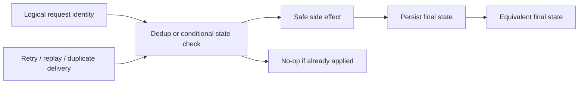

# Idempotency

## Overview

Idempotency is the operational safety principle that lets AI systems retry, replay, and parallelize work without changing the final state more than once. In distributed training and inference pipelines, it is what keeps retries from turning into duplicate writes, corrupted checkpoints, and inconsistent model or feature state.[^1][^2]

## Problem

When AI engineering operations—such as data writes, model checkpoint saves, feature store updates, or inference result logging—are not designed to be idempotent, retries after failures, duplicate message delivery, or concurrent execution produce inconsistent state, data corruption, or resource leaks, making systems unpredictable and difficult to debug in production. The failure surface is especially large in at-least-once delivery systems, where duplicate execution is expected rather than exceptional.[^2][^1]

## Statement

Design every externally visible side effect so that repeating the same operation with the same identity and inputs produces an equivalent final state, even if the operation is replayed, retried, or interleaved with other execution attempts.[^1][^2]

## Intuition

Distributed systems do not preserve your intent; they preserve effects. If a job can be retried, the system must treat the retry as a replay of the same intent, not as a new event with new consequences. Idempotency is therefore a state-management discipline: it moves correctness from “did the call happen once?” to “is the final state equivalent to one successful execution?”[^2][^1]

## Engineering Consequences

- **Retry safety** - Retries become operationally acceptable because repeated attempts do not multiply side effects or corrupt state.[^1]
- **Duplicate tolerance** - Duplicate delivery from queues, streams, or RPC clients can be absorbed without inventing new model states or records.[^2][^1]
- **Checkpoint integrity** - Training checkpoints, optimizer state, and artifact writes remain coherent across crashes and restarts when writes are identity-stable and atomic at the right boundary.[^2]
- **Pipeline determinism** - Replayed jobs and backfills converge to the same end state, which makes incident recovery and auditability materially easier.[^1]
- **Concurrency safety** - Concurrent workers can operate on the same logical task if state transitions are guarded by unique identity or conditional updates.[^2]

## Common Violations

- **Violation** - Side effects are executed before an idempotency key or deduplication record is durably written.
**Symptoms** - Duplicate model artifacts, repeated charges or notifications, and “successful” retries that amplify the original action.
**Why It Happens** - The write path is split across multiple steps without atomic record-and-act semantics.[^1][^2]
- **Violation** - Retries are generated by clients or orchestration layers without a stable operation identity.
**Symptoms** - Duplicate rows, duplicate feature updates, and checkpoint versions that drift across attempts.
**Why It Happens** - The system has at-least-once execution but no canonical request identity to collapse repeats.[^1]
- **Violation** - Non-idempotent mutations are hidden inside jobs that are assumed to be “just rerunnable.”
**Symptoms** - Reprocessing a failed job changes downstream counts, metrics, or state twice.
**Why It Happens** - Batch and workflow code is written as if failure were impossible, then retried by infrastructure that assumes failure is normal.[^2]
- **Violation** - Checkpoint and artifact writes are append-like when the logical operation is replace-like.
**Symptoms** - Stale weights, mixed-version artifacts, partially updated manifests, and inconsistent model rollbacks.
**Why It Happens** - Physical storage semantics are mistaken for logical state semantics.[^2]

## Appears In

- **Distributed training** - Examples include checkpoint save/restore flows, optimizer-state updates, and resumed training after worker failure.
- **Feature pipelines** - Examples include feature store upserts, backfills, and late-arriving event handling where repeated writes must collapse to one logical result.
- **Inference systems** - Examples include request logging, cache population, billing events, and result persistence under timeout-driven retries.
- **Streaming and event processing** - Examples include at-least-once consumers, exactly-once semantics emulation, and deduplication around message replays.[^1][^2]

## Mental Model

## Decision Checklist

- Does every retried operation carry a stable identity?
- Is the final state determined by the request identity and inputs, not by execution count?
- Can the side effect be repeated without changing the logical outcome?
- Is the deduplication or uniqueness check durable enough to survive crashes?
- Are writes atomic at the boundary where logical state changes?
- Can concurrent executions converge on the same state without manual intervention?

## Misconceptions

- **Myth** - Idempotency means the system does nothing on repeat calls.
**Reality** - The system may still execute work; the requirement is an equivalent final state, not necessarily zero computation.[^1]
- **Myth** - Idempotency is only needed for APIs.
**Reality** - It is equally critical in jobs, checkpoints, feature updates, and stream consumers.[^2]
- **Myth** - “Exactly once” delivery solves the problem.
**Reality** - End-to-end correctness still depends on idempotent processing because delivery guarantees do not remove all duplicate or partial execution risks.[^1][^2]
- **Myth** - A successful retry proves the original action failed.
**Reality** - In distributed systems, a timeout can occur after the side effect has already happened, so retries must be safe by design.[^1]

## Engineering Heuristic

If an operation may be replayed, make the identity durable before the side effect.

## Historical Origin

The concept is well established in distributed systems and transaction processing, where retryable operations, duplicate message delivery, and partial failures forced architects to distinguish delivery guarantees from effect guarantees. Modern treatments of retries and idempotency in distributed systems emphasize that exactly-once processing semantics are only achievable when the processing step itself is idempotent or made equivalent through deduplication and transactional recording.[^2][^1]

## Tradeoffs

- **Benefits**
    - Safer retries and recoveries.
    - Lower incident blast radius from duplicate execution.
    - Easier backfills, reprocessing, and workflow replay.
    - Better alignment with at-least-once infrastructure.[^1]
- **Costs**
    - Extra state to track request identity or deduplication windows.
    - More complex write paths and conditional logic.
    - Storage and coordination overhead for durable uniqueness checks.
    - Harder design for operations with naturally non-idempotent effects.[^2]

## Limitations

- It is harder to apply to inherently non-repeatable external effects, such as some third-party side effects or irreversible human-visible actions.
- It can add significant coordination overhead in ultra-low-latency paths.
- It does not remove the need for broader consistency controls such as transaction boundaries, ordering, or reconciliation.
- It can be misleading if the logical identity is poorly defined or unstable across retries.[^2][^1]

## Related Concepts

- Retry safety.
- Exactly-once semantics.
- At-least-once delivery.
- Deduplication.
- Event sourcing.
- Saga pattern.
- Distributed transactions.
- Conditional writes.
- Checkpointing.
- Consistency.

## Further Study

### Seminal Papers

- Martin Kleppmann, *Message Delivery and Processing*.[^1]
- Sam Newman, *Retries \& Idempotency*.[^2]

### Books

- Martin Kleppmann, *Designing Data-Intensive Applications*.[^1]
- Sam Newman, *Building Resilient Distributed Systems*.[^2]
- George Coulouris, Jean Dollimore, Tim Kindberg, and Gordon Blair, *Distributed Systems: Concepts and Design*.[^3]

### Official Documentation

- Manning livebook chapter on message delivery, processing, equivalence, and idempotence.[^1]
- Sam Newman’s book page for *Building Resilient Distributed Systems*.[^2]
- JBoss Clustering Guide section on idempotent operations.[^4]

## Suggested Meta

- **Tags:** architecture, systems, distributed-systems, reliability, data-integrity, pipeline-safety
- **Aliases:** idempotent-operations, safe-retries, at-least-once-semantics, exactly-once-processing, deterministic-operations
- **Keywords:** idempotency, retry-safety, distributed-systems, exactly-once, at-least-once, deduplication, state-consistency, checkpointing, pipeline-idempotency, side-effect-free, deterministic-execution
- **Search Tokens:** idempotency, idempotent operations, retry safety, exactly once processing, at least once semantics, distributed idempotency, deduplication, state consistency, idempotent pipeline, idempotent checkpoint, safe retry, deterministic execution
- **Difficulty:** Intermediate
- **Domain:** systems
- **Engineering Area:** distributed_systems
- **Estimated Reading Time:** 15-20 minutes
- **Prerequisites:** None
- **Recommended Next:** separation-of-concerns, single-source-of-truth, event-sourcing, saga-pattern, distributed-transactions
- **Cross-Links:**
    - referenced_by_patterns: training-loop, gradient-accumulation, kv-cache, mixed-precision, checkpointing, early-stopping, gradient-checkpointing, flash-attention, prompt-caching, streaming-inference, batch-inference
    - referenced_by_models: llama, mistral, bert
    - referenced_by_workflows: build-rag-system, fine-tune-llm-lora-qlora
[^10][^11][^12][^13][^14][^15][^16][^17][^18][^19][^20][^21][^22][^23][^24][^25][^26][^27][^28][^29][^30][^31][^32][^33][^34][^5][^6][^7][^8][^9]

⁂

[^1]: https://jisem-journal.com/index.php/journal/article/view/14608

[^2]: https://www.ijcesen.com/index.php/ijcesen/article/view/4940

[^3]: https://www.semanticscholar.org/paper/973b5b60482f946dd6777e4ffbf1a0b6f09daea5

[^4]: https://wjarr.com/node/9131

[^5]: https://www.semanticscholar.org/paper/170ccc92e1b54fe909ab924542cea8df8aa15f17

[^6]: https://ieeexplore.ieee.org/document/10628305/

[^7]: https://ieeexplore.ieee.org/document/6839142/

[^8]: https://ieeexplore.ieee.org/document/10092692/

[^9]: https://leaders.tec.br/pdf/en/b997bb.pdf

[^10]: https://blog.stackademic.com/idempotency-in-distributed-systems-preventing-duplicate-operations-c1ad1e287691

[^11]: https://annas-archive.org/md5/6bf4a626644407a7f2719b23a57d665c

[^12]: https://ijsret.com/2025/12/30/end-to-end-exactly-once-processing-in-distributed-stream-pipelines-integrating-apache-flink-state-snapshots-with-kafka-transactions/

[^13]: https://www.ijcsejournal.org/exactly-once-semantics-distributed-stream/

[^14]: https://www.scs.stanford.edu/14sp-cs240h/projects/dimson_ganjoo.pdf

[^15]: https://sarcouncil.com/download-article/SJECS-401-2025-727-735.pdf

[^16]: https://documentation.extremenetworks.com/efa/efa_2.4.0/admin/GUID-C3E1C3EB-2D2B-4F1E-9D80-42C0463D8EE5.shtml

[^17]: https://www.infoq.com/presentations/distributed-systems-resiliency/

[^18]: https://docs.jboss.org/jbossas/docs/Clustering_Guide/5/html/ch06s07.html

[^19]: https://link.springer.com/deleted

[^20]: https://www.semanticscholar.org/paper/5df51833cd8d6a89be76ac822a2a91d512b71195

[^21]: https://www.semanticscholar.org/paper/61800cc5f75bec28afc278aaacd014d46b4d2211

[^22]: https://www.semanticscholar.org/paper/56e0605f0236be4d1b09cf6c6f62bd76c8581587

[^23]: http://ieeexplore.ieee.org/document/414847/

[^24]: https://www.semanticscholar.org/paper/a9d279cd015cc6e2422e9a0eb9821991b4a55b96

[^25]: https://www.taylorfrancis.com/books/9781003254119

[^26]: https://www.manning.com/preview/think-distributed-systems/chapter-4

[^27]: https://www.oreilly.com/library/view/building-resilient-distributed/9781098163532/ch03.html

[^28]: https://livebook.manning.com/book/think-distributed-systems/chapter-4/v-9

[^29]: https://www.scribd.com/document/572213004/Understanding-distributed-systems-2nd-edition-1838430210

[^30]: https://www.thoughtworks.com/content/dam/thoughtworks/documents/books/Patterns_Distributed_Systems_Sample.pdf

[^31]: http://dcbcl.haut.edu.cn/ups/files/20210506/1620280872105502.pdf

[^32]: https://vowi.fsinf.at/images/b/bc/TU_Wien-Verteilte_Systeme_VO_(G%C3%B6schka)_-_Tannenbaum-distributed_systems_principles_and_paradigms_2nd_edition.pdf

[^33]: https://samnewman.io/books/building-resilient-distributed-systems/

[^34]: https://www.slideshare.net/slideshow/exactlyonce-semantics-revisited-distributed-transactions-across-flink-and-kafka/262764482?nway-content_model=D

