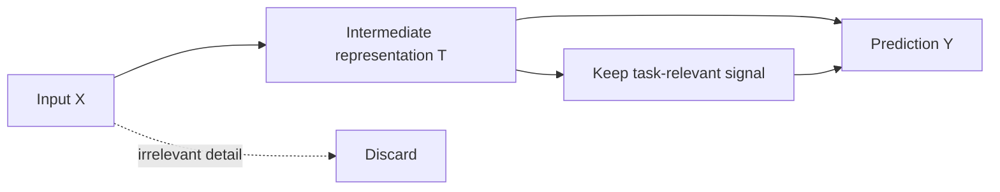

# Information Bottleneck

## Overview

Information Bottleneck is the principle of forcing intermediate representations to retain only the information that is predictive for the task while discarding irrelevant input detail. In AI engineering systems, it matters because representation compression is a direct control on memorization, transferability, and the interpretability of learned features.[^1][^2]

## Problem

When deep neural networks are trained without considering the information-theoretic tradeoff between compression and prediction, layers either retain too much irrelevant input detail (failing to generalize) or discard too much task-relevant information (failing to predict), producing representations that are either overfitted to training noise or insufficiently expressive for downstream tasks. This failure is usually invisible at the loss level because the model can still fit the objective while learning unstable, non-transferable internal codes.[^2][^1]

## Statement

Learn representations by minimizing irrelevant input information while preserving the information needed to predict the target, and treat representation quality as a compression–sufficiency problem rather than a pure accuracy problem.[^1][^2]

## Intuition

The useful representation is not the richest one, but the smallest one that still supports the task. If a layer keeps every input detail, it becomes a storage device for noise; if it compresses blindly, it loses signal needed for prediction. The engineering value of the principle is that it gives a criterion for whether a hidden layer is doing useful work: it should drop nuisance variation while preserving task-relevant structure that survives transfer to new data.[^3][^1]

## Engineering Consequences

- **Representation quality control** - The principle separates useful compression from accidental feature collapse, which helps distinguish robust abstractions from memorization-heavy encodings.[^1]
- **Generalization behavior** - Compression of irrelevant variation tends to improve out-of-sample behavior when the learned code is aligned with the predictive structure of the task.[^2][^3]
- **Transfer learning utility** - Bottlenecked representations are often more reusable because they retain shared task signal rather than dataset-specific noise.
- **Debuggability of internal layers** - The information profile of a layer can reveal whether it is serving as a semantic abstraction or merely relaying raw input detail.[^2]
- **Architectural tuning signal** - The principle informs where capacity should be reduced or preserved, especially in layered networks whose intermediate states are intentionally hierarchical.[^2]

## Common Violations

- **Violation** - Intermediate layers preserve too much raw input detail.
**Symptoms** - Internal activations remain highly input-specific, transfer performance is weak, and validation behavior tracks training noise too closely.
**Why It Happens** - The model is optimized only for end-task loss, so no pressure exists to discard nuisance information.[^1][^2]
- **Violation** - Compression is applied too aggressively or too early.
**Symptoms** - Accuracy drops sharply, downstream tasks fail to recover useful features, and the representation becomes brittle.
**Why It Happens** - The bottleneck removes information before the network has formed a sufficiently predictive abstraction.[^1]
- **Violation** - Information-theoretic claims are made from noisy or intractable estimates of mutual information.
**Symptoms** - Reported “compression phases” vary wildly across runs or fail to reproduce under small implementation changes.
**Why It Happens** - Estimation error dominates the measured information quantities, especially in high-dimensional deep networks.[^3]
- **Violation** - The bottleneck is treated as a universal explanation for all generalization behavior.
**Symptoms** - The same interpretation is applied to architectures and regimes where the measured information dynamics are not reliable.
**Why It Happens** - The principle is overextended beyond the regimes where its theoretical or empirical support is strongest.[^3]

## Appears In

- **Deep feedforward networks** - Examples include layered classifiers where intermediate abstractions are expected to become more task-specific with depth.[^2]
- **Representation learning** - Examples include learned embeddings, latent-variable encoders, and compressed feature maps used for downstream prediction.
- **Self-supervised learning** - Examples include contrastive or masked-prediction objectives where preserving task-relevant structure under augmentation matters.
- **Transfer and multitask systems** - Examples include shared backbones whose intermediate representations must remain compact enough to generalize across tasks.

## Mental Model

## Decision Checklist

- Does this layer reduce irrelevant input variation without destroying target-relevant signal?
- Is the representation reusable outside the training set or single task?
- Are compression and predictive sufficiency both being evaluated, not just loss?
- Is the layer acting as an abstraction boundary rather than a high-fidelity relay?
- Are information estimates trustworthy enough to interpret as design signals?
- Does the architecture need a bottleneck at this stage, or only after sufficient feature formation?

## Misconceptions

- **Myth** - More information in a representation is always better.
**Reality** - Extra information often means extra nuisance variation, which harms generalization and transfer.[^1][^2]
- **Myth** - The bottleneck should always be as tight as possible.
**Reality** - Over-compression can remove the signal needed for prediction.[^1]
- **Myth** - A low training loss implies the representation is good.
**Reality** - The model can fit the task while still encoding brittle, non-transferable features.[^2]
- **Myth** - Information bottleneck is only a theory, not an engineering tool.
**Reality** - It provides a practical criterion for representation design, layer analysis, and compression tradeoffs in deep systems.[^3]

## Engineering Heuristic

Compress what the task does not need, preserve what the downstream decision depends on.

## Historical Origin

The concept is well established in information theory and learning, formalized by Tishby, Pereira, and Bialek as a variational principle and later adapted to deep learning analysis through layered mutual-information views and generalization studies.[^2][^1]

## Tradeoffs

- **Benefits**
    - Better generalization through nuisance suppression.
    - More reusable and interpretable representations.
    - A principled way to reason about layer capacity and abstraction.
    - Potentially improved transfer learning behavior.[^1][^2]
- **Costs**
    - Mutual-information estimation is difficult in high-dimensional networks.
    - Excessive compression can destroy predictive features.
    - The principle can be hard to validate empirically in real training pipelines.
    - Different architectures may exhibit information dynamics that are hard to compare directly.[^3]

## Limitations

- It is difficult to apply cleanly when information estimates are too noisy to trust.
- It may be misleading in architectures where standard compression phases do not appear.
- It is less useful when the task requires preserving rich input detail rather than abstraction.
- It can be counterproductive if used as a rigid rule instead of a design lens.[^3]

## Related Concepts

- Mutual information.
- Minimal sufficient statistic.
- Representation learning.
- Generalization.
- Variational inference.
- Autoencoders.
- Self-supervised learning.
- Compression–prediction tradeoff.
- Deep layer abstraction.
- Relevance and sufficiency.

## Further Study

### Seminal Papers

- Naftali Tishby, Fernando C. Pereira, and William Bialek, *The Information Bottleneck Method*.[^1]
- Naftali Tishby and Noga Zaslavsky, *Deep Learning and the Information Bottleneck Principle*.[^2]
- Hassan Hafez-Kolahi and Shohreh Kasaei, *Information Bottleneck and its Applications in Deep Learning*.[^3]

### Books

- David J. C. MacKay, *Information Theory, Inference, and Learning Algorithms*.[^4]
- Thomas M. Cover and Joy A. Thomas, *Elements of Information Theory*.[^5]
- Kevin P. Murphy, *Probabilistic Machine Learning: An Introduction*.[^6]

### Official Documentation

- arXiv record for *The Information Bottleneck Method*.[^1]
- arXiv record for *Deep Learning and the Information Bottleneck Principle*.[^2]
- arXiv survey record for *Information Bottleneck and its Applications in Deep Learning*.[^3]

## Suggested Meta

- **Tags:** learning-theory, information-theory, representation-learning, deep-learning, generalization
- **Aliases:** ib-principle, information-compression, predictive-compression, tishby-bottleneck, relevance-compression
- **Keywords:** information-bottleneck, mutual-information, compression, prediction, representation, sufficiency, minimality, deep-learning, generalization, ib-lagrange, tradeoff
- **Search Tokens:** information bottleneck, information bottleneck principle, tishby, mutual information, representation compression, predictive sufficiency, deep learning generalization, ib tradeoff, compression prediction tradeoff, relevant information, minimal sufficient statistic
- **Difficulty:** Advanced
- **Domain:** learning_theory
- **Engineering Area:** representation_learning
- **Estimated Reading Time:** 15-20 minutes
- **Prerequisites:** None
- **Recommended Next:** maximum-likelihood-estimation, variational-inference, autoencoders, self-supervised-learning
- **Cross-Links:**
    - referenced_by_patterns: training-loop, gradient-accumulation, kv-cache, mixed-precision, checkpointing, early-stopping, gradient-checkpointing, flash-attention, prompt-caching, streaming-inference, batch-inference
    - referenced_by_models: llama, mistral, bert
    - referenced_by_workflows: build-rag-system, fine-tune-llm-lora-qlora
[^10][^11][^12][^13][^14][^15][^16][^17][^18][^7][^8][^9]

⁂

[^1]: https://ieeexplore.ieee.org/document/11457969/

[^2]: https://link.springer.com/10.1007/978-3-030-45442-5_61

[^3]: https://www.semanticscholar.org/paper/9cda61384bb873852acd3030b714c8eb24d5e5df

[^4]: https://www.semanticscholar.org/paper/431af7ee9b0c855ebf5d99b4f785a8b1ca6b5e26

[^5]: https://linkinghub.elsevier.com/retrieve/pii/S0893608025002606

[^6]: https://arxiv.org/abs/2506.04870

[^7]: https://arxiv.org/abs/2507.18391

[^8]: https://ieeexplore.ieee.org/document/10772242/

[^9]: https://proceedings.mlr.press/v202/kawaguchi23a/kawaguchi23a.pdf

[^10]: https://arxiv.org/abs/1904.03743

[^11]: https://arxiv.org/abs/physics/0004057

[^12]: https://arxiv.org/abs/2509.26327

[^13]: https://dl.acm.org/doi/10.1007/978-3-540-87987-9_12

[^14]: https://arxiv.org/abs/1503.02406

[^15]: https://www2.eecs.berkeley.edu/Pubs/TechRpts/2020/Archive/EECS-2020-56.pdf

[^16]: https://pmc.ncbi.nlm.nih.gov/articles/PMC7764901/

[^17]: https://arxiv.org/pdf/2002.00008.pdf

[^18]: https://arxiv.org/abs/2410.00535

