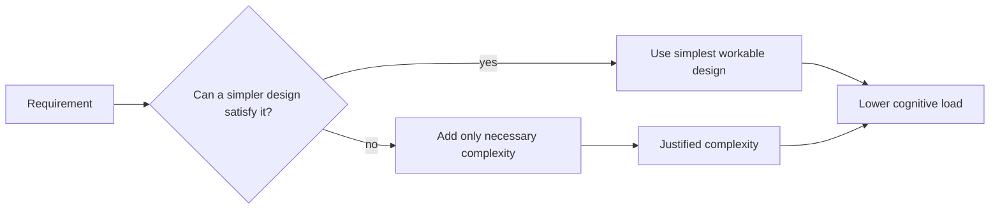

# KISS

## Overview

KISS is the principle that system design should prefer the simplest solution that fully satisfies the engineering requirement. In AI engineering systems, it reduces cognitive load and failure surface by avoiding unnecessary orchestration, indirection, and abstraction that make production behavior harder to understand and debug.[^1][^2]

## Problem

When AI engineering teams default to complex architectures—multi-stage pipelines, custom orchestration layers, or over-parameterized models—without evidence that the complexity is warranted, the resulting systems accumulate accidental complexity that obscures failure modes, slows iteration, and makes safe changes prohibitively expensive. Complexity also makes it harder to tell whether a failure is caused by data, model behavior, infrastructure, or coordination logic because too many layers are involved in the execution path.[^3][^1]

## Statement

Prefer the simplest design that meets the requirement, and add complexity only when it removes a demonstrated engineering constraint rather than a hypothetical one.[^2][^1]

## Intuition

Every extra layer increases the number of places where the system can disagree with itself. In AI pipelines, that usually means more state, more configuration, more coupling, and more paths to debug under pressure. KISS is valuable because simplicity preserves local reasoning: engineers can predict behavior, isolate faults, and make changes without first reconstructing an elaborate mental model.[^4][^2]

## Engineering Consequences

- **Lower cognitive load** - Simpler systems are easier to understand, which shortens onboarding and reduces the chance that engineers misread the execution path.
- **Faster debugging** - Fewer moving parts make it easier to locate the layer that introduced the failure, especially in training and deployment workflows.
- **Reduced accidental complexity** - Avoiding unnecessary abstractions limits the amount of code that exists only to manage other code.
- **Safer change management** - Small, direct designs have fewer interaction effects, so a change is less likely to trigger regressions in distant components.
- **Improved operational clarity** - Simpler pipelines expose fewer hidden dependencies, which makes ownership and incident response more tractable.

## Common Violations

- **Violation** - Custom frameworks are built to wrap a single model or pipeline stage.
**Symptoms** - New contributors need architecture diagrams before they can make routine changes, and the wrapper becomes a second system to debug.
**Why It Happens** - Teams overestimate future reuse and optimize for hypothetical generality instead of current requirements.[^2]
- **Violation** - Multi-stage orchestration is introduced before the workflow justifies it.
**Symptoms** - Debugging requires tracing state across several coordinators, and failures appear far from the underlying cause.
**Why It Happens** - Complexity is added to feel “production ready” rather than to solve a concrete scaling or reliability constraint.
- **Violation** - Model and data logic are split into many micro-abstractions with unclear ownership.
**Symptoms** - Changes require editing many small files, and engineers cannot tell which abstraction is the authoritative one.
**Why It Happens** - Abstraction is used as decoration rather than as a response to real duplication or separation of concerns.
- **Violation** - Configuration systems become more complex than the behavior they control.
**Symptoms** - Small changes require touching multiple config layers, and default values are difficult to reason about.
**Why It Happens** - The team treats flexibility as a goal in itself instead of a cost that must be justified.

## Appears In

- **Training pipelines** - Examples include direct training scripts that avoid unnecessary orchestrators until distributed coordination is actually required.
- **Inference services** - Examples include simple request-to-response paths with limited middleware and explicit error boundaries.
- **Data workflows** - Examples include straightforward transformation steps rather than deeply nested ETL frameworks for small or stable pipelines.
- **MLOps systems** - Examples include deployment and release flows that use the minimum number of layers needed to achieve reliability and rollback safety.[^3]

## Mental Model

## Decision Checklist

- Does the proposed complexity solve a real current constraint?
- Can the same outcome be achieved with fewer moving parts?
- Will this design still be understandable under incident pressure?
- Is the complexity helping the system or compensating for weak requirements?
- Would the simpler version be easier to test, deploy, and recover?
- Is the added abstraction likely to survive long enough to justify its cost?

## Misconceptions

- **Myth** - KISS means simplistic design.
**Reality** - It means minimal sufficient design, not careless reduction.
- **Myth** - Simpler systems are always less scalable.
**Reality** - Simpler systems often scale better because they are easier to reason about and optimize incrementally.[^3]
- **Myth** - KISS conflicts with extensibility.
**Reality** - It conflicts only with premature extensibility; disciplined simplicity can still leave room for evolution.[^1]
- **Myth** - Complexity is free if it is hidden behind abstractions.
**Reality** - Hidden complexity still exists and usually moves the burden from execution to comprehension and debugging.[^2]

## Engineering Heuristic

If the design needs a diagram before it can be explained, it is probably already too complex.

## Historical Origin

The principle evolved through software engineering practice and is widely associated with pragmatic software design guidance and architectural simplicity rather than a single formal theoretical origin.[^1][^2]

## Tradeoffs

- **Benefits**
    - Easier comprehension and faster onboarding.
    - Lower defect rates from interaction bugs.
    - Faster incident triage and safer changes.
    - Less accidental complexity in AI pipelines.[^4][^2]
- **Costs**
    - Fewer built-in extension points.
    - Some future adaptations may require refactoring rather than preemptive abstraction.
    - Simpler designs can look under-featured to stakeholders expecting general-purpose platforms.
    - Over-commitment to simplicity can delay needed specialization in mature systems.

## Limitations

- It can be counterproductive when a problem genuinely requires coordination across many subsystems.
- It does not justify ignoring reliability, security, or compliance requirements that add unavoidable complexity.
- It is less useful when the system is still exploratory and the right shape of the architecture is not yet known.
- It should not be used to reject necessary abstraction after duplication or coupling has become demonstrably harmful.

## Related Concepts

- DRY.
- Separation of concerns.
- Modularity.
- Occam’s razor.
- Minimalism.
- Essential complexity.
- Accidental complexity.
- YAGNI.
- Maintainability.
- Cognitive load.

## Further Study

### Seminal Papers

- Bertrand Meyer, *Applying “Design by Contract”*.[^1]
- Thomas Menzies, *Occam’s Razor and Simple Software Project Management*.[^3]
- Hartmut Obendorf, *Minimalism: Designing Simplicity*.[^4]

### Books

- *The Pragmatic Programmer* by Andy Hunt and Dave Thomas.[^2]
- *Software Architect’s Handbook* by Gabriel Cioca.[^5]
- *Minimalism: Designing Simplicity* by Hartmut Obendorf.[^4]

### Official Documentation

- O’Reilly excerpt on KISS in *Software Architect’s Handbook*.[^5]
- Springer chapter on Occam’s Razor and simple software project management.[^3]
- Springer's *Minimalism* book overview.[^4]
[^10][^11][^12][^13][^14][^15][^16][^17][^18][^6][^7][^8][^9]

⁂

[^1]: https://www.semanticscholar.org/paper/0ebbd4140442f98226a990f544d3d940579fad72

[^2]: https://teses.usp.br/teses/disponiveis/45/45134/tde-20230727-113255/

[^3]: https://www.semanticscholar.org/paper/66bfae0f564128acd5c33f862d1222334203e6ec

[^4]: https://link.springer.com/10.1007/978-1-4419-7326-9

[^5]: https://www.semanticscholar.org/paper/195ebfce48f9a8679af0928b3716dd21490a11b2

[^6]: http://ieeexplore.ieee.org/document/5189589/

[^7]: http://choicereviews.org/review/10.5860/CHOICE.43-4067

[^8]: http://link.springer.com/10.1007/978-3-658-19938-8_7

[^9]: https://publications.uni.lu/handle/10993/33915

[^10]: https://www.geeksforgeeks.org/software-engineering/kiss-principle-in-software-development/

[^11]: https://www.oreilly.com/library/view/software-architects-handbook/9781788624060/f8d8845e-d115-4c92-8898-396b76a9a3e2.xhtml

[^12]: https://www.scribd.com/document/824671414/Principle-of-Clean-Code

[^13]: https://link.springer.com/chapter/10.1007/978-3-642-55035-5_18

[^14]: https://www.amazon.com/Clean-Architecture-Craftsmans-Software-Structure/dp/0134494164

[^15]: https://www.abebooks.com/9781402074165/Computer-Architecture-Minimalist-Perspective-Springer-1402074166/plp

[^16]: https://edwardbetts.com/monograph/Occam's_razor

[^17]: http://www2.informatik.uni-freiburg.de/~omartine/publications/occams-razor-03-01.pdf

[^18]: https://link.springer.com/book/10.1007/978-1-84882-371-6

