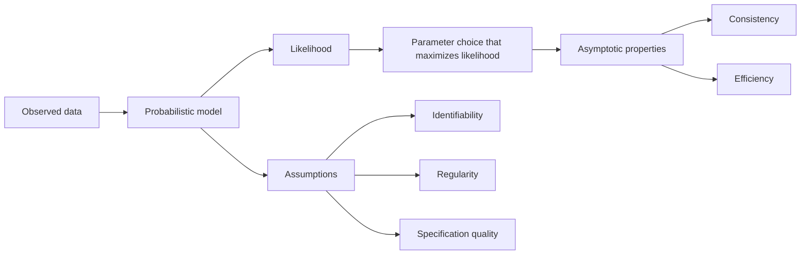

# Maximum Likelihood Estimation

## Overview

Maximum Likelihood Estimation is the principle of inferring model parameters by choosing the values that make the observed data most probable under a specified probabilistic model. In AI engineering systems, it matters because calibration, parameter consistency, and uncertainty interpretation all depend on whether the likelihood is correctly specified and the inference regime is well behaved.[^1][^2]

## Problem

When AI models are trained by minimizing loss functions without understanding that many standard objectives are derived from maximum likelihood assumptions, engineers cannot diagnose when those assumptions are violated—such as misspecified likelihoods, small sample sizes, or non-iid data—leading to biased parameters, miscalibrated uncertainties, and incorrect inference in production. In those cases, an apparently successful optimizer can still produce statistically unreliable estimates because the objective no longer corresponds to the data-generating process.[^2][^1]

## Statement

Estimate parameters by maximizing the likelihood under an explicit probabilistic model, and treat the validity of the result as conditional on model specification, identifiability, and regularity assumptions.[^1][^2]

## Intuition

MLE is a contract between the model and the data: if the model family is right enough, the parameter choice that best explains the sample also has desirable asymptotic properties. The failure mode is equally important: when the likelihood is misspecified or the sample is too small or too dependent, the estimate can remain numerically optimal while being statistically misleading. For AI systems, that means the value of MLE is not just optimization, but the inferential guarantees it gives—or fails to give—around parameters, uncertainty, and downstream decisions.[^3][^1]

## Engineering Consequences

- **Parameter inference quality** - MLE provides consistent and asymptotically efficient estimates under regularity conditions, which makes it a default choice for statistically grounded parameter fitting.[^1]
- **Uncertainty quantification** - Fisher information and asymptotic normality let engineers approximate parameter variance, but only when the likelihood is sufficiently well specified and the asymptotics are credible.[^2][^1]
- **Calibration discipline** - Likelihood-based objectives make it possible to distinguish a good fit from a good probabilistic fit, which is critical for production systems that emit probabilities rather than point estimates.[^2]
- **Misspecification sensitivity** - If the likelihood family is wrong, the estimator can remain stable computationally while being statistically biased, which makes model validation part of the estimation problem itself.[^3]
- **Optimization alignment** - Many ML losses are implemented as surrogate objectives whose statistical meaning depends on the likelihood assumption, so incorrect interpretation can lead to false confidence in training results.[^2]

## Common Violations

- **Violation** - Cross-entropy or negative log-likelihood is used as a generic loss without checking whether the assumed observation model matches the task.
**Symptoms** - Probability outputs look confident but are poorly calibrated, and residuals show systematic structure.
**Why It Happens** - The loss is treated as an optimization recipe rather than as a statement about the data-generating process.[^1][^2]
- **Violation** - Standard MLE is applied under clear covariate shift or dependent samples without adjusting the estimation strategy.
**Symptoms** - Validation performance degrades sharply on target data, and uncertainty estimates become overconfident.
**Why It Happens** - Regularity assumptions are silently inherited from textbook settings and not rechecked against deployment data.[^3]
- **Violation** - Small-sample estimates are interpreted as if asymptotic normal approximations were already valid.
**Symptoms** - Confidence intervals are too narrow, parameter instability is high across resamples, and model comparisons fluctuate.
**Why It Happens** - The asymptotic theory is used before the sample regime is large enough for it to be informative.[^1]
- **Violation** - The likelihood is numerically maximized successfully, but identifiability is weak or absent.
**Symptoms** - Multiple parameter settings produce nearly identical fit, and parameter values drift between runs with little change in loss.
**Why It Happens** - The estimation problem is mathematically underconstrained even though the optimizer converges.[^1]

## Appears In

- **Probabilistic classification** - Examples include logistic regression, calibration layers, and any classifier trained with log-likelihood or cross-entropy objectives.
- **Generative modeling** - Examples include language models, density estimators, and sequence models that maximize token likelihood or sequence likelihood.
- **Latent-variable estimation** - Examples include expectation-maximization workflows where MLE is computed indirectly for incomplete-data problems.
- **Distribution shift analysis** - Examples include covariate-shift settings where well-specified MLE can remain minimax optimal, but misspecification changes the correct estimator.[^3]

## Mental Model

## Decision Checklist

- Is there an explicit probabilistic model for the data I am fitting?
- Does the likelihood match the measurement process and label noise structure?
- Are identifiability and parameter redundancy under control?
- Are sample size and dependence structure sufficient for asymptotic reasoning?
- Do I have evidence that misspecification is not dominating the inference?
- Are uncertainty estimates being derived from valid likelihood-based approximations?

## Misconceptions

- **Myth** - MLE is just another loss function.
**Reality** - It is an inference principle whose statistical meaning depends on the assumed distributional model.[^2][^1]
- **Myth** - If optimization converges, inference is trustworthy.
**Reality** - Convergence only says the optimizer found a stationary or optimal point of the objective; it does not validate the probabilistic assumptions behind the objective.[^1]
- **Myth** - Likelihood-based estimates are automatically well calibrated.
**Reality** - Calibration depends on specification quality and data regime, not just on maximizing likelihood.[^3][^2]
- **Myth** - Asymptotic normality makes finite-sample uncertainty trivial.
**Reality** - The approximation can be poor in small samples, under weak identifiability, or under misspecification.[^1]

## Engineering Heuristic

Maximize likelihood only after you are sure the likelihood is the right model of the data.

## Historical Origin

The concept is well established in statistical theory and is strongly associated with Fisher’s early 20th-century work on likelihood, sufficiency, and asymptotic efficiency, later formalized through Cramér, Wald, Rao, and subsequent developments in statistical inference.[^2][^1]

## Tradeoffs

- **Benefits**
    - Strong inferential foundation under regularity conditions.
    - Asymptotic consistency and efficiency in well-specified settings.
    - Natural route to uncertainty estimates via observed or expected information.
    - Unified objective for many probabilistic ML models.[^2][^1]
- **Costs**
    - Sensitive to model misspecification.
    - Can be misleading in small-sample or dependent-data regimes.
    - Requires identifiability and regularity reasoning that many training pipelines ignore.
    - Likelihood maximization can give a false sense of statistical validity when only optimization has been verified.[^3]

## Limitations

- It is less reliable when the model family is misspecified relative to the true data-generating process.
- It can be counterproductive when parameter identifiability is weak or absent.
- Its asymptotic guarantees are not a substitute for finite-sample validation.
- It does not by itself solve robustness under heavy distribution shift or non-iid sampling.[^3]

## Related Concepts

- Log-likelihood.
- Fisher information.
- Asymptotic normality.
- Statistical consistency.
- Identifiability.
- Cross-entropy loss.
- Bayesian inference.
- Expectation-maximization.
- Misspecification.
- Covariate shift.

## Further Study

### Seminal Papers

- R. H. Norden, *A Survey of Maximum Likelihood Estimation*.[^1]
- Bradley Efron, *Maximum Likelihood and Decision Theory*.[^2]
- Jiawei Ge, Shange Tang, Jianqing Fan, Cong Ma, and Chi Jin, *Maximum Likelihood Estimation is All You Need for Well-Specified Covariate Shift*.[^3]

### Books

- George Casella and Roger L. Berger, *Statistical Inference*.[^4]
- E. L. Lehmann and George Casella, *Theory of Point Estimation*.[^5]
- A. W. van der Vaart, *Asymptotic Statistics*.[^6]

### Official Documentation

- International Statistical Review record for *A Survey of Maximum Likelihood Estimation*.[^1]
- Annals of Statistics record for *Maximum Likelihood and Decision Theory*.[^2]
- arXiv record for *Maximum Likelihood Estimation is All You Need for Well-Specified Covariate Shift*.[^3]

## Suggested Meta

- **Tags:** learning-theory, statistics, probabilistic-modeling, parameter-estimation, mle
- **Aliases:** mle, maximum-likelihood, likelihood-maximization, fisher-scoring
- **Keywords:** likelihood, probability, parameter-estimation, statistical-consistency, log-likelihood, fisher-information, asymptotic-normality, misspecification
- **Search Tokens:** maximum likelihood estimation, mle, likelihood function, log likelihood, parameter estimation, fisher information, statistical inference, probabilistic model
- **Difficulty:** Intermediate
- **Domain:** learning_theory
- **Engineering Area:** probabilistic_modeling
- **Estimated Reading Time:** 15-20 minutes
- **Prerequisites:** None
- **Recommended Next:** bayesian-inference, expectation-maximization, cross-entropy-loss, information-theory
- **Cross-Links:**
    - referenced_by_patterns: training-loop, gradient-accumulation, kv-cache, mixed-precision, checkpointing, early-stopping, gradient-checkpointing, flash-attention, prompt-caching, streaming-inference, batch-inference
    - referenced_by_models: llama, mistral, bert
    - referenced_by_workflows: build-rag-system, fine-tune-llm-lora-qlora
[^10][^11][^12][^13][^14][^15][^16][^17][^18][^7][^8][^9]

⁂

[^1]: https://www.semanticscholar.org/paper/cb481ac56588ca5c1fc29218d0a104ec3c812f61

[^2]: https://projecteuclid.org/journals/bernoulli/volume-10/issue-4/Maximum-likelihood-estimation-of-pure-GARCH-and-ARMA-GARCH-processes/10.3150/bj/1093265632.full

[^3]: http://ieeexplore.ieee.org/document/4034151/

[^4]: http://www.ssrn.com/abstract=2625565

[^5]: https://academic.oup.com/ej/article/107/441/503-519/5128428

[^6]: http://www.emerald.com/books/edited-volume/14316/chapter/85258255

[^7]: https://linkinghub.elsevier.com/retrieve/pii/S0378375820300744

[^8]: http://link.springer.com/10.1007/978-3-030-20351-1_44

[^9]: https://www.stat.rice.edu/~dobelman/courses/texts/qualify/MLE.survey.Norden.Both.IMS.1972.pdf

[^10]: https://www.mit.edu/~18.655/papers/stigler2008.pdf

[^11]: https://www.amazon.com/Maximum-Likelihood-Estimation-Quantitative-Applications-ebook/dp/B00VA9INPY

[^12]: https://www.amazon.com/Maximum-Likelihood-Estimation-Inference-Examples/dp/0470094826

[^13]: https://books.google.com/books?id=9yI60AEACAAJ\&printsec=frontcover

[^14]: https://openlibrary.org/books/OL1416011M/Maximum_likelihood_estimation

[^15]: https://projecteuclid.org/journals/annals-of-statistics/volume-10/issue-2/Maximum-Likelihood-and-Decision-Theory/10.1214/aos/1176345778.full

[^16]: https://download.e-bookshelf.de/download/0000/5688/41/L-G-0000568841-0002288031.pdf

[^17]: https://www.awi.uni-heidelberg.de/md/awi/forschung/dp417.pdf

[^18]: https://arxiv.org/abs/2311.15961

