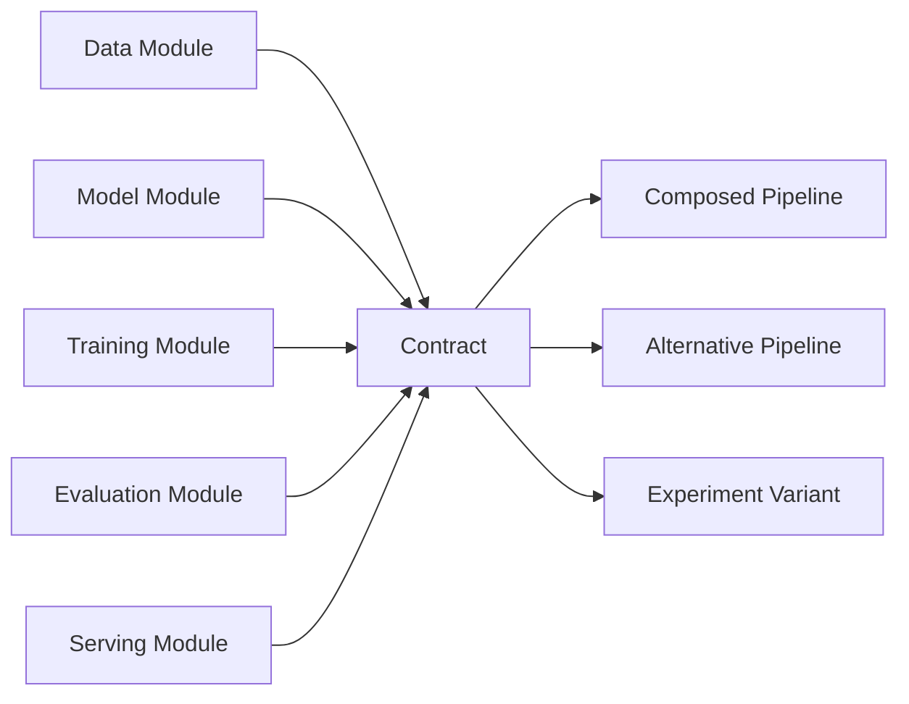

# Modularity \& Composability

## Overview

Modularity \& Composability is the principle that AI systems should be built from discrete, replaceable modules with well-defined interfaces so they can be combined into larger pipelines without cross-cutting rewrites. In production AI engineering, this reduces maintenance drag, narrows debug scope, and makes experimentation safer because changes stay localized to the module that owns them.[^1][^2]

## Problem

When AI system components such as data loading, model logic, training loops, logging, and evaluation are tightly coupled and not designed as discrete modules, changes to one component require changes to others. The result is a brittle architecture that is hard to extend, difficult to compose into larger pipelines, and expensive to maintain under rapid iteration.[^2][^1]

## Statement

Design AI systems as interchangeable modules with explicit boundaries so they can be composed into larger systems without exposing internal implementation details.[^1][^2]

## Intuition

A system becomes easier to evolve when each part has one clear responsibility and a narrow contract with its neighbors. In AI platforms, that means the retriever, ranker, scorer, trainer, evaluator, and serving layer should be independently understandable and swappable rather than merged into one execution blob. The practical payoff is not elegance; it is the ability to add, remove, or replace capabilities without destabilizing the rest of the stack.[^3][^2]

## Engineering Consequences

- **Change containment** - A new tokenizer, loss, metric, or serving backend should affect only the owner module and its interface, not the whole pipeline.[^1]
- **Composable pipelines** - Independent modules can be assembled into new workflows, which reduces the cost of trying new task variants or deployment shapes.[^3]
- **Local reasoning** - Debugging becomes tractable when failures can be attributed to a bounded component instead of a monolithic control path.[^2][^1]
- **Test isolation** - Modules can be validated against contracts, making regression testing more precise and reducing accidental dependence on hidden state.[^2]
- **Lifecycle resilience** - Components evolve at different speeds, so modular boundaries prevent fast-moving parts from forcing rebuilds of stable parts.[^2]

## Common Violations

- **Violation** - One monolithic training script owns ingestion, preprocessing, model construction, optimization, evaluation, and persistence.
**Symptoms** - Small changes trigger unrelated failures, experiments require duplicated edits, and the script becomes the only execution path.
**Why It Happens** - Prototypes are promoted to production without re-partitioning responsibilities.[^1]
- **Violation** - Modules expose internal data structures instead of stable interfaces.
**Symptoms** - Consumers depend on private fields, downstream breakage follows minor refactors, and integration code becomes brittle.
**Why It Happens** - Teams optimize for immediate convenience rather than long-term substitutability.[^1][^2]
- **Violation** - Composition logic is embedded inside core model or data code.
**Symptoms** - Reuse across tasks is awkward, and adding a new pipeline stage requires editing leaf modules.
**Why It Happens** - Orchestration is treated as a side effect instead of a first-class responsibility.[^3]
- **Violation** - The same concern is reimplemented differently in each service or pipeline stage.
**Symptoms** - Drift in evaluation, inconsistent preprocessing, and repeated bug fixes across code paths.
**Why It Happens** - There is no owned module for the concern, so each team recreates it locally.[^2]

## Appears In

- **Training systems** - Examples include training-loop orchestration, gradient accumulation, checkpointing, early stopping, and mixed-precision paths that should be swappable rather than fused.
- **Inference systems** - Examples include batch inference, streaming inference, prompt caching, and kv-cache management where runtime responsibilities must remain separable.
- **Retrieval systems** - Examples include RAG pipelines that compose retrieval, reranking, generation, and evaluation as replaceable stages.
- **Compiler and runtime stacks** - Examples include MLIR-style lowering pipelines and tensor compiler components, where structured composition directly affects retargetability and reuse.[^3]

## Mental Model

## Decision Checklist

- Can this concern be implemented, tested, and replaced independently?
- Does the interface expose only what downstream consumers actually need?
- Can a new module be composed without editing unrelated internals?
- Does the system allow alternative pipeline orderings or stage substitutions?
- Would this boundary still make sense if the implementation changed completely?
- Is orchestration separate from the logic of the stage it coordinates?

## Misconceptions

- **Myth** - Modularity is just splitting code into smaller files.
**Reality** - File boundaries do nothing if interfaces still leak internals and changes still propagate across modules.[^1]
- **Myth** - Composability is automatic once modules exist.
**Reality** - Modules must be designed for stable contracts and predictable behavior under composition; otherwise they are merely isolated, not reusable.[^3]
- **Myth** - Modular systems are always slower.
**Reality** - Performance tradeoffs come from boundary implementation and data movement, not from the principle itself.[^1]
- **Myth** - One abstract framework is better than many modules.
**Reality** - Frameworks help only when they preserve clean ownership and do not collapse all concerns into a single extension point.[^2]

## Engineering Heuristic

If a stage cannot be replaced without rewriting its neighbors, it is not modular enough.

## Historical Origin

The concept evolved through software engineering practice and is strongly associated with modularization and information-hiding research that emphasized hiding volatile design decisions behind stable interfaces.[^2][^1]

## Tradeoffs

- **Benefits**
    - Smaller blast radius for change.
    - Better reuse across tasks and pipelines.
    - Easier debugging and testing.
    - Safer experimentation with new components.
    - More maintainable long-lived systems.[^3][^1][^2]
- **Costs**
    - More upfront interface design.
    - More indirection between orchestration and implementation.
    - Potential overhead if composition layers are inefficient.
    - Stronger governance required to keep contracts stable.[^1]

## Limitations

- It can be counterproductive in throwaway prototypes where speed matters more than longevity.
- Over-modularization can create fragmentation, where boundaries multiply without real reuse.
- Some tightly bound optimization paths may need local coupling for performance reasons.
- A poor interface design can preserve modules while destroying composability.

## Related Concepts

- Separation of concerns.
- Information hiding.
- Encapsulation.
- Loose coupling.
- High cohesion.
- Single source of truth.
- Interface segregation.
- Dependency inversion.
- Plugin architecture.

## Further Study

### Seminal Papers

- Parnas, *On the Criteria To Be Used in Decomposing Systems into Modules*.[^1]
- Parnas, *Decoupling change from design*.[^2]
- Vasilache et al., *Composable and Modular Code Generation in MLIR: A Structured and Retargetable Approach to Tensor Compiler Construction*.[^3]

### Books

- Parnas and Clements, *A Rational Design Process: How and Why to Fake It*.[^4]
- Garlan and Shaw, *Software Architecture: Perspectives on an Emerging Discipline*.[^5]
- E. W. Dijkstra, *Selected Writings on Computing: A Personal Perspective*.[^6]

### Official Documentation

- ACM Digital Library entry for Parnas’s modularization paper.[^1]
- ACM Digital Library entry for *Decoupling change from design*.[^2]
- arXiv abstract and paper page for MLIR composable modular code generation.[^3]

## Suggested Meta

- **Tags:** architecture, systems, design-principles, modularity, composability
- **Aliases:** modular-design, component-composition, plug-and-play-architecture
- **Keywords:** architecture, modularity, composability, systems-design, component-based
- **Search Tokens:** modularity, composability, modular design, component composition, system design
- **Difficulty:** Intermediate
- **Domain:** systems
- **Engineering Area:** architecture
- **Estimated Reading Time:** 15-20 minutes
- **Prerequisites:** None
- **Recommended Next:** single-source-of-truth, separation-of-concerns
- **Cross-Links:**
    - referenced_by_patterns: training-loop, gradient-accumulation, kv-cache, mixed-precision, checkpointing, early-stopping, gradient-checkpointing, flash-attention, prompt-caching, streaming-inference, batch-inference
    - referenced_by_models: llama, mistral, bert
    - referenced_by_workflows: build-rag-system, fine-tune-llm-lora-qlora
[^10][^11][^12][^13][^14][^15][^16][^17][^18][^7][^8][^9]

⁂

[^1]: https://dl.acm.org/doi/10.1145/1408647.1408652

[^2]: https://dl.acm.org/doi/10.1145/3609025.3609476

[^3]: https://www.semanticscholar.org/paper/7505d6038f6b17547961fa1f9e6c4b048445a208

[^4]: http://ieeexplore.ieee.org/document/7965114/

[^5]: http://link.springer.com/10.1007/11880240_12

[^6]: https://ieeexplore.ieee.org/document/10821246/

[^7]: https://arxiv.org/abs/2507.23370

[^8]: https://ieeexplore.ieee.org/document/11576701/

[^9]: https://theswissbay.ch/pdf/Gentoomen Library/Software Engineering/OO/MODULMSA.PDF

[^10]: https://citeseerx.ist.psu.edu/document?repid=rep1\&type=pdf\&doi=43c8f1ceceb630f02f70cc9e8c2247943707729f

[^11]: https://arxiv.org/abs/2202.03293

[^12]: https://ijeret.org/index.php/ijeret/article/view/271

[^13]: https://i.cs.hku.hk/~bruno/thesis/WeixinZhang.pdf

[^14]: https://core.ac.uk/download/pdf/82305719.pdf

[^15]: https://www.irejournals.com/paper-details/1715637

[^16]: https://www.scitepress.org/papers/2012/40855/40855.pdf

[^17]: https://ijcotjournal.org/archive/ijcot-v12i1p302

[^18]: https://rauterberg.employee.id.tue.nl/presentations/parnas-1972.pdf

