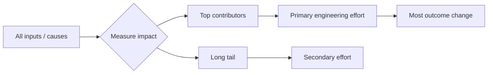

# Pareto Principle

## Overview

The Pareto Principle is a prioritization lens for systems with uneven outcome distribution: a small number of factors usually drive a disproportionate share of results. In AI engineering, it matters because model quality, defect density, latency, and operational cost are rarely spread uniformly; identifying the dominant contributors lets teams concentrate scarce attention where it moves the system most.[^1][^2]

## Problem

When AI engineering teams apply uniform effort across all dimensions of a system—equal optimization time for every feature, equal monitoring for every error class, equal review for every module—they exhaust resources on low-signal activities while the small subset of factors that actually dominate outcomes receives insufficient attention, producing suboptimal systems and burned-out teams. This is especially damaging when teams confuse breadth of work with impact and fail to distinguish high-leverage constraints from incidental noise.[^2][^1]

## Statement

Focus engineering effort on the small set of causes, components, or decisions that account for most of the measurable outcome, and treat the remainder as secondary unless evidence shows they are becoming dominant.[^1][^2]

## Intuition

In real systems, not all inputs are equally expensive to ignore. A handful of data paths, modules, prompts, error classes, or hyperparameters often explain most of the performance loss or incident volume, while the rest contribute marginally. The principle matters because it prevents teams from “polishing the floor” while the ceiling leaks; the goal is not equal attention, but maximal effect per unit of engineering effort.[^3][^1]

## Engineering Consequences

- **Better prioritization under constraint** - Teams can direct scarce engineering time toward the few changes most likely to improve quality, reliability, or latency.
- **More efficient debugging** - Concentrating analysis on the dominant defect sources shortens incident resolution and improves root-cause discovery.
- **Lower optimization waste** - The principle discourages over-investment in low-impact micro-optimizations that consume time without materially changing outcomes.
- **Sharper risk control** - Monitoring and remediation can focus on the error classes or subsystems that generate most of the operational burden.
- **Improved roadmap discipline** - Product and platform work becomes more evidence-driven when high-impact leverage points are identified explicitly rather than assumed evenly distributed.

## Common Violations

- **Violation** - Every feature or module gets equal optimization effort.
**Symptoms** - Long work cycles produce limited improvement, and the most important bottlenecks remain unresolved.
**Why It Happens** - Teams default to fairness in attention instead of evidence-based prioritization.
- **Violation** - Monitoring is spread uniformly across all error categories.
**Symptoms** - Dashboards are noisy, alert fatigue increases, and the recurring failure modes still dominate incidents.
**Why It Happens** - Instrumentation is added broadly instead of targeted at the highest-yield failure clusters.
- **Violation** - Defect analysis treats all files or components as equally likely sources of risk.
**Symptoms** - Code review and testing effort are diluted, while a small number of fault-prone areas continue to generate most problems.
**Why It Happens** - The organization lacks a data-backed notion of hotspot concentration.[^3]
- **Violation** - Model improvements are pursued without measuring contribution concentration.
**Symptoms** - Many experiments show tiny gains, but a few high-leverage changes could have produced most of the available improvement.
**Why It Happens** - Teams optimize by intuition rather than by ranking contributors to outcome variance.

## Appears In

- **Model evaluation** - Examples include identifying a few prompts, labels, or data slices that explain most failures in classification or generation quality.
- **Data quality management** - Examples include a small set of pipelines or sources contributing most invalid records, schema breaks, or label noise.
- **Incident response** - Examples include a few recurring error classes or services that drive the majority of page volume and downtime.
- **Performance engineering** - Examples include the dominant latency contributors in inference paths or the highest-cost stages in training workflows.

## Mental Model

## Decision Checklist

- Have you measured which few factors dominate the outcome?
- Is the current effort distribution proportional to measured impact?
- Would improving the top contributor change the result more than spreading effort evenly?
- Are you spending time on low-yield optimizations because they are easy to discuss?
- Do the highest-frequency defects or highest-cost bottlenecks have dedicated attention?
- Is the tail still important enough to justify work, or merely visible?

## Misconceptions

- **Myth** - The rule means exactly 80/20 in every case.
**Reality** - The numbers are directional; the important property is disproportionate concentration, not a fixed ratio.[^2][^1]
- **Myth** - The principle says the tail never matters.
**Reality** - The long tail can matter when it aggregates risk, cost, or strategic value, especially in safety or compliance contexts.
- **Myth** - Pareto thinking is an excuse to ignore hard problems.
**Reality** - It is a method for sequencing work by leverage, not a license to neglect critical low-frequency failures.
- **Myth** - High impact can be identified without measurement.
**Reality** - The principle becomes useful only when outcome concentration is observed, not assumed.[^3]

## Engineering Heuristic

Find the few contributors that explain most of the pain, and optimize those before polishing the rest.

## Historical Origin

The principle evolved from Pareto’s observations about uneven wealth distribution and was later generalized in quality management and systems analysis as the “vital few and trivial many.” Its use in software engineering is empirical rather than axiomatic, with defect concentration studies repeatedly showing hotspot behavior in a minority of files or modules.[^1][^3]

## Tradeoffs

- **Benefits**
    - Better allocation of scarce engineering effort.
    - Faster quality gains from the same budget.
    - More focused incident reduction and optimization work.
    - Clearer prioritization across product and platform teams.[^1][^3]
- **Costs**
    - Requires measurement discipline and ongoing re-ranking.
    - Can obscure important low-frequency risks if used too aggressively.
    - May create tension with teams seeking balanced ownership.
    - Can be misapplied as a shortcut for avoiding necessary tail work.[^2]

## Limitations

- It is less useful when risk is intentionally uniform, such as strict compliance or safety constraints.
- It can be misleading in systems where the tail is highly volatile or where few data points make concentration look stronger than it is.
- It should not replace root-cause analysis when a low-frequency issue has catastrophic impact.
- It is weaker in early-stage systems where the dominant contributors are not yet observable.

## Related Concepts

- Prioritization.
- Bottleneck analysis.
- Cost-benefit analysis.
- Incremental improvement.
- Technical debt triage.
- Long-tail distribution.
- Hotspot analysis.
- Resource allocation.
- Optimization.
- Opportunity cost.

## Further Study

### Seminal Papers

- Vilfredo Pareto, original inequality observations later formalized in management and quality literature.[^1]
- J. M. Juran, *The Pareto Principle* in quality management.[^2]
- Timea Illes-Seifert and Barbara Paech, *The vital few and trivial many: An empirical analysis of the Pareto Distribution of defects*.[^3]

### Books

- Richard Koch, *The 80/20 Principle*.[^2]
- Martin Kleppmann, *Designing Data-Intensive Applications* for workload concentration and operational leverage thinking.[^4]
- *System Architecture: Strategy and Product Development for Complex Systems* for Pareto-front reasoning in architecture tradeoffs.[^5]

### Official Documentation

- O’Reilly excerpt from *The 80/20 Principle* / related professional literature on Pareto-based prioritization.[^2]
- Springer-based empirical software engineering study on Pareto defect concentration.[^3]
- O’Reilly chapter on Pareto frontier tradeoff analysis in system architecture.[^5]
[^10][^11][^12][^13][^14][^15][^16][^17][^18][^6][^7][^8][^9]

⁂

[^1]: https://www.frontiersin.org/articles/10.3389/ffgc.2026.1775825/full

[^2]: https://linkinghub.elsevier.com/retrieve/pii/S0925231219308975

[^3]: https://www.semanticscholar.org/paper/63ad24cacd4fdf3dfee4ae305088b0d083d0c3f3

[^4]: https://ingegneriasismica.com/2026/volume-43-issue-3/government-attention-allocation-in-the-process-of-building-a-public-management-system-under-the-rule-of-law-a-textual-analysis-of-chinese-state-council-government-work-reports-1979-2020/

[^5]: https://linkinghub.elsevier.com/retrieve/pii/S2405896320314233

[^6]: http://link.springer.com/10.1007/s40565-017-0331-y

[^7]: https://journal.umy.ac.id/index.php/jphk/article/view/25471

[^8]: https://jurnal.unikal.ac.id/index.php/hk/article/view/5257

[^9]: https://www.amazon.com/Pareto-Principle-Unleash-principle-yourself/dp/B08BF14K8G

[^10]: https://www.oreilly.com/library/view/the-art-of/9781098141349/c02.xhtml

[^11]: https://www.scribd.com/document/314147637/eBook-Handbook-of-Software-Quality-Assurance-9781596931862-35996-Split-1

[^12]: https://childrensbookworld.com/book/9781998769377

[^13]: https://www1.goramblers.org/professor/pdf?ID=NHI38-1165\&title=pareto-principle-80-20-rule.pdf

[^14]: https://www.oreilly.com/library/view/system-architecture-strategy/9780136462989/xhtml/fileP70004959190000000000000000023AD.xhtml

[^15]: https://www.barnesandnoble.com/w/maximizing-the-pareto-principle-the-secret-strategy-to-optimizing-every-area-of-your-life-sensei-paul-david/1141679420?ean=9781778488405

[^16]: http://se.ifi.uni-heidelberg.de/fileadmin/pdf/publications/2009_SE_illes.pdf

[^17]: https://en.wikipedia.org/wiki/Pareto_principle

[^18]: https://www.everand.com/book/306359879/Pareto-s-Principle-Expand-your-business-with-the-80-20-rule

