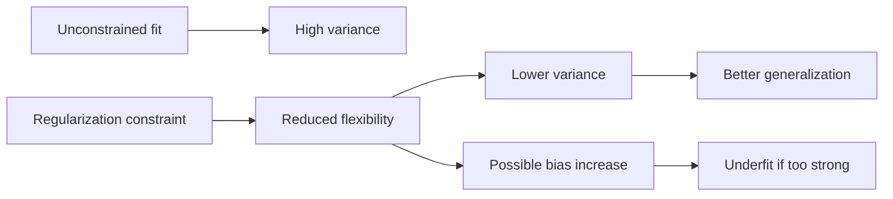

# Regularization

## Overview

Regularization is the principle of constraining model flexibility so that training captures stable signal rather than memorizing noise. In AI engineering systems, it is the main control surface for reducing overfitting, managing effective model complexity, and improving out-of-sample behavior under realistic data drift and finite-sample conditions.[^1][^2]

## Problem

When AI models are trained without explicit constraints on model complexity, they memorize training noise rather than learning generalizable patterns, causing severe overfitting, inflated variance, and catastrophic performance degradation when deployed on real-world data distributions. In practice, the failure is often hidden during training because the same configuration can achieve low empirical loss while still producing brittle predictions outside the training distribution.[^2][^1]

## Statement

Apply an explicit complexity constraint, penalty, or stochastic training intervention when the unconstrained model class is too flexible for the available data, the deployment regime, or the required calibration properties.[^1][^2]

## Intuition

Regularization is the mechanism that forces a model to prefer simpler explanations when the data do not justify extra freedom. The engineering point is not “make the model small,” but “make the inductive bias match the reliability of the evidence.” When the data are scarce, noisy, or highly correlated, unconstrained fitting often amplifies variance; when the penalty is too strong, it can suppress useful structure and create underfitting. The useful regime is the one where constraints reduce memorization faster than they erase signal.[^3][^1]

## Engineering Consequences

- **Generalization control** - Regularization directly affects the gap between training and validation performance, which determines whether the system is learning task structure or memorizing sample-specific artifacts.[^1]
- **Parameter stability** - Shrinkage and penalties reduce sensitivity to small perturbations in the data, which improves reproducibility across resamples and training runs.[^3]
- **Model selection leverage** - Regularization provides a tunable complexity axis, enabling tradeoffs among accuracy, sparsity, interpretability, and calibration.[^2]
- **Deployment robustness** - Models constrained during training tend to degrade more gracefully under modest distribution shift because they rely less on brittle high-variance features.[^3][^1]
- **Optimization interaction** - Some regularizers alter the effective optimization path as much as the final hypothesis class, so the training recipe is part of the regularization strategy rather than a separate concern.[^2]

## Common Violations

- **Violation** - Regularization is treated as a fixed default rather than a task-dependent control.
**Symptoms** - Some models underfit, others overfit, and the same penalty strength behaves inconsistently across datasets or scales.
**Why It Happens** - The inductive bias required by the data regime is not assessed before selecting the constraint.[^1][^2]
- **Violation** - Weight decay is used interchangeably with every other form of regularization without checking whether the optimizer semantics match the intended penalty.
**Symptoms** - Hyperparameter tuning looks stable on paper but produces inconsistent generalization behavior in practice.
**Why It Happens** - The engineer collapses distinct mechanisms—penalties, constraints, noise injection, and early stopping—into one label.[^2]
- **Violation** - Sparsity penalties are imposed in settings where feature correlation or representation coupling makes sparsity unstable.
**Symptoms** - Coefficients flip across runs, important features disappear, or prediction quality changes abruptly with minor data variation.
**Why It Happens** - The regularizer is chosen for interpretability or simplicity rather than compatibility with feature geometry.[^3][^2]
- **Violation** - Data augmentation, dropout, early stopping, and explicit penalties are stacked without understanding their combined effect.
**Symptoms** - Training becomes harder to tune, and the system alternates between underfitting and overfitting depending on the seed or batch schedule.
**Why It Happens** - Multiple regularization channels are applied without a clear control objective or attribution of effect.[^2]

## Appears In

- **Linear and generalized linear models** - Examples include ridge regression, lasso, elastic net, and generalized linear models where shrinkage shapes coefficient stability.[^2]
- **Deep learning** - Examples include dropout, label smoothing, weight decay, stochastic depth, and architecture-level constraints used to improve generalization.[^2]
- **Probabilistic modeling** - Examples include priors and penalized likelihood formulations where regularization encodes preference structure into inference.[^3]
- **Ill-posed inverse problems** - Examples include Tikhonov-style calibration and reconstruction where regularization is required for numerical stability.[^3]

## Mental Model

## Decision Checklist

- Is the model capacity large relative to the sample size or noise level?
- Is there evidence that validation error is materially worse than training error?
- Does the selected regularizer match the geometry of the parameters or features?
- Is the penalty strength justified by a validation regime rather than convention?
- Are multiple regularization mechanisms being composed intentionally rather than accidentally?
- Does the regularizer improve out-of-sample behavior without erasing useful signal?

## Misconceptions

- **Myth** - Regularization is only about preventing overfitting.
**Reality** - It also stabilizes inference, shapes optimization, and encodes structural assumptions into the model.[^3][^2]
- **Myth** - Any penalty automatically improves generalization.
**Reality** - Excessive or misaligned constraints can increase bias and reduce performance.[^1]
- **Myth** - Dropout, early stopping, and weight decay are interchangeable.
**Reality** - They act through different mechanisms and can have different effects on optimization and calibration.[^2]
- **Myth** - Stronger regularization is always safer in production.
**Reality** - Over-regularization can create systematically underpowered models that fail on legitimate signal.[^1]

## Engineering Heuristic

Regularize to remove unsupported freedom, not to make the model harder to train.

## Historical Origin

The concept is well established in statistical estimation and inverse problems, especially through ridge/Tikhonov-style stabilization and later sparsity and structural penalties in statistical learning. Its modern deep-learning form is a synthesis of penalty methods, architectural constraints, stochastic training effects, and empirical generalization practice.[^3][^2]

## Tradeoffs

- **Benefits**
    - Lower overfitting and better out-of-sample performance.
    - More stable parameters and predictions.
    - Improved calibration or interpretability in some settings.
    - Better control of complexity under finite data.[^1][^2]
- **Costs**
    - Added hyperparameter tuning burden.
    - Possible loss of representational power.
    - Interactions between regularizers can be non-obvious.
    - The wrong penalty can produce underfitting or brittle sparsity.[^2][^3]

## Limitations

- It can be counterproductive when the model is already bias-limited.
- It is less effective if the chosen penalty does not match the task geometry.
- It does not replace better data, better features, or better labeling.
- Some forms of regularization are difficult to interpret or tune in large-scale deep models.[^2]

## Related Concepts

- Bias–variance tradeoff.
- Model selection.
- Cross-validation.
- Weight decay.
- Ridge regression.
- Lasso.
- Elastic net.
- Dropout.
- Early stopping.
- Tikhonov regularization.

## Further Study

### Seminal Papers

- Robert Tibshirani, *Regression Shrinkage and Selection Via the Lasso*.[^1]
- Jan Kukačka, Vladimir Golkov, and Daniel Cremers, *Regularization for Deep Learning: A Taxonomy*.[^2]
- Daniel Gerth, *A new interpretation of (Tikhonov) regularization*.[^3]

### Books

- Trevor Hastie, Robert Tibshirani, and Jerome Friedman, *The Elements of Statistical Learning*.[^4]
- Christopher M. Bishop, *Pattern Recognition and Machine Learning*.[^5]
- Bernd Schölkopf and Alexander J. Smola, *Learning with Kernels*.[^6]

### Official Documentation

- Oxford Academic record for *Regression Shrinkage and Selection Via the Lasso*.[^1]
- arXiv record for *Regularization for Deep Learning: A Taxonomy*.[^2]
- arXiv record for *A new interpretation of (Tikhonov) regularization*.[^3]

## Suggested Meta

- **Tags:** learning-theory, generalization, model-complexity, overfitting-prevention, regularization
- **Aliases:** reg, weight-decay, penalty-term, complexity-control, shrinkage
- **Keywords:** regularization, generalization, overfitting, model-complexity, l1, l2, dropout, early-stopping, weight-decay, bias-variance, constraint, prior
- **Search Tokens:** regularization, l1 regularization, l2 regularization, weight decay, dropout, early stopping, ridge, lasso, elastic net, model complexity, overfitting prevention
- **Difficulty:** Intermediate
- **Domain:** learning_theory
- **Engineering Area:** model_selection
- **Estimated Reading Time:** 15-20 minutes
- **Prerequisites:** None
- **Recommended Next:** bias-variance-tradeoff, cross-validation, ensemble-methods, gradient-descent
- **Cross-Links:**
    - referenced_by_patterns: training-loop, gradient-accumulation, kv-cache, mixed-precision, checkpointing, early-stopping, gradient-checkpointing, flash-attention, prompt-caching, streaming-inference, batch-inference
    - referenced_by_models: llama, mistral, bert
    - referenced_by_workflows: build-rag-system, fine-tune-llm-lora-qlora
[^10][^11][^12][^13][^14][^15][^16][^17][^18][^19][^20][^21][^22][^23][^24][^25][^26][^27][^28][^29][^30][^31][^32][^33][^34][^35][^7][^8][^9]

⁂

[^1]: https://arxiv.org/abs/2511.02460

[^2]: https://iopscience.iop.org/article/10.1088/0266-5611/33/1/014002

[^3]: https://www.spiedigitallibrary.org/conference-proceedings-of-spie/10615/2302490/Image-deblurring-based-on-nonlocal-regularization-with-a-non-convex/10.1117/12.2302490.full

[^4]: https://www.semanticscholar.org/paper/be75af10e11f33347ea57855067855ba43c989f9

[^5]: https://ieeexplore.ieee.org/document/11075102/

[^6]: https://arxiv.org/abs/2305.08675

[^7]: https://iopscience.iop.org/article/10.1088/1361-6544/aa9a86

[^8]: https://arxiv.org/abs/2301.11476

[^9]: https://www.oreilly.com/library/view/the-regularization-cookbook/9781837634088/

[^10]: https://www.oreilly.com/library/view/mastering-machine-learning/9781788621113/8314a347-d6da-4dcd-8a93-8728d91fcfaa.xhtml

[^11]: https://www.sciencedirect.com/science/article/abs/pii/S156625352100230X

[^12]: https://www.perlego.com/book/4514202/regularization-optimization-kernels-and-support-vector-machines-pdf

[^13]: https://eller.arizona.edu/sites/default/files/2024-04/carter hill ml chapter 4 15 2024.pdf

[^14]: https://www.is.uni-freiburg.de/resources/seminar-papers/Ridge_Regression_LASSO.pdf

[^15]: https://www.amazon.com/Regularization-Optimization-Kernels-Support-Machines/dp/0367658984

[^16]: https://arxiv.org/pdf/1503.06910.pdf

[^17]: https://github.com/PacktPublishing/The-Regularization-Cookbook

[^18]: https://arxiv.org/abs/1710.10686

[^19]: https://www.scitepress.org/DigitalLibrary/Link.aspx?doi=10.5220/0013700300004670

[^20]: https://www.spiedigitallibrary.org/conference-proceedings-of-spie/13219/3036681/Implementation-of-linear-regression-lasso-ridge-regression-and-kernel-trick/10.1117/12.3036681.full

[^21]: https://link.springer.com/10.1007/s41060-025-00957-y

[^22]: https://ace.ewapub.com/article/view/11112

[^23]: https://www.clausiuspress.com/article/12969.html

[^24]: https://onlinelibrary.wiley.com/doi/10.1002/sta4.540

[^25]: https://link.springer.com/10.1007/s13571-025-00363-1

[^26]: https://www.semanticscholar.org/paper/46ce19f2d2dbf045b70744fc01a6629624567315

[^27]: https://www.arxiv.org/abs/1710.10686

[^28]: https://proceedings.neurips.cc/paper_files/paper/2022/hash/708fdc7911f11585ee7161518e509ae6-Abstract-Conference.html

[^29]: https://www.tu-chemnitz.de/mathematik/ip/fulltext/CHY.pdf

[^30]: https://arxiv.org/abs/2103.08218

[^31]: https://academic.oup.com/jrsssb/article/58/1/267/7027929

[^32]: https://sesug.org/proceedings/sesug_2022_final_papers/Statistics,_Analytics_and_Reporting/SESUG2022_Paper_170_Final_PDF.pdf

[^33]: https://onlinelibrary.wiley.com/doi/abs/10.1002/9780470061602.eqf12016

[^34]: https://arxiv.org/pdf/1412.6540.pdf

[^35]: http://www.mtm.ufsc.br/~fermin/ltik_gdpfp.pdf

