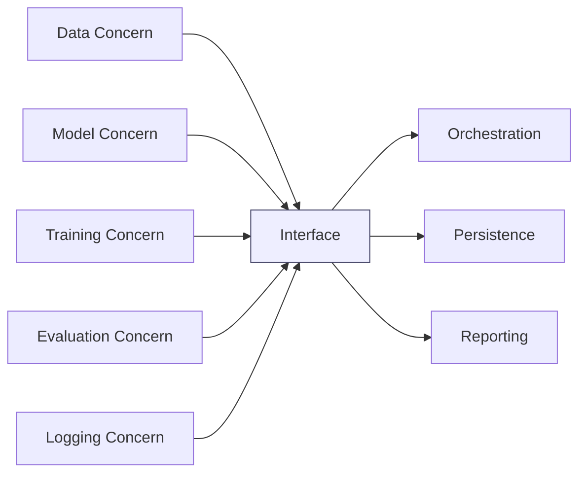

# Separation of Concerns

## Overview

Separation of Concerns is the practice of assigning distinct engineering responsibilities to distinct modules so that each change is localized and each failure mode is easier to reason about. In AI engineering systems, that discipline improves maintainability, debugging speed, and scaling because data handling, model logic, orchestration, evaluation, and observability stop contaminating one another with implementation details.[^1][^2]

## Problem

When AI system components such as data loading, model logic, training loops, logging, and evaluation are tightly coupled, changes to one component force changes in others. That coupling makes systems brittle, obscures root causes, and turns routine iteration into cross-cutting refactors.[^2][^1]

## Statement

Design each module around a single stable concern, and hide design decisions that are likely to change behind a narrow interface.[^1]

## Intuition

The core intuition is that AI systems fail fastest when “what it does” and “how it does it” are mixed in the same code path. If representation, sequencing, metrics, persistence, and control flow all live together, every experiment becomes a system rewrite. When concerns are separated, the system can change one axis at a time without destabilizing the rest.[^2][^1]

## Engineering Consequences

- **Change locality** - Changes stay inside the owning module, which reduces the blast radius of new data formats, new model variants, or new evaluation logic.[^1]
- **Debuggability** - Failures are easier to isolate because symptoms map to a bounded responsibility instead of a tangled execution path.[^2][^1]
- **Independent development** - Teams or agents can work on storage, training, inference, and metrics with fewer coordination dependencies.[^1]
- **Replaceability** - You can swap implementations inside a concern boundary, such as changing a tokenizer, retriever, or optimizer, without rewriting orchestration code.[^1]
- **Scalability of maintenance** - Long-lived AI systems remain tractable because architectural drift is constrained by ownership boundaries rather than spread across the codebase.[^2]

## Common Violations

- **Violation** - Data access, preprocessing, and model execution are embedded in one training script.
**Symptoms** - Small schema changes break training, evaluation logic duplicates preprocessing, and experiments require manual code edits in multiple places.
**Why It Happens** - Fast prototypes often optimize for immediate execution rather than stable ownership boundaries.[^1]
- **Violation** - Logging, metrics, and checkpointing are hardcoded inside the model forward or loss computation.
**Symptoms** - Reusing the model outside one training loop becomes difficult, and observability changes require touching core model code.
**Why It Happens** - Engineers treat instrumentation as “small enough” to inline, then later cannot separate it cleanly.[^2]
- **Violation** - Training orchestration and algorithmic logic are fused.
**Symptoms** - Scheduler changes, distributed execution changes, or evaluation frequency changes force edits in core model behavior.
**Why It Happens** - The system is organized around execution order instead of stable responsibility boundaries.[^1]
- **Violation** - Evaluation code depends on private internals of the model or data pipeline.
**Symptoms** - Metrics break when internals change, and benchmark runs require synchronized edits across modules.
**Why It Happens** - The interface between components was never designed as a contract; it emerged accidentally.[^2][^1]

## Appears In

- **Training systems** - Examples include training-loop orchestration, checkpointing, early stopping, gradient accumulation, and mixed-precision handling, where each concern should be isolated to reduce coupling.
- **Inference systems** - Examples include batch inference, streaming inference, prompt caching, kv-cache management, and flash-attention integration, where runtime performance concerns should not leak into business logic.
- **Retrieval systems** - Examples include RAG pipelines, indexing, retrieval, reranking, and answer synthesis, where retrieval mechanics should remain separable from prompt composition.
- **Model packaging** - Examples include model wrappers, adapters, and serving layers for Llama, Mistral, and BERT-style systems, where architecture, runtime, and deployment concerns evolve at different rates.

## Mental Model

## Decision Checklist

- Does this module own one primary responsibility?
- Can this concern change without requiring edits in unrelated modules?
- Can tests for this concern run without the full system?
- Does the interface hide volatile implementation details?
- Would adding a new model, dataset, or metric require changes in more than one owner?
- Can debugging be localized to a single concern boundary?

## Misconceptions

- **Myth** - Separation of concerns means creating more files.
**Reality** - It means creating clearer ownership boundaries; file count is incidental.
- **Myth** - A clean call graph automatically means clean separation.
**Reality** - A call graph can still encode hidden coupling if module boundaries expose implementation decisions.[^1]
- **Myth** - Separation of concerns conflicts with performance.
**Reality** - Performance cost usually comes from the implementation of the boundary, not from the principle itself; Parnas explicitly notes that efficiency depends on implementation strategy.[^1]
- **Myth** - This is only a code organization style.
**Reality** - In AI systems it is an architectural discipline that governs change propagation, debugging scope, and lifecycle stability.[^2]

## Engineering Heuristic

If a change feels “small” but touches many modules, the concern boundaries are wrong.

## Historical Origin

The concept evolved through software engineering practice and is strongly associated with modularization and information hiding work, especially Parnas’s 1971–1972 research on decomposing systems by design decisions likely to change.[^2][^1]

## Tradeoffs

- **Benefits**
    - Lower change propagation.
    - Easier debugging and testing.
    - Better modular reuse.
    - Cleaner ownership for teams and systems.
    - More stable long-term architecture.[^2][^1]
- **Costs**
    - More interface design work up front.
    - Potential performance overhead if boundaries are implemented naively.
    - More indirection in call paths.
    - Requires stronger discipline to avoid leaking implementation details.[^1]

## Limitations

- It is less useful for throwaway prototypes where speed of iteration dominates maintainability.
- It can be counterproductive if boundaries are artificial and create excessive abstraction without reducing coupling.
- It does not eliminate the need for coordination when a change genuinely spans multiple concerns.
- It can be implemented poorly enough to add complexity without adding isolation.[^1]

## Related Concepts

- Information hiding.
- Modularization.
- Single source of truth.
- Encapsulation.
- Loose coupling.
- High cohesion.
- Interface segregation.
- Dependency inversion.
- Change locality.

## Further Study

### Seminal Papers

- David L. Parnas, *On the Criteria To Be Used in Decomposing Systems into Modules*.[^1]
- Parnas, *Decoupling change from design*.[^2]
- Akşit et al., *The Six Concerns for Separation of Concerns*.[^3]

### Books

- David L. Parnas and Paul C. Clements, *A Rational Design Process: How and Why to Fake It*.[^4]
- Edsger W. Dijkstra, *Selected Writings on Computing: A Personal Perspective*.[^5]

### Official Documentation

- ACM Digital Library entry for Parnas’s modularization paper.[^1]
- ACM Digital Library entry for *Decoupling change from design*.[^2]
- UTwente paper on the six concerns for separation of concerns.[^3]

## Suggested Meta

- **Tags:** architecture, systems, design-principles, separation-of-concerns
- **Aliases:** soc, concern-separation
- **Keywords:** architecture, modularity, systems-design
- **Search Tokens:** separation of concerns, soc, system design
- **Difficulty:** Intermediate
- **Domain:** systems
- **Engineering Area:** architecture
- **Estimated Reading Time:** 15-20 minutes
- **Prerequisites:** None
- **Recommended Next:** single-source-of-truth, modularity
- **Cross-Links:**
    - referenced_by_patterns: training-loop, gradient-accumulation, kv-cache, mixed-precision, checkpointing, early-stopping, gradient-checkpointing, flash-attention, prompt-caching, streaming-inference, batch-inference
    - referenced_by_models: llama, mistral, bert
    - referenced_by_workflows: build-rag-system, fine-tune-llm-lora-qlora
[^10][^11][^12][^13][^14][^15][^16][^17][^18][^19][^20][^21][^22][^23][^6][^7][^8][^9]

⁂

[^1]: RESOURCE_KNOWLEDGE_REQUIREMENTS_REPORT.md

[^2]: MACHINE_LEARNING_INTEGRATION_ARCHITECTURE_AUDIT.md

[^3]: CONTENT_QUALITY_STANDARD.md

[^4]: ARCHITECTURE_FREEZE.md

[^5]: AENS-Knowledge-Layer-Specification.md

[^6]: https://www.semanticscholar.org/paper/522d7d3e62103f24e347269c891bc5158115e1ed

[^7]: https://www.scienceopen.com/document_file/af682c37-c3be-4f6e-8362-218b42d3bba2/ScienceOpen/001_Alencar.pdf

[^8]: http://arxiv.org/pdf/2105.00534.pdf

[^9]: https://www.rajpub.com/index.php/ijct/article/download/1181ijct/pdf_247

[^10]: https://arxiv.org/ftp/arxiv/papers/2012/2012.08347.pdf

[^11]: https://pmc.ncbi.nlm.nih.gov/articles/PMC9767994/

[^12]: https://www.ijert.org/research/microservices-api-security-IJERTV7IS010137.pdf

[^13]: https://pmc.ncbi.nlm.nih.gov/articles/PMC8235787/

[^14]: https://dl.acm.org/doi/10.5555/1241515.1241527

[^15]: https://ris.utwente.nl/ws/files/5428452/Aksit01six.pdf

[^16]: https://dl.acm.org/doi/10.1145/239098.239109

[^17]: https://arxiv.org/abs/1111.3013v1

[^18]: https://prl.khoury.northeastern.edu/img/p-tr-1971.pdf

[^19]: http://www.sci.brooklyn.cuny.edu/~kopec/csc79000/ModularStructure.doc

[^20]: https://www.cl.cam.ac.uk/ftp/users/rja14/ieee99-infohiding.pdf

[^21]: https://dl.acm.org/doi/10.5555/2032497.2032509

[^22]: https://www.lix.polytechnique.fr/~mandres/downloads/IHPCS-full.pdf

[^23]: https://arxiv.org/ftp/arxiv/papers/1404/1404.3063.pdf

