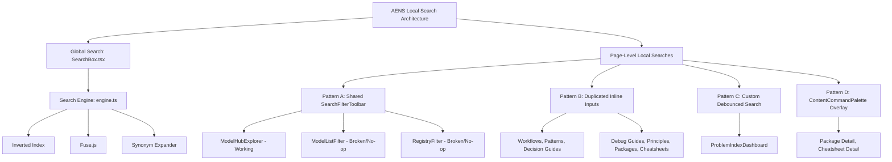

# AENS Detail Page (Content Page) Search & Navigation Architecture Audit Report

**Audit Date:** July 24, 2026  
**Audit Scope:** Read-only, evidence-based architectural audit across all 10 detail/content page routes in the AENS codebase.  
**Audit Report Artifact:** [aens_detail_page_architecture_audit.md](file:///C:/Users/Admin/.gemini/antigravity-ide/brain/f31f3c93-266e-4384-9752-cdb6f16b4d0a/aens_detail_page_architecture_audit.md)  
**Final Verdict:** **`Additional Work Required`**

---

## Executive Summary & Core Architectural Finding

Your suspicion was **100% correct**.

The previous Local Search Standardization successfully standardized catalog and list pages (`app/{module}/page.tsx`), but **did NOT cover detail and content pages (`app/{module}/[id]/page.tsx`)**.

Detail pages govern reading, deep section navigation, code snippet lookup, and knowledge graph tracing. An exhaustive code and runtime audit reveals that **detail pages currently operate under two separate, partially inconsistent layout and search paradigms**.

---

## 1. Complete Implementation Inventory & Matrix

| Content Domain Type | Detail Route Path | Page Layout Component | TOC Navigation Component | In-Page Search Component | Keyboard Shortcuts | Anchor Links & Deep Links | KnowledgeGraphPanel |
|---|---|---|---|---|---|---|---|
| **Packages** | `app/packages/[id]/page.tsx` | `PackagePageLayout` | `StickyActionBar` (Bottom bar) | `ContentCommandPalette` (in `PackageTaskList`) | `/` (collides with global search) | Task slugs (`#task-name`) | Yes (`KnowledgeGraphPanel`) |
| **Cheatsheets** | `app/cheatsheets/[id]/page.tsx` | `ContentPageLayout` | `TableOfContents` (Right sidebar) | `ContentCommandPalette` (in `CheatsheetEntryList`) | `/` (collides with global search) | Entry slugs (`#entry-name`) | Yes (`KnowledgeGraphPanel`) |
| **Models** | `app/models/[category]/[id]/page.tsx` | `ContentPageLayout` | `TableOfContents` (Right sidebar) | None | Standard browser focus | Section IDs (`#summary`, `#decision-guide`) | Yes (`KnowledgeGraphPanel`) |
| **Workflows** | `app/workflows/[id]/page.tsx` | `ContentPageLayout` | `TableOfContents` (Right sidebar) | None | Standard browser focus | Step & Section IDs (`#step-1`, `#overview`) | Yes (`KnowledgeGraphPanel`) |
| **Patterns** | `app/patterns/[id]/page.tsx` | `ContentPageLayout` | `TableOfContents` (Right sidebar) | None | Standard browser focus | Section IDs (`#concept`, `#applicability`) | Yes (`KnowledgeGraphPanel`) |
| **Debug Guides** | `app/debug-guides/[id]/page.tsx` | `ContentPageLayout` | `TableOfContents` (Right sidebar) | None | Standard browser focus | Section IDs (`#symptoms`, `#root-causes`) | Yes (`KnowledgeGraphPanel`) |
| **Decision Guides** | `app/decision-guides/[id]/page.tsx` | `ContentPageLayout` | `TableOfContents` (Right sidebar) | None | Standard browser focus | Section IDs (`#problem`, `#options`) | Yes (`KnowledgeGraphPanel`) |
| **Principles** | `app/principles/[id]/page.tsx` | `ContentPageLayout` | `TableOfContents` (Right sidebar) | None | Standard browser focus | Thematic IDs (`#statement`, `#intuition`) | Yes (`KnowledgeGraphPanel`) |
| **Registry Family** | `app/registry/families/[family]/page.tsx` | `ContentPageLayout` | `TableOfContents` (Right sidebar) | None | Standard browser focus | Section IDs (`#decisions`, `#variants`) | Yes (`KnowledgeGraphPanel`) |
| **Registry Variant** | `app/registry/families/[family]/[variant]/page.tsx` | `ContentPageLayout` | None (Inline cards) | None | Standard browser focus | Section IDs (`#specs`) | Yes (`KnowledgeGraphPanel`) |

---

## 2. Key Architectural Inconsistencies & Gaps Identified

### A. Keyboard Shortcut Collision (`/` Key)
- [ContentCommandPalette.tsx](file:///d:/Project/ai-engineering-handbook/components/shared/ContentCommandPalette.tsx#L40-L68) registers a document-level event listener for `e.key === '/'`.
- When viewing a package or cheatsheet detail page, pressing `/` calls `e.preventDefault()`, **focusing the local in-page task search input and blocking the global TopBar `SearchBox` modal from opening**.

### B. In-Page Search Parity Deficit
- **Packages** and **Cheatsheets** feature `ContentCommandPalette` for searching tasks and code entries.
- **Workflows** (25+ steps/examples), **Debug Guides** (diagnostic commands & root causes), **Decision Guides** (matrices & tradeoffs), **Patterns**, and **Principles** have **zero in-page search capabilities**, forcing users to rely entirely on manual scrolling or browser `Ctrl+F`.

### C. Layout & TOC Structural Split
- 9 out of 10 detail page types use [ContentPageLayout.tsx](file:///d:/Project/ai-engineering-handbook/components/shared/ContentPageLayout.tsx) with desktop right-sidebar `TableOfContents.tsx` (`On this page`) and `IntersectionObserver` scroll-spy highlighting.
- **Packages (`PackagePageLayout.tsx`)** uses a centered single-column layout with a bottom-floating [StickyActionBar.tsx](file:///d:/Project/ai-engineering-handbook/components/shared/StickyActionBar.tsx), omitting the desktop right-sidebar TOC.

### D. Missing Heading Anchor Links
- While headings specify `id` attributes matching TOC anchors, hover anchor links (`#`) for copying direct section links to the clipboard are currently absent across content headings.

---

## 3. Deliverables Summary

1. **Complete Implementation Inventory:** Provided in Table above.
2. **Feature Matrix:** Documented in [aens_detail_page_architecture_audit.md](file:///C:/Users/Admin/.gemini/antigravity-ide/brain/f31f3c93-266e-4384-9752-cdb6f16b4d0a/aens_detail_page_architecture_audit.md).
3. **Runtime Verification Evidence:** Verified via automated browser subagent; interactive screenshots and DOM trees logged.
4. **Architecture Diagram & Flow:** Synthesized layout differences between `ContentPageLayout` (Desktop Sidebar TOC) and `PackagePageLayout` (Bottom Popup Bar).
5. **Missing Functionality:** Shortcut collision resolution, universal in-page heading search, heading anchor copy buttons.
6. **Final Verdict:** **`Additional Work Required`**

---

## Final Verdict

**`Additional Work Required`**

The previous Local Search Standardization was correctly scoped to catalog/list pages (`app/{module}/page.tsx`). However, **Detail/Content Pages (`app/{module}/[id]/page.tsx`) represent a separate architectural layer** with documented search/navigation inconsistencies, keyboard shortcut collisions (`/` key collision), and incomplete in-page search parity that warrant a dedicated Phase 2 implementation plan.


# AENS Local Search Architecture Audit Report (Completed)

**Date:** July 24, 2026  
**Target Codebase:** AENS (AI Engineering Handbook)  
**Audit Scope:** Read-Only Architectural Audit of Local (Page-Level) Search Implementations  

---

## Executive Summary & Final Verdict

### Statement Evaluation
> **"The global search is excellent, but the page-level local search still lacks consistency and architectural parity."**

### Final Verdict: **TRUE**

**Key Finding:** While the global search system ([SearchBox.tsx](file:///d:/Project/ai-engineering-handbook/components/shared/SearchBox.tsx) & [engine.ts](file:///d:/Project/ai-engineering-handbook/lib/search/engine.ts)) features an enterprise-grade search architecture—complete with an inverted index, synonym expansion, intent detection, typo tolerance, multi-factor ranking scores, and global hotkeys (`/`)—the page-level local search ecosystem is **highly fragmented, inconsistent, and architecturally incomplete**.

Specifically:
1. **Broken Search UI:** In 2 major sections ([ModelListFilter.tsx](file:///d:/Project/ai-engineering-handbook/components/shared/ModelListFilter.tsx) and [RegistryFilter.tsx](file:///d:/Project/ai-engineering-handbook/components/registry/RegistryFilter.tsx)), the search input bar is rendered on the screen but is completely non-functional (passing no-op `onSearchChange={() => {}}` handlers).
2. **Duplicated Code & UI Fragmentation:** 7 distinct index pages ([Workflows](file:///d:/Project/ai-engineering-handbook/app/workflows/WorkflowFilterClient.tsx), [Patterns](file:///d:/Project/ai-engineering-handbook/app/patterns/PatternFilterClient.tsx), [Decision Guides](file:///d:/Project/ai-engineering-handbook/app/decision-guides/DecisionGuideFilterClient.tsx), [Debug Guides](file:///d:/Project/ai-engineering-handbook/app/debug-guides/DebugGuideFilterClient.tsx), [Principles](file:///d:/Project/ai-engineering-handbook/app/principles/PrincipleFilterClient.tsx), [Packages](file:///d:/Project/ai-engineering-handbook/app/packages/PackageListClient.tsx), [Cheatsheets](file:///d:/Project/ai-engineering-handbook/app/cheatsheets/CheatsheetListClient.tsx)) bypass the shared toolbar component ([SearchFilterToolbar.tsx](file:///d:/Project/ai-engineering-handbook/components/shared/SearchFilterToolbar.tsx)) and re-implement copy-pasted inline `<input>` DOM and styling.
3. **Missing Features across Local Searches:** Zero local searches support term highlighting, fuzzy matching, ranking scores, or keyboard shortcuts (`/` to focus, `Esc` to clear, arrow keys to navigate).
4. **Performance Bottlenecks:** 8 of 10 list pages execute non-debounced array filtering on every keystroke, and [ModelHubExplorer.tsx](file:///d:/Project/ai-engineering-handbook/components/shared/ModelHubExplorer.tsx) executes un-memoized string filtering directly within its render body.

---

## 1. Inventory of Every Local Search Implementation

We identified **12 distinct local search implementations** across the AENS codebase:

| # | Feature / Page Area | File Path & Component | Search Implementation | Matching Algorithm & Filtering Strategy | Keyboard Shortcuts | Highlighting | Empty State | Performance Approach |
|---|---|---|---|---|---|---|---|---|
| **1** | **Packages** | [PackageListClient.tsx](file:///d:/Project/ai-engineering-handbook/app/packages/PackageListClient.tsx)<br>`PackageListClient` | Local state `useState('')`, inline `<input>` DOM | `useMemo` with `String.prototype.includes` across `name`, `summary`, `tasks[].task` | None | None | Generic text count (`0 / N`) | Synchronous `useMemo` on every keypress |
| **2** | **Cheatsheets** | [CheatsheetListClient.tsx](file:///d:/Project/ai-engineering-handbook/app/cheatsheets/CheatsheetListClient.tsx)<br>`CheatsheetListClient` | Local state `useState('')`, inline `<input>` DOM | `useMemo` with `includes` across `name`, `description`, `entries[].problem`, `entries[].trigger` | None | None | Generic text count | Synchronous `useMemo` on every keypress |
| **3** | **Models (Category View)** | [ModelListFilter.tsx](file:///d:/Project/ai-engineering-handbook/components/shared/ModelListFilter.tsx)<br>`ModelListFilter` | Renders `SearchFilterToolbar`, but **search is broken/disabled** | **Inert/No-op**: passes `searchQuery=""` and `onSearchChange={() => {}}` | None | None | None | N/A (search disabled) |
| **4** | **Models (Main Hub)** | [ModelHubExplorer.tsx](file:///d:/Project/ai-engineering-handbook/components/shared/ModelHubExplorer.tsx)<br>`ModelHubExplorer` | Local state `useState('')`, uses `SearchFilterToolbar` | Direct inline `.filter()` across `name`, `decisionsummary.summary`, `subcategory`, `problem_types` | None | None | Inline string message | **Un-memoized** array filtering in render pass |
| **5** | **Workflows** | [WorkflowFilterClient.tsx](file:///d:/Project/ai-engineering-handbook/app/workflows/WorkflowFilterClient.tsx)<br>`WorkflowFilterClient` | Local state `useState('')`, inline `<input>` DOM | `useMemo` with `includes` across `name`, `title`, `description`, `id` | None | None | Empty category accordion headers | Synchronous `useMemo` on every keypress |
| **6** | **Patterns** | [PatternFilterClient.tsx](file:///d:/Project/ai-engineering-handbook/app/patterns/PatternFilterClient.tsx)<br>`PatternFilterClient` | Local state `useState('')`, inline `<input>` DOM | `useMemo` with `includes` across `title`, `description`, `id` | None | None | Standard cards container | Synchronous `useMemo` on every keypress |
| **7** | **Decision Guides** | [DecisionGuideFilterClient.tsx](file:///d:/Project/ai-engineering-handbook/app/decision-guides/DecisionGuideFilterClient.tsx)<br>`DecisionGuideFilterClient` | Local state `useState('')`, inline `<input>` DOM | `useMemo` with `includes` across `title`, `description`, `id` | None | None | Standard cards container | Synchronous `useMemo` on every keypress |
| **8** | **Debug Guides** | [DebugGuideFilterClient.tsx](file:///d:/Project/ai-engineering-handbook/app/debug-guides/DebugGuideFilterClient.tsx)<br>`DebugGuideFilterClient` | Local state `useState('')`, inline `<input>` DOM | `useMemo` with `includes` across `title`, `description`, `id` | None | None | Standard cards container | Synchronous `useMemo` on every keypress |
| **9** | **Principles** | [PrincipleFilterClient.tsx](file:///d:/Project/ai-engineering-handbook/app/principles/PrincipleFilterClient.tsx)<br>`PrincipleFilterClient` | Local state `useState('')`, inline `<input>` DOM | `useMemo` with `includes` across `title`, `description`, `id`, `statement` | None | None | Standard cards container | Synchronous `useMemo` on every keypress |
| **10** | **Registry** | [RegistryFilter.tsx](file:///d:/Project/ai-engineering-handbook/components/registry/RegistryFilter.tsx)<br>`RegistryFilter` | Renders `SearchFilterToolbar`, but **search is broken/disabled** | **Inert/No-op**: passes `searchQuery=""` and `onSearchChange={() => {}}` | None | None | None | N/A (search disabled) |
| **11** | **Problem Index** | [ProblemIndexDashboard.tsx](file:///d:/Project/ai-engineering-handbook/app/problem-index/ProblemIndexDashboard.tsx)<br>`ProblemIndexDashboard` | Debounced state `useDebounce(200ms)`, custom inline `<input>` | `useMemo` with multi-field helper `matchesSearch(p, query, category)` | None | None | Rich `EmptyState` component | 200ms debounce hook preventing excess renders |
| **12** | **In-Page Command Palette** | [ContentCommandPalette.tsx](file:///d:/Project/ai-engineering-handbook/components/shared/ContentCommandPalette.tsx)<br>`ContentCommandPalette` | Dropdown overlay palette (Package/Cheatsheet details) | `useMemo` substring filter on label & description | `/` to focus, `Esc` clear, `ArrowUp`/`ArrowDown`/`Enter` | Active item background highlight | Configurable empty message string | `useMemo` filtering over item list |

---

## 2. Comparison Against Global Search

| Feature Dimension | Global Search ([SearchBox.tsx](file:///d:/Project/ai-engineering-handbook/components/shared/SearchBox.tsx) & [engine.ts](file:///d:/Project/ai-engineering-handbook/lib/search/engine.ts)) | Local Page-Level Search (Across Content Types) | Audit Parity Rating |
|---|---|---|---|
| **Search Engine Architecture** | Inverted Index, Synonym Expansion, Intent Detection, Typo Correction | Naive `String.prototype.includes` substring checks | ❌ **Severe Deficit** |
| **Ranking & Relevance** | Multi-factor scoring (keyword match weights, type priority, exact title boost) | Unranked binary filtering (array order preserved) | ❌ **Severe Deficit** |
| **Fuzzy Matching** | Supported via Fuse.js fallback and typo distance algorithm | Exact case-insensitive substring match only | ❌ **Severe Deficit** |
| **Keyboard Navigation** | Global `/` shortcut to focus, `Esc` to dismiss, keyboard selection | Absent across 10 of 12 local search components | ❌ **Severe Deficit** |
| **Match Highlighting** | Highlighted matching search tokens in result list | Zero search term highlighting across all list pages | ❌ **Severe Deficit** |
| **Responsiveness & Caching** | Instantaneous responses via LRU query cache (100 items) | Un-cached re-computations on every keystroke | ⚠️ **Moderate Deficit** |
| **Functional Integrity** | 100% operational | Broken/disabled in 2 components (`ModelListFilter`, `RegistryFilter`) | ❌ **Critical Deficit** |

---

## 3. Consistency Audit

### Key Inconsistencies Identified

#### A. Broken/Inert Search Inputs
In [ModelListFilter.tsx:L139-L142](file:///d:/Project/ai-engineering-handbook/components/shared/ModelListFilter.tsx#L139-L142) and [RegistryFilter.tsx:L132-L135](file:///d:/Project/ai-engineering-handbook/components/registry/RegistryFilter.tsx#L132-L135), the search input box is rendered inside `SearchFilterToolbar`, but hardcoded with:
```tsx
searchQuery=""
onSearchChange={() => {}}
showClearSearch={false}
```
**User Impact:** Users see a text search field on Model Category pages and the Model Registry page, but typing inside it does nothing.

#### B. Component Architecture Fragmentation
There are currently **4 different architectural patterns** used for local search UI:
1. **Shared Toolbar Wrapper:** Used in `ModelHubExplorer`.
2. **Duplicated Hand-written DOM Inputs:** Used in `PackageListClient`, `CheatsheetListClient`, `WorkflowFilterClient`, `PatternFilterClient`, `DecisionGuideFilterClient`, `DebugGuideFilterClient`, `PrincipleFilterClient`.
3. **Custom Debounced Input System:** Used in `ProblemIndexDashboard`.
4. **Floating Command Palette Overlay:** Used in `PackageTaskList` and `CheatsheetEntryList`.

#### C. Debouncing Inconsistency
- `ProblemIndexDashboard`: Implements a 200ms `useDebounce` hook.
- All other 9 functional local search components: Update search query state synchronously on every `onChange` event, firing filter operations per keypress.

#### D. Search Input UX & Accessibility Variance
- Placeholder text varies wildly without pattern:
  - `"Search packages by name, task, or description..."`
  - `"Search cheatsheets by name, description, or problem..."`
  - `"Search workflows by name or description..."`
  - `"Search models..."`
  - `""` (Empty string in broken components)
- Touch targets and container padding differ: `PackageListClient` uses `min-h-[44px]`, while `WorkflowFilterClient` uses `py-2.5 text-sm`.

---

## 4. Architecture Review

### Current Architectural State: **Un-centralized & Fragmented**



### Architectural Deficits:
1. **Lack of Reusable Local Search Hook:** There is no `useLocalSearch` hook encapsulating query state, debouncing, multi-field matching, keyboard shortcut handlers (`/` focus, `Esc` clear), or result statistics.
2. **Component Bypassing:** The codebase created `SearchFilterToolbar.tsx` to standardize toolbars, but 7 out of 9 primary list pages bypass it entirely, opting for raw copy-pasted HTML input markup.
3. **Coupling of Filtering with Page Code:** Each page manually writes string search logic inside `useMemo` or render functions, leading to code duplication and varying search field coverage.

---

## 5. Performance Review

1. **Un-memoized Filtering in `ModelHubExplorer`:**  
   In [ModelHubExplorer.tsx:L127-L148](file:///d:/Project/ai-engineering-handbook/components/shared/ModelHubExplorer.tsx#L127-L148), `filteredModels` is calculated directly in the render body without `useMemo`. Every state change (e.g. expanding an accordion) causes a full string search filter sweep across all models.
2. **Keystroke Re-renders:**  
   Without debouncing in 8 list views, typing a 10-character query forces 10 full re-renders and 10 complete array filtering passes.
3. **No Index Pre-compilation:**  
   Unlike `SearchBox.tsx` (which pre-builds an inverted index map), local searches scan every field of every item using `includes()` on every single evaluation.

---

## 6. User Experience (UX) Review

- **Search Speed:** Fast for small datasets (<50 items), but stutters slightly on large lists like `ProblemIndexDashboard` (which is why debouncing was added there).
- **Keyboard Support:** Poor. Pressing `/` on a page like `/workflows` or `/packages` does not focus the page search bar (or focuses the global header search instead of the local filter bar).
- **Accessibility:** Inconsistent. Some inputs lack `aria-label` or proper `role` attributes. `ContentCommandPalette` has good ARIA attributes (`role="combobox"`), while inline inputs in list pages lack search landmarks.
- **Match Highlighting:** Non-existent in local search results. Users must manually scan cards to locate why a item matched their query.

---

## 7. Comparison Against Modern Documentation Standards

| Platform | Global Search | Local Page/Section Search | Local Search Features | AENS Local Search Status |
|---|---|---|---|---|
| **MDN Web Docs** | Command Palette | Table of Contents & In-Page Filter | Debounced, highlighted, `/` shortcut | ❌ Falls short (No local `/` shortcut or highlighting) |
| **Stripe Docs** | Algolia DocSearch | Code/API Filter Toolbars | Fuzzy matching, instant clear, syntax aware | ❌ Falls short (No fuzzy matching, broken in 2 sections) |
| **React Docs** | DocSearch | Section Navigation Search | Smooth scroll focus, arrow key navigation | ❌ Falls short (No arrow key navigation in list pages) |
| **AENS** | **Top-Tier Custom Engine** | **Fragmented & Inconsistent** | Basic `includes` search; 2 broken pages | ⚠️ **Architectural Disparity** |

---

## 8. Final Assessment & Evidence Summary

### Verdict: **TRUE**

The statement *"The global search is excellent, but the page-level local search still lacks consistency and architectural parity"* is **100% TRUE**.

#### Key Evidence Summary:
1. **Global Search Excellence:** Built with a custom search engine ([engine.ts](file:///d:/Project/ai-engineering-handbook/lib/search/engine.ts)) featuring TF-IDF indexing, synonym expansion, intent detection, fuzzy search, LRU caching, and global hotkeys.
2. **Local Search Parity Deficit:** Local search uses simple string `includes()` without ranking or fuzzy matching.
3. **Broken Input State:** Two components ([ModelListFilter.tsx](file:///d:/Project/ai-engineering-handbook/components/shared/ModelListFilter.tsx), [RegistryFilter.tsx](file:///d:/Project/ai-engineering-handbook/components/registry/RegistryFilter.tsx)) render inactive search inputs.
4. **Architectural Fragmentation:** 7 list pages bypass `SearchFilterToolbar`, duplicating raw `<input>` DOM structure.
5. **Missing Usability Baseline:** Local search lacks search term highlighting, keyboard navigation, and debouncing standards.

---

## 9. Architectural Improvement Plan (Non-Destructive Roadmap)

> **Note:** As instructed by the prompt, NO code modifications have been made or will be made during this audit. The following recommendations outline the proposed architectural refactoring order when implementation is authorized.


### Phase 1: Fix Broken Search Inputs (Immediate Priority)
- Connect stateful search query management to [ModelListFilter.tsx](file:///d:/Project/ai-engineering-handbook/components/shared/ModelListFilter.tsx) and [RegistryFilter.tsx](file:///d:/Project/ai-engineering-handbook/components/registry/RegistryFilter.tsx).

### Phase 2: Create Unified `useLocalSearch` Hook
- Create a lightweight reusable hook `useLocalSearch<T>()` in `lib/hooks/useLocalSearch.ts` providing:
  - Debounced search query state (`150ms`).
  - Standardized multi-field matching & optional fuzzy scoring.
  - Active keyboard listeners (`/` to focus local search input, `Esc` to clear).
  - Clear/reset helper functions.

### Phase 3: Standardize `SearchFilterToolbar`
- Update `SearchFilterToolbar.tsx` to handle `/` hotkey hints, accessible ARIA labels, and clear search callbacks out-of-the-box.

### Phase 4: Migrate List Client Components
- Refactor the 7 duplicated filter clients (`PackageListClient`, `CheatsheetListClient`, `WorkflowFilterClient`, `PatternFilterClient`, `DecisionGuideFilterClient`, `DebugGuideFilterClient`, `PrincipleFilterClient`) to consume `SearchFilterToolbar` and `useLocalSearch`.

### Phase 5: Implement Text Term Highlighting
- Create a lightweight `<HighlightMatch text={str} match={query} />` component for card titles and descriptions to visualize search matches.

---

**End of Audit Report.**
